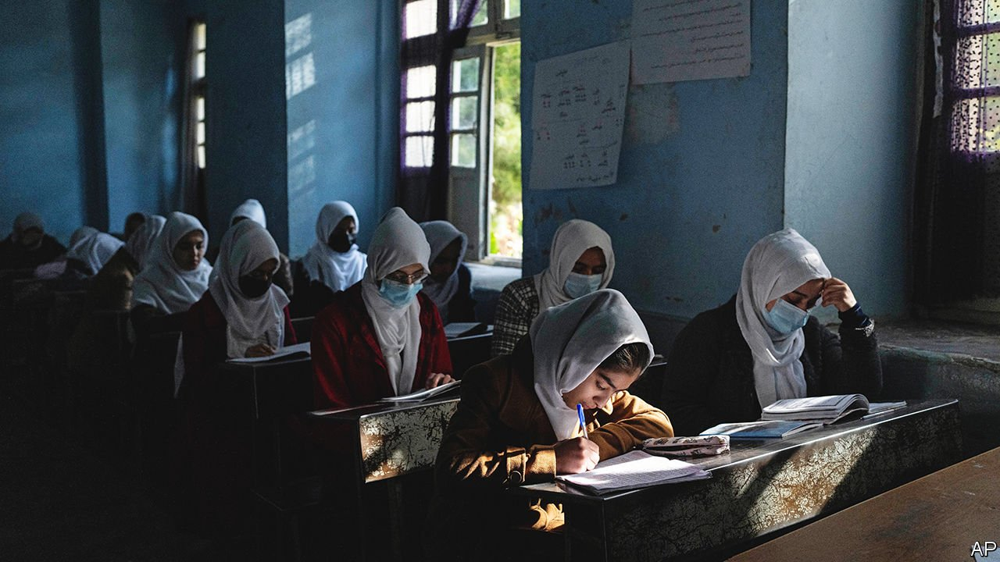

###### Back to the dark ages

# The Taliban are shackling half the Afghan population 

##### Girls are barred from secondary school; women from travelling without a chaperone 

 

> Apr 2nd 2022 

THE PAST week has been grim in Afghanistan. Many girls had looked forward to going to secondary school on March 23rd. But the Taliban broke an earlier promise and barred them, citing their supposedly immodest uniforms. As if that were not bad enough, Afghan women who venture far from home will now need male chaperones, making it impractical to hold down a job and needlessly hard to visit a hospital. Parks are to be segregated by sex, to preserve public morals. Foreign broadcasters such as the BBC were taken off local channels. And it was reported that government employees will be obliged to wear traditional dress and sport beards. That would be tricky for women, had they not mostly been sent home months ago.

President Joe Biden’s disorderly retreat from Kabul last year doomed an elected government and allowed the Taliban to seize power. That may or may not have helped convince Vladimir Putin that the West was weak and emboldened him to attack Ukraine. What is certain is that it handed Afghanistan back to a group of violent misogynists. And though the Taliban claim to have mellowed since they first ran the country in 1996-2001, many of them plainly have not. Granted, they now allow girls to attend primary school, which they banned before. But once those girls hit puberty they must put down their books and .


The Taliban may have changed dispiritingly little in the past two decades; but Afghan society has changed a lot. The share of girls who attended primary school rose from zero in 2001 to 85% by 2019. For secondary school it was a less impressive 40%. A generation of Afghan women has tasted a measure of freedom. Their voices have not entirely been silenced. Street protests have erupted in Kabul against the closures of girls’ schools. Activists lamenting them have appeared on local television. Some Afghan men object to the loss of their wives’ income, and the hassle of having to accompany them everywhere.

The government’s last-minute U-turn over schools suggests that even among the Taliban, there is internal disagreement. The outside world must decide how best to encourage the regime’s less repressive elements. It is a tricky balancing act. Isolating Afghanistan would favour the hardliners; lifting all sanctions would reward a brutal regime. Overthrowing the Taliban militarily, as the West did in 2001 after they harboured al-Qaeda terrorists, is out of the question.

Some donors hope that economic pressure might persuade them to change. Certain kinds of foreign assistance have been made conditional on girls being allowed to go to school. Amer ican officials have pulled out of talks with the Taliban in Doha, where funding for education was to be discussed. The World Bank has put $600m of development projects on hold. However, history suggests that making aid conditional on better behaviour by an unwilling regime seldom works.

Meanwhile, more than half the population is suffering “acute food insecurity”, according to the World Food Programme. Earlier this year the UN launched its largest-ever appeal for a single country, hoping to raise $4.4bn. No one is trying to make such emergency aid conditional, but nor is the world rushing to feed the 40m struggling Afghans. Only 13% of the requested sum had been committed by March 31st, when a pledging conference was to open. Some of the emergency aid will inevitably leak and prop up the Taliban, but donors should provide it anyway. Human lives are at stake.

To send a signal, non-emergency assistance and diplomatic recognition should be withheld until female Afghans enjoy their basic rights. But the argument must be won within the Taliban. No society thrives by hobbling half its population. Those that oppress women are more likely to be poor, violent and unstable. Some Taliban know this and they must prevail over their reactionary brothers. Afghanistan’s future rests on this frail hope. ■

