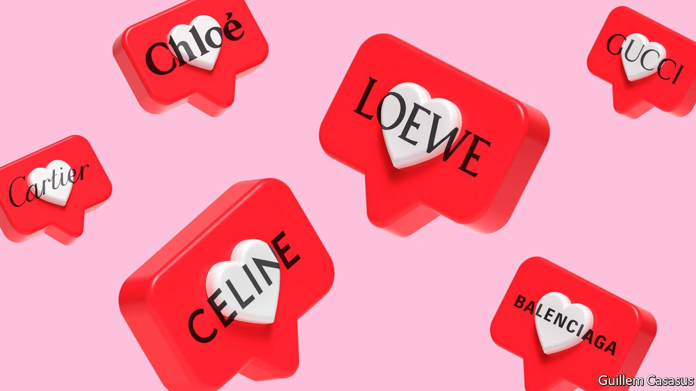

###### Brands and marketing

# The serious business of being a social influencer 

##### Read this leader!!#ad 

 

> Apr 2nd 2022 

IT IS A sure sign that a hot trend has reached the mainstream when the tax authorities catch up. This week China promised a tax-evasion crackdown on social-media influencers, who are paid by brands to promote products online to armies of followers. One of the big stars, Viya, a 30-something fashionista known as the live-streaming queen, has already been fined $210m for not declaring her income. The size of that levy shows the sheer scale of the industry, which accounts for 12% of online sales in China. Outside China, influencers are also likely to have an . For all firms with brands—and together those brands are worth over $7trn—it is time to realise that influencing is more than just a hobby.

The use of personal endorsements used to be about harnessing existing celebrity power. Elizabeth Taylor touted Colgate-Palmolive’s shampoo in the 1950s, and Michael Jordan’s deal in 1984 with Nike revolutionised both basketball and branding. Influencers turn the logic on its head: selling things helps make them more famous. Through curated feeds of clipped videos and filtered photos they offer recommendations to consumers, mingled with glimpses into their daily lives that give their artifice an aura of authenticity. Sometimes they disclose how they are paid. Often they do not.


Initially dismissed as credulous Gen-Z folk who had mistaken posting selfies for having a job, these entrepreneurs have become a big business, boosted further by the e-commerce surge from the pandemic. Total spending on influencers by brands could reach $16bn this year. Whereas the number of wannabe influencers outside China is in the millions, an elite of under 100,000 of them who have over 1m followers each get the bulk of revenues and the front seats at fashion shows.

Their staying power suggests that they add value in several ways. They can save money: Elon Musk is an honorary influencer whose raucous online presence lets Tesla do without any conventional advertising (General Motors blew $3.3bn on it in 2021). Influencers’ networks reach new audiences, particularly younger shoppers. Global brands can localise their appeal by cutting deals with them. In China local shopping festivals and style sensibilities matter, so transplanting marketing campaigns from the West does not work. And influencers are technologically proficient in a way that old-style brand ambassadors never were. They are quick to adapt to newer platforms like TikTok and to the ever-changing algorithms of older ones like Instagram.

Yet one-third of brands do not use influencers. They worry about tarnishing their reputation. Having a swarm of freelance advocates is riskier than the command-and-control campaigns of the “Mad Men” era. And the industry is a Wild West, awash with fraud and manipulation.

Despite this, ignoring influencers is a mistake. Their share of digital advertising budgets is still low at perhaps 3%, but it is rising fast. The boundary between entertainment and e-commerce is blurring. And the most popular marketing strategy of the 2010s—ads targeted through Google and Facebook—is under threat as new privacy standards, including on Apple’s iPhone, make it harder to spy on potential customers.

To get the most out of influencers, brands should set a clear strategy. They should expect more regulation on consumer protection: China’s crackdown may also include limits on spending and content rules. The guiding principle should be to use only influencers who disclose to their audiences that their posts are paid. As the Wild West phase ends, brands should also embrace new analytical tools that help them gauge the performance of influencers, sorting the con-artists from the stars. It used to be said that only half of all advertising spending worked, but it was impossible to know which half. Now brands can control only half of what influencers say, but they may be able to calculate 100% of the value they add. ■

