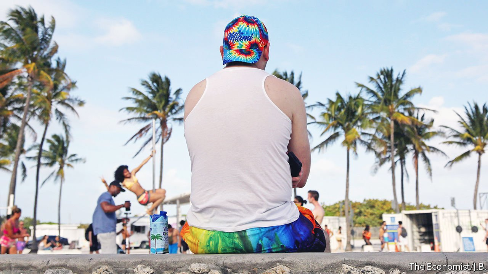

###### The Sunshine State

# What America can learn from Florida’s boom 

##### It has important lessons for the environment, politics and the economy 

 

> Apr 2nd 2022 

AS THE SOUTHERNMOST state in continental America, Florida is often pooh-poohed as peripheral. Headlines about crimes committed by Floridians, sometimes involving alligators, alcohol, or a combination of the two, have contributed to a wacky “Florida man” stereotype. Many associate Florida with retirement, rednecks and a world-famous rodent, Mickey Mouse.

In fact, Florida has become emblematic of much of America and central to all of it. The state is on the rise, as our special report this week explains. Between 2010 and 2020 its population grew at double the national rate. Florida has overtaken New York to become America’s third-most-populous state after California and Texas, with a dynamic and diverse demography, including fast-rising numbers of Hispanics. It is now the number-one destination for American and foreign movers. In the year to July 31st 2021, 260,000 more people arrived in Florida than left—equivalent to adding a city the size of Buffalo, New York.


Its economic and political heft is growing, too. Florida’s GDP has doubled since 2002. Were it a country, it would rank as the 15th-largest economy in the world, ahead of Mexico and Indonesia. Having recently gained a 30th electoral-college vote, it has more than a tenth of those required to win the presidency. The largest swing state, in the past 12 presidential elections Florida has voted all but twice for the winner. And as home to musicians, athletes and a recent former president, Florida is a cultural trendsetter, for better or worse, as well as ground zero for the fight over government restrictions related to covid-19.

Americans ignore this powerhouse at their peril—and should heed the lessons it holds. For a start, Florida points to the wider looming battle between generations. Its residents include millions of retired Americans who want to limit government spending, even while they use government programmes, such as Medicare, a health-care scheme for the elderly. Younger Floridians, meanwhile, want to see investment in their own future, and are finding cities like Miami increasingly unaffordable.

The young are also more affected by the threats Florida faces, nowhere more so than over the environment, Florida’s biggest draw as well as its most acute vulnerability. A fifth of its property is at “substantial” risk of flooding because of rising sea-levels. Its Republican governor, Ron DeSantis, was elected as an environmentalist and has invested in programmes that fund cities’ “resilience”, but the state needs to do much more. Florida has a chance to serve as an inspiration for how to mitigate the damage of climate change, but risks becoming a cautionary tale of what happens when a state government does too little, too late.

Politically, Florida has come to embody the Republican Party and its rightward tilt. If the Florida-based Donald Trump decides not to run again in 2024, Mr DeSantis is the likeliest Republican nominee for president. The rising number of independents in Florida suggests that people are fed up with both parties. But Democrats look especially vulnerable. A decade ago they claimed 558,000 more registered voters than Republicans; today they trail Republicans by 43,000. Nationally, Democrats need to run more optimistic, centrist candidates who can appeal to independent voters like those in Florida. As it is, they are struggling to shake off the “socialist” label that Republicans have given them, turning off many voters, notably Hispanics.

Lastly, Florida offers a case study in economic policy. It charges no income tax, which enhances its appeal, as do the pro-business attitudes of the state’s leaders. The pandemic has prompted people and firms to reconsider where they want to be based, leading many to move out of high-tax, high-regulation states (such as New York and California) to Florida and Texas, which are pro-business and tax-light. Silicon Valley and Wall Street types are attracted to a place where politicians welcome them and never condemn their success.

It is neither practical nor desirable for all other states to emulate Florida’s low-tax, low-spend model. But Florida’s success should give pause to states intent on continuing to raise taxes, to enact new regulations and to slander successful businesses. As America’s population peaks, states will compete with each other for people. Those that prove to be good places to live and work will be rewarded with economic growth.

Florida itself has lessons to learn, too. It has a history of booms and busts, with an over-reliance on property. It thrives as people move there, yet some of its politicians sound anti-immigrant. It should deal with the rising cost of living and its tired infrastructure. The rightward shift in the legislature is concerning for those who have a broad, and inclusive, interpretation of liberty. This week Mr DeSantis signed into law the “parental rights in education” bill, also known as “don’t say gay”, which limits discussion of sexuality in classrooms.

Still, Florida’s surge and struggles are instructive. Mock Florida Man, if you wish, but don’t underestimate him. ■

