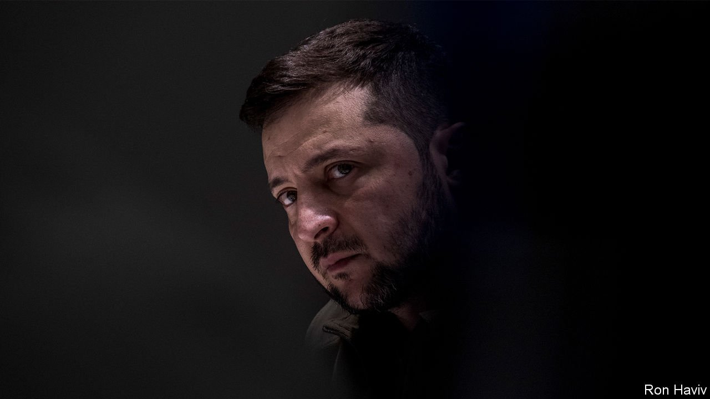

###### Western support

# Why Ukraine must win 

##### A decisive victory could transform the security of Europe 

 

> Apr 2nd 2022 

WHEN VLADIMIR PUTIN ordered Russian troops into Ukraine he was not alone in thinking victory would be swift. Many Western analysts also expected Kyiv, the capital, to fall within 72 hours. Ukrainian valour and ingenuity confounded those assumptions. As the war enters its sixth week, the side that is contemplating victory is not Russia but Ukraine—and it would be a victory that redraws the map of European security.

Speaking to The Economist in Kyiv on March 25th, President Volodymyr Zelensky explained how people power is the secret to Ukraine’s resistance and why the war is shifting in his nation’s favour. “We believe in victory,” he declared. “This is our home, our land, our independence. It’s just a question of time.”


The battlefield is starting to tell the same story as the president. After several weeks in which the Russian assault stalled, Ukrainian forces have begun to counter-attack. On March 29th Russia said that it will “fundamentally cut back” the northern campaign. Its retreat may well be only tactical, but Russia has in effect conceded that, for the moment, it cannot take Kyiv.

Yet a lot of Ukraine remains in Russian hands, including the strip of land on the southern coast that the Russians now claim was their focus all along. A large chunk of the Ukrainian army, in the Donbas region, is vulnerable to encirclement. Nobody should underestimate Russian firepower. Even if its forces are depleted and demoralised they can dig in. Victory for Ukraine means keeping its Donbas brigades intact and using them to deny Russia a secure hold on occupied territory.

For that, Mr Zelensky , the West must impose tougher sanctions on Russia and supply more weapons, including aircraft and tanks. Sanctions deplete Russia’s ability to sustain a long war. Arms help Ukraine take back territory. But NATO countries are refusing to provide him with what he wants. Given what is at stake, for the West as well as Ukraine, that betrays a reprehensible failure of strategic vision.

For Ukraine, a decisive victory would deter yet another Russian invasion. The more convincingly Ukraine can see off the Russian army, the more able it will be to resist the compromises that could poison the peace. Victory would also be the best basis for launching a post-war democratic state that is less corrupted by oligarchs and Russian infiltration.

The prize for the West would be almost as great. Not only could Ukraine invigorate the cause of democracy, but it would also enhance European security. During 300 years of imperialism, Russia has repeatedly been at war in Europe. Sometimes, as with Poland and Finland, it was the invader. Other times, as with Nazi Germany and Napoleonic France, it was seen as a lethal threat and itself fell victim to aggression.

A strong, democratic Ukraine would thwart Russia’s expansionism—because its borders would be secure. In the short term an angry, defeated dictator would be left in the Kremlin, but eventually Russia, following Ukraine’s example, would be more likely to solve its problems by reform at home rather than adventures abroad. As it did so, NATO would become correspondingly less of a drain on budgets and diplomacy. The United States would be freer to attend to its growing rivalry with China.

Alas, much of the West seems blind to this historic chance. America is leading as it must, even if it vetoed . But Germany is taking a short-term view of sanctions, balancing pressure from its allies and public opinion against the preservation of its trading links with Russia, the supplier of much of its oil and natural gas. France’s president, Emmanuel Macron, claims to speak for Western allies when he argues that to supply the heavy weapons Ukraine needs would turn them into “co-belligerents”. Mr Zelensky accuses such countries of being either short-sighted or timorous. He is right.

Perhaps Germany doubts that Ukraine can leave behind its post-Soviet past. It is true that, after the Maidan protests established democracy in 2014, the country was unable to slough off its corruption and political inertia. And after being pounded by Russian artillery, Ukraine’s economy will be in ruins. However, the EU can help ensure that this time is different by starting work on Ukrainian membership . There could be no greater affirmation of the EU’s founding mission to create peace on a continent ravaged by war.

Bringing Ukraine’s governance in line with the EU’s will necessarily be lengthy and bureaucratic. The risk is that Brussels strings Ukraine along, as if Europe is deigning to let it join. Instead, the EU should welcome Ukraine eagerly, as eastern Europe was welcomed when it shook off Soviet domination in the early 1990s. That calls for generous aid to rebuild the economy, as well as political support and patience.

The other worry is Mr Macron’s: that NATO will provoke Russia. From the start of this war, when he spoke of “consequences…such as you have never seen in your entire history”, Mr Putin has hinted that Western involvement could lead to the use of nuclear weapons. Wisely, the West has therefore been clear that NATO will not fight against Russian forces—because, if they did, the war could spin out of control, with catastrophic results.

Yet backing away from Mr Putin’s nuclear-tinged threat entails risks, too. Limiting Ukrainian aid would abet Russia in imposing an unstable—and hence temporary—peace on Mr Zelensky. It would reward Mr Putin for his threats, setting up his next act of atomic aggression. By contrast, more powerful weapons and sanctions would mark a change in the degree of aid, but not its kind. And this week, facing Ukrainian success, Russia paused the campaign in the north, rather than escalate. For all those reasons, the best deterrence is for NATO to stand up to Mr Putin’s veiled threat, and make clear that a nuclear or chemical atrocity would lead to Russia’s utter isolation.

Lift up your eyes

Conflict is unpredictable. History is littered with wars that were meant to be short but which dragged on for years. Ukraine has won the first phase of this one simply by surviving. Now it needs to advance, and so Mr Zelensky needs redoubled Western help. It would be terrible if what stood between a bad peace and a good one was a failure of imagination in the capitals of Europe. ■

Watch the  with Mr Zelensky, read the , and get a look . For more of our recent coverage of the Ukraine crisis, visit our .

For subscribers only: to see how we design each week’s cover, sign up to our weekly 

