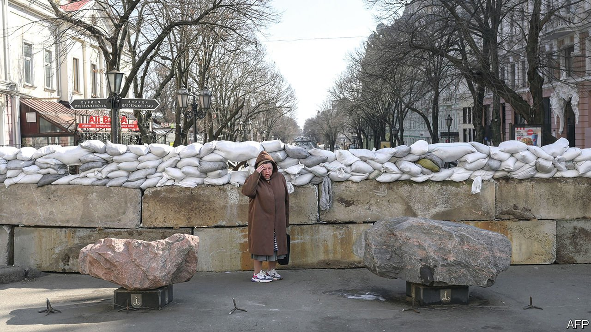

###### On Russia and Ukraine, California, baseball, grammar, Dostoyevsky, Bagehot

# Letters to the editor 

##### A selection of correspondence 

> Apr 2nd 2022 


 


Russia’s war aims

You have reported about the failure of the Russian army to achieve its immediate objectives in Ukraine (“”, March 19th). This might well be the case. Yet without really knowing Vladimir Putin’s goals, we cannot really tell. For once, should we not take Mr Putin at his own word?


He claims the “special military operation” is going “according to plan”. Two large cities, which successfully resisted separatists in 2014, are being reduced to rubble; a land corridor from Donbas to Crimea has been established; a quarter of Ukraine’s population displaced (10% as refugees abroad); thousands if not tens of thousands of civilians killed, and all this after only one month into the war. These results are fully commensurate with Mr Putin’s obsessive hatred towards all things Ukrainian.

From the point of view of someone who denies the existence of an independent Ukraine and considers that state to be an anomaly, his war seems indeed as if it is going to plan. It reminds me of the Serb campaign in Bosnia in the 1990s, which aimed at ethnic cleansing. As we know, this culminated in genocide.

ULF BRUNNBAUER

Director

Leibniz Institute for East and Southeast European Studies

Regensburg, Germany

Regina Ip (, March 19th) either misunderstands or wilfully misinterprets NATO’s expansion into central Europe. That expansion was not the result of pressure from NATO but rather the free decisions of democratically elected governments. They recognised the threat from the Russian dictatorship, which thinks that adjacent countries and their populations are an indissoluble part of its polity. If the central European governments wish to leave NATO they are free to do so, though Russia’s savage butchery of Ukraine now makes their original case a thousand times stronger.

If Ms Ip were to open her window in the Legislative Council offices in Hong Kong, she might find that a democratic majority of Hong Kongers see very distinct parallels in their own Asian region.

DAVID HART

Harrogate, North Yorkshire

The honourable member of Hong Kong’s Legislative Council wrote about one incident when “a pair of American bombers flying over the Black Sea” in 2021 had to be “escorted away from the Russian border by Russian jets”. Yet the Royal Air Force, showing admirable restraint, has had to escort Russian bombers out of British air space on and off for decades.

RICHARD SPROULLE

Royston, Hertfordshire

No one has provoked Russia. Eastern European countries wanted a Western security umbrella after 40 years of Kremlin dictatorship. Rather than NATO moving East, as Ms Ip implies, these countries moved West. Who should be surprised, or even offended?

MICHAEL KUTTNER

Stege, Denmark

NATO continues to turn a deaf ear to Ukraine’s plea to impose a no-fly zone over the country. There is a middle ground. If they were allowed to resign their enlistments, NATO fighter pilots and maintenance personnel could find employment in the Ukrainian air force as mercenaries. They would fly and service planes they are familiar with. A cash bounty could be paid for every Russian bomber or fighter jet shot down. These bounties would be funded by private subscription. So too would disability benefits, and a fund to compensate surviving families of the airmen. This model is similar to the Flying Tigers, American volunteer pilots who helped nationalist China survive Japan’s campaign of conquest in 1941.

GEORGE BOTJER

Emeritus professor of history at the University of Tampa

Belleair, Florida

 


Moving for more space

“” (March 12th) suggested that many of the people moving out of California are fed up with the state’s restrictions on building new homes. Actually, most people who leave California move to places with the same kind of restrictive zoning that has constrained housing supply in the Golden State. Look at a zoning map of any city in Arizona or Texas and you will see that it is mostly restricted to single-family homes. Although there may be less red tape, the fundamental constraint is the same: almost all residential land may have only a single house per lot.

For fleeing Californians, the main attraction of these destinations is that they are still comparatively low-density places to live. These people are not “streaming” to cities on the east coast that do allow multiple homes on the same patch of land, such as New York or Washington.

ANTUN KARLOVAC

San Francisco

 


Sporting firsts

An article about Cleveland’s baseball team changing its name from Indians to Guardians that doesn’t mention Louis Sockalexis is not complete (“”, March 26th). Cleveland became the Indians in honour of Sockalexis, who was from the Penobscot tribe and played as an outfielder in the late 1890s.

CHARLES WHITE

Portland, Oregon

 


Rules of grammar

Johnson tied the teaching of grammar to the learning of foreign languages and development of natural-language processing software (). English does not always rigidly follow a set of rules, and the rules it does follow were developed after the language itself. With computer-programming languages, Python included, the opposite is true. A formal grammar needs to be established first, and it must be rigidly followed. Noam Chomsky’s linguistic work is invaluable to the engineering of non-human languages.

I wonder whether learning grammar would affect students’ performance on a programming test? A formal understanding of the verb “to be” might not be necessary to differentiate between identity and belonging to a category in English, but any Python code you write won’t function properly if there is even a sliver of ambiguity.

CHRIS SHAFFER

Philadelphia

 


A complicated author

You rightly say that by cancelling Dostoyevsky because of Russia’s war we will “miss peerless insights into nihilism and violence” (“”, March 19th). But away from his novels, we would also miss out Dostoyevsky’s anti-Semitism and disgust with the West. He believed in the primacy of the Russian soul, which should avoid contamination by foreign cultures and customs. Russians (except for the Jews) should live in a paradise of self-negation and brotherly love. I am not suggesting that he would have supported the invasion of Ukraine, but his Russophile rhetoric has echoes in what we hear from the Kremlin today, unlike anything you can find in Tolstoy or Turgenev.

ANDREW ROBSON

Abinger Hammer, Surrey

 


Word of the week

I devoured Bagehot’s “unappetising menu” that Rishi Sunak will have to swallow with a coprophagic grin ().

MITCH HERSEY

Presque Isle, Maine

