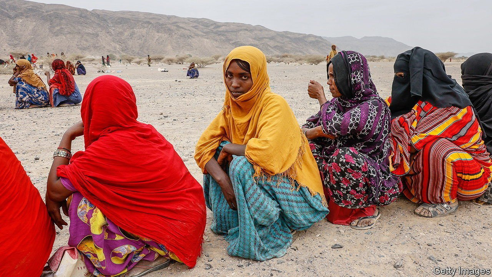
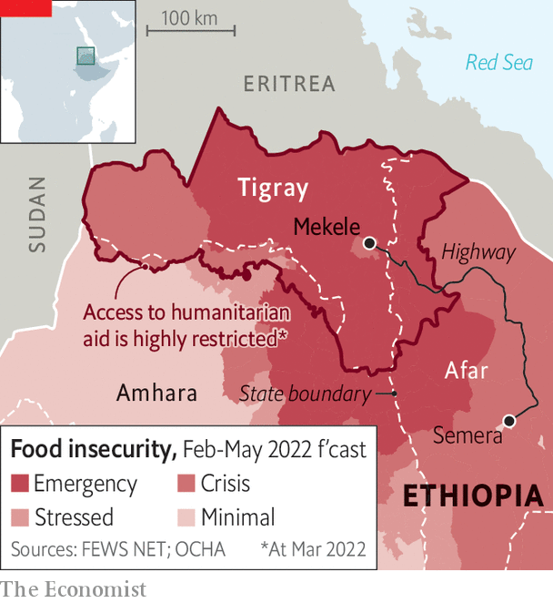

###### The road not taken

# A fragile ceasefire offers hope in Ethiopia 

##### But it may collapse unless Tigray receives humanitarian aid 

 

> Apr 2nd 2022 

THE ROAD to peace in Ethiopia runs for about 500km through some of the most inhospitable land on earth, from Semera in Afar to Mekele, the capital of the state of Tigray (see map). Cutting it is the front line in Ethiopia’s 17-month-old civil war between the forces of Abiy Ahmed, the national prime minister, and the Tigrayan People’s Liberation Front (TPLF), the party-cum-militia that runs Tigray. The road is the only route authorised by the government for aid shipments into Tigray, where hundreds of thousands are starving. No food has moved along it since the middle of December.

 


The Semera-Mekele highway is thus the proving ground of the “indefinite humanitarian truce” that the government announced on March 24th and that Tigrayan leaders provisionally accepted. If it holds, it could help bring an end to a conflict that has claimed tens of thousands of lives (no official figures are available) and that still threatens to tear Ethiopia apart. The first crucial test is whether aid starts moving along the main road. If it does not, then the fighting could swiftly resume.


As The Economist went to press, telecommunications were still cut off and no lorries were heading to Tigray. Aid workers say this is because the road through Afar, a region mostly under government control, is still too dangerous to use. There have been skirmishes with Tigrayan forces nearby. Many Afars are furious about Tigrayan incursions, which have left hundreds of thousands homeless and hungry. Some have attacked shipments of aid in recent weeks. “First, feed Afar,” says Mussa Adem, an opposition leader in the region.

Part of the problem is a lack of agreement about what the ceasefire actually means. The TPLF has indicated that aid must flow before its troops will withdraw to Tigray’s borders. The government seems to think the opposite. Both are already crying foul. On March 28th the TPLF accused the government of lying about lifting its blockade. The government accused Tigrayan forces of blocking the road.

Some suspect the government’s real aim is to buy time while staving off the threat of American sanctions. “You can’t call it a humanitarian truce and then condition it on a withdrawal,” says a Western diplomat. That Abiy has not made visible efforts to make sure aid gets through Afar unimpeded only adds to such concerns.

Still, there are some grounds for thinking that both sides are inching closer to ending the war. The TPLF, which last year seemed set to storm the capital, Addis Ababa, has since suffered setbacks on the battle field and is unable to relieve the suffering of civilians. Thousands of Tigrayans are crossing into the neighbouring Amhara region to escape hunger and drone strikes inflicted on them by government forces. “I don’t think they’ve got much wiggle room,” says a UN official, referring to the TPLF.

Indirect talks mediated by America and the African Union have begun bearing fruit. Military commanders have made contact and both sides have toned down their rhetoric. Fighting is much less intense than it was last year. Since January the government has released many Tigrayans from prison, including some TPLF leaders. A three-month state of emergency was lifted in February.

Asked to explain the government’s shift, a senior official from the ruling party says, “Diplomatic pressure, the economy, war-weariness—in that order.” David Satterfield, America’s special envoy for the Horn of Africa, was in Addis Ababa days before the ceasefire was announced. America has already suspended duty-free access for Ethiopian goods and two bills on further sanctions are currently before Congress.

Ethiopia’s economy is collapsing. Spending on the war has exacerbated a shortage of foreign currency. Banks are running dry and factories are cutting back for want of imported materials. Russia’s invasion of Ukraine means inflation may climb from its current rate of 34%. “There is no choice but to end the war,” says a central banker. “The economic consequence is beyond what the country can bear.”

Even so, progress towards peace may yet founder. In recent days busloads of Ethiopian troops have been seen moving north towards Tigray. TPLF leaders warn ominously of launching a new offensive should aid not arrive soon. “People are losing patience,” says a Tigrayan diplomat. The road from Afar to Tigray has a fork that leads straight back to war. ■

