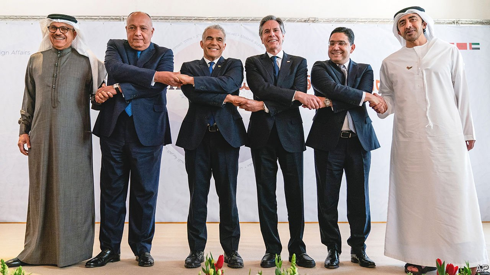
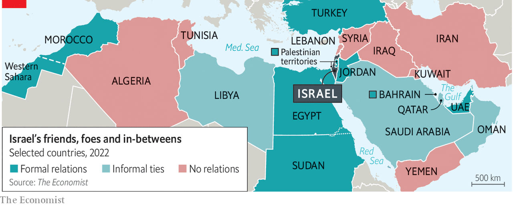

###### Desert-blooming friendships

# Israel hosts an unprecedented summit with Arab leaders 

##### It was long on symbols but short on promises 

 

> Apr 2nd 2022 

DAVID BEN-GURION never much believed in the prospect of peace with Arabs. When Israel’s first prime minister died in 1973, after years of retirement in Sde Boker, a sleepy kibbutz deep in the Negev desert, his country had just emerged from another war with its angry Arab neighbours. None recognised Israel’s existence. No doubt he would have been shocked by the scene half a century later: a few miles from his tomb, the foreign ministers of four Arab states—Bahrain, Egypt, Morocco and the United Arab Emirates (UAE)—met their Israeli and American counterparts at a hotel in Sde Boker on March 27th, clasped hands amid smiles (pictured above), then tucked into kebabs together.

It was the second notable Middle Eastern gathering in a week, after a meeting in Sharm al-Sheikh between the leaders of Egypt, Israel and the UAE. Save Egypt, none of the Arab participants had formal relations with Israel until 2020. That they met, warmly and openly, showed how low the Palestinian cause has fallen on the agenda of Arab governments (if not their citizens). For Israel, it was another impressive step, albeit symbolic, towards its widening acceptance as a normal regional power.


The twin summits were part of a broader flurry of diplomacy, some of it rooted in a feeling that America is no longer a reliable partner. The meeting in Sharm al-Sheikh showed that America’s partners can co-ordinate their own positions; the gathering in Israel was a chance to share those concerns with Antony Blinken, America’s secretary of state. It says much about the troubled state of America’s regional relations that Mr Blinken flew out to Israel for three days as war was raging in Ukraine.

 


Chief among those concerns is Iran. Gulf countries grumble that America has not protected them from Iranian-made rockets and drones. Since January these have hit oil installations in Saudi Arabia and killed civilians in the UAE. Israel and the Gulf leaders think America is close to rejoining the nuclear deal struck in 2015 with Iran, which Donald Trump ditched in 2018. They fear it may only briefly delay Iran’s nuclear plans and give it an economic windfall to spend on regional mischief.

Rob Malley, the lead American negotiator, is more guarded about prospects for a deal. “You could be close, you could be close for a very long time, and you could never get there,” he says. Still, one Israeli diplomat says, the Negev summit was meant “to ensure that, whether the Americans and the Iranians sign a deal or it all blows up, we will still have a joint strategy with the administration on how to deal with Iran the day after”.

For his part, Mr Blinken used the summit to prod his fellow ministers to boost oil output and join sanctions on Russia. They have little incentive to do either. Israel does not want to jeopardise its military co-operation with Russia in Syria, where it carries out air strikes against Iran and its proxies. The UAE, the world’s seventh-biggest oil producer, is a member of the so-called OPEC+ agreement, in which Russia is a key player. The UAE’s energy minister said this week he would refuse to do “something unilateral” to increase output.

So neither side got what it wanted in the Negev. There were no firm promises. But the mere act of meeting was enough, certainly for Israel. Though it has had diplomatic relations with Egypt since 1979 and Jordan since 1994, public summits with their leaders have been rare, stilted affairs.

The informality of the Negev summit, at which the delegations slept in the same hotel and dined together, was a sign of the changing atmosphere in swathes of the Middle East. Last year’s removal of Binyamin Netanyahu after 12 years as prime minister, orchestrated by Naftali Bennett and Yair Lapid, now the prime and foreign ministers, did much to improve Israel’s regional ties, and not only with Arab states.

Turkey has spent the past decade at odds with Israel, Egypt and the UAE, largely because of its vociferous and vigorous support for political Islam. It is now eager to mend those rifts. On March 9th Recep Tayyip Erdogan, its president, hosted his Israeli counterpart, Isaac Herzog, for the first such visit since 2007. A month earlier he had been in Abu Dhabi dining with the Emirati crown prince.

The change of government in Israel gave Mr Erdogan a chance to change his tone towards it. So does the prospect of exporting natural gas buried under Israel’s Mediterranean waters. Turkey’s economic ties with the UAE may improve, too. Elsewhere, Egypt and the Gulf states have buried their feud with Qatar, which had enraged them by backing Islamists across the region. The UAE is even courting Bashar al-Assad, Syria’s dictator, hoping to diminish his reliance on Iran.

There were notable absentees in the Negev. One was Saudi Arabia, which has not established ties with Israel. But it shares many of the same concerns about Iran, and was certainly there in spirit. “You don’t get in a room with Emiratis and the Bahrainis without having the Saudis’ approval,” says an Israeli diplomat. Many Saudis expect Muhammad bin Salman, the crown prince, to recognise Israel once he is king.

Also absent, of course, were the Palestinians. Not only were they not invited, but their long conflict with Israel, once the cause célèbre of Middle Eastern diplomats, got little more than a passing mention. They made do with a visit from King Abdullah of Jordan, who travelled to Ramallah, their de facto capital, to meet Mahmoud Abbas, the Palestinians’ ageing president.

The Negev summit was also a reminder that there are no easy answers when it comes to Iran. If America does not know how to find one, neither do its regional partners. In the short term they will probably work together to boost military co-operation and missile defences. Participants in the Negev suggested making it a regular forum, to be convened annually in a desert location. An American diplomat joked that, with old enemies now gambling on new alliances, it could be Las Vegas. ■

