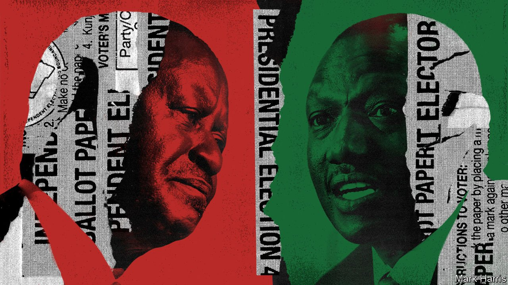

###### Never-ending party

# Kenyan voters face an invidious choice in August 

##### Neither of the leading candidates inspires much hope 

 

> Apr 2nd 2022 

THE PROMISES politicians make often sound similar: more jobs, more roads, few details. To understand their worldview better, it can be illuminating to ask them whom they admire.

William Ruto, Kenya’s deputy president and a marginal favourite to win a presidential election in August, tells The Economist that he is inspired by Julius Nyerere, the first president of Tanzania, and Margaret Thatcher. It is an odd combination. One destroyed Tanzania’s economy by nationalising businesses and forcing people into collective farms. The other transformed Britain’s economy through privatisation.


In Tanzania, Mr Ruto explains, Nyerere built “something that we are struggling to build”: a national identity that overcame tribal differences. Kenyan politics, by contrast, have long been tribal and sometimes violent. During the 1990s the Kalenjin (those who speak a clutch of languages in the Rift Valley) killed hundreds of Kikuyu (Kenya’s largest tribe) to tilt the local electoral balance. Ethnic slaughter erupted again after a disputed election in 2007. More than 1,000 people died.

Mr Ruto, a Kalenjin who says he is building a national party, not a tribal one, may also be invoking Nyerere the uniter because of his own reputation as a divider. In 2013 the International Criminal Court accused him of orchestrating the violence in 2007. The case against him was never proved. The court suspended the charges (which he denies) after prosecution witnesses recanted or disappeared.

Thatcher is admired, he says, because she came from a humble background. Mr Ruto, who once sold fried chicken to motorists at a railway crossing, argues he is a “hustler” like the poor whose votes he is courting. He dismisses as “dynasts” his main opponent, Raila Odinga, a son of Kenya’s first vice-president, and Mr Odinga’s main backer, the incumbent, Uhuru Kenyatta, a son of Kenya’s first president.

Mr Ruto does, indeed, offer at least a few echoes of the Iron Lady in his economic policies. He wants to encourage the growth of small businesses by cutting red tape. But Mrs T would probably have sniffed at much of his “bottom-up economics” plan, which would subsidise fertilisers and cap interest rates.

If Mr Ruto’s economic policies seem contradictory, they are not uniquely so. Mr Odinga tells The Economist that he takes inspiration from Lee Kuan Yew, who oversaw Singapore’s astonishing economic success. The late Lee is a popular role model among African leaders, many of whom admire his tough style and achievements. Yet few have emulated Lee’s personal discipline, willingness to curb corruption or commitment to opening the economy. Another of Mr Odinga’s idols is Narendra Modi, the prime minister of India. Mr Odinga is impressed by how Mr Modi attracted investment and spurred economic growth, (though, one would hope, not by Mr Modi’s religious chauvinism).

Look in the mirror

Mr Odinga says he, too, wants to boost growth and attract investment. Yet he is going about it in an odd way. Like Mr Ruto, he punts “bottom-up economics” and subsidised fertiliser. He also wants to renegotiate Kenya’s debt (which is about 70% of GDP) with its external creditors. When asked what are the main differences between his platform and Mr Ruto’s, he suggests personalities, rather than policies. “I stand for righteousness…and against corruption,” Mr Odinga says. “My opponent is basically the opposite of me.”

That both campaigns are so light on policy is perhaps a reflection of the deep cynicism pervading Kenyan politics. Mr Odinga, who is making his fifth bid for president, claims to have been cheated of victory in Kenya’s three most recent elections, starting with 2007, when Mr Ruto was then his loyal chief lieutenant. In 2017 he claimed an electoral official had been murdered to facilitate a rigging of the count that handed victory to Mr Kenyatta.

Yet since Mr Odinga forged an alliance with President Kenyatta in 2018, he no longer asks questions about the murdered official. Nor has he sought justice for the scores of his supporters who were shot dead by the police after he called for protests against the outcome of the election.

This cynicism seems to percolate down to the electorate, too. When in February Mr Kenyatta endorsed Mr Odinga, once his bitter est rival, and denounced Mr Ruto, his deputy for the past ten years, Kenyans barely turned a hair. “Politics in Kenya is like looking through a kaleidoscope,” grumbles a Western diplomat. “The bits are still the same but every time you shake it they form different patterns.”

One reason for it may be that electoral contests are not ideological sparring grounds. Instead many voters still cast their ballots on ethnic lines. Few political parties survive more than one electoral cycle. “Political parties are single-purpose vehicles,” designed solely to catapult their leaders to power, says David Ndii, an economic adviser to Mr Ruto. Mr Odinga has belonged to six political parties, Mr Ruto to five and President Kenyatta to four. As a result, there is usually little to distinguish presidential candidates from each other.

The unpalatable choice before Kenyans may explain why this election is likely to be characterised by indifference. Apathy is preferable to violence, but it is still corrosive and leads to stagnation. The Kenya African National Union (KANU) was once the country’s only legally permitted political party, ruling from 1963 until 2002.

In every single election since then the winners and runners-up, as well as all their key lieutenants, have been former card-carrying members of KANU. No new political party has been able to break through. Kenya has many parties on paper. Yet it still bears the imprint of its corrupt old one-party system. ■

