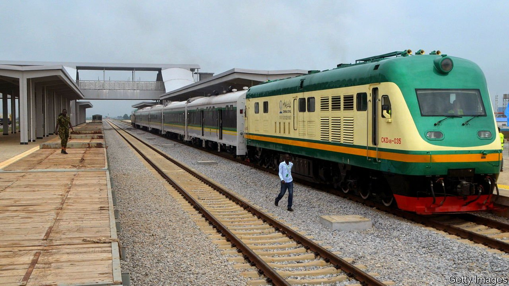

###### Red line

# Kidnappers brazenly attack a train in Nigeria 

##### Parts of Africa’s most populous country are becoming ungovernable 

 

> Apr 2nd 2022 

RAILWAY DELAYS are the bane of travellers the world over. Occasionally, though, they may be a lifesaver. In October your correspondent boarded a train from Nigeria’s capital, Abuja, to the northern city of Kaduna. A fault held up its departure for 30 minutes. This was just long enough that a train coming in the opposite direction was the first to trigger explosives placed on the track. Luckily, in that attack, the train limped on and nobody was hurt.

Passengers travelling on the same line on March 28th were less fortunate. First a bomb derailed their train. Then gunmen set upon the estimated 400 passengers and guards, killing eight, injuring 25 and kidnapping an unknown number. The attack was the most brazen yet by the kidnapping gangs locally known as bandits that terrorise the region. This lawlessness, in addition to a long-running insurgency in the north-east by jihadists affiliated with Islamic State and regular clashes between farmers and herders, are rendering large parts of Africa’s most populous country ungovernable.


The 190km road between Abuja and Kaduna has long been a favourite hunting ground for the gangs, which regularly ambush travellers and herd them into forest hideouts where they hold them for ransom. In recent years thousands have been abducted, with relatives paying billions of naira (there are 415 naira to $1) for their return. Many hoped that trains, which started running in 2016, would be a safer alternative. But as well-heeled Nigerians switched from road to rail, so the gangs have begun targeting trains.

“We warned that lives will be lost,” fumed Rotimi Amaechi, the transport minister, after the attack, accusing his colleagues of blocking funds for cameras and sensors that might have averted it. “Now lives are lost.”

Two days before the train outrage, gunmen attacked Kaduna airport, killing an employee and further isolating the city. Airlines have suspended flights. Such insecurity is prompting many educated Nigerians to flee abroad. Among them would have been Chinelo Nwando, a young dentist who had planned to emigrate to Canada this month. “I’m in the train, I’ve been shot,” she tweeted, hours before her death was confirmed. “Please pray for me.”

