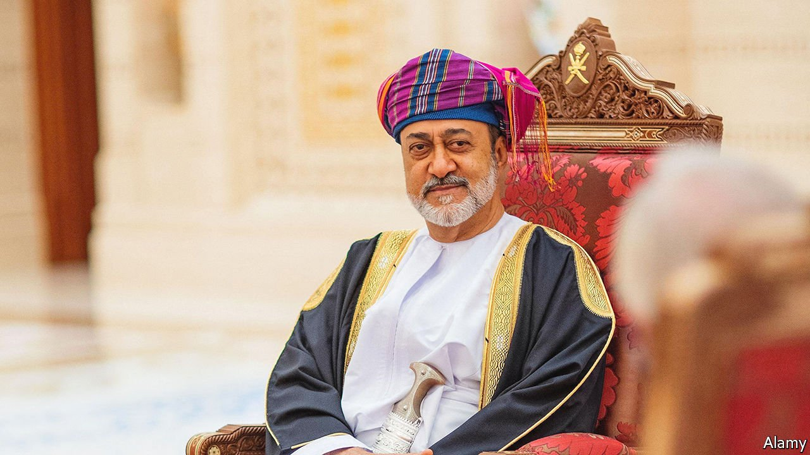

###### New blood begins to simmer

# Oman’s sultan breaks with the past in economics 

##### An oil windfall is a boon to public finances, but reminds Oman that it must diversify 

 

> Apr 2nd 2022 

WHEN TWO British prisoners were freed from Iran in March, it was no surprise that Oman was their first stop. Nazanin Zaghari-Ratcliffe and Anoosheh Ashoori, held for years on bogus espionage charges, were freed as part of a deal that saw Britain settle an old debt with Iran. Oman was the essential middleman, providing an air-force jet to fly the prisoners to freedom and a bank to serve as a conduit for the British payment.

Two years have passed since Sultan Haitham replaced his late cousin, Qaboos, who had ruled for five decades. Not much was known about him when he took over. Qaboos never publicly named a successor. It was unclear what to expect from the new man, whose hitherto humdrum career had consisted—among other responsibilities—of working in foreign affairs, cherishing the national heritage, watching football matches and running the census.


Oman’s role in the prisoner deal was a sign that, at least in foreign policy, the new boss is much like the old. Neighbouring Saudi Arabia and the United Arab Emirates (UAE) are Gulf heavyweights with far deeper pockets and beefier armies. Instead Oman has used neutrality to its advantage, not just over Iran.

The new sultan has kept Oman neutral in the war in neighbouring Yemen, which pits a Saudi-led coalition against the Houthis, a militant group that seized chunks of the country in 2014. He has set up talks between the warring parties, so far without much success, though in 2020 Oman negotiated a prisoner swap whereby the Houthis freed two Americans. Sultan Haitham is also friendlier with Saudi Arabia and the UAE, hoping to woo investment. Mostly it has been business as usual.

In domestic policy, though, he has broken with the past. Sultan Qaboos built the modern Omani state but did little to diversify its economy. Oman is a middling oil producer, pumping about 1m barrels a day, yet its economy depends utterly on the black stuff: petroleum accounts for two-thirds of exports and more than 70% of government revenue.

Sultan Haitham inherited a sluggish economy. GDP growth had been below 2% since 2017. Years of low oil prices had driven Oman’s external debt from 64% of GDP in 2016 to 94% in 2019. Then the pandemic hit, causing the non-oil economy to shrink by 4% in 2020 and pushing the current-account deficit to 14% of GDP.

This has spurred change, starting with the public sector. Oman’s hefty public-wage bill was 15% of GDP in 2020 and 25% of spending. Yet stroll through the government quarter after 2pm and barely a civil servant is in sight. Since 2020 older ones have had to retire; new ones must earn lower wages. Last year Oman imposed a 5% value-added tax, the fourth Gulf state to do so. The finance ministry expects to collect 450m rials ($1.2bn) in 2022, 4% of revenue. Electricity and water tariffs rose last year. Subsidies may be phased out by 2025.

This year’s budget projects a 5% deficit, better than before but still high for a country with a debt-to-GDP ratio above 100%. However, the budget was based on oil at $50 a barrel. So if prices stay at current levels, Oman should run a fat surplus and tip its current-account balance into the black. On March 24th the sultan pledged to use the windfall to pay down debt.

The bigger challenge is how to diversify the economy and create jobs: half of young people are thought to be unemployed. Many of the big projects announced in the latter years of Qaboos’s reign were still quite oily. Refineries and petrochemical plants are the star turns at Duqm, a mega-port on the Indian Ocean.

The new sultan has avoided flashy mega-projects. He has reinstated the economy ministry, abolished in 2011, and created a new investment authority, both with mandates to create jobs. On March 28th the Muscat stock exchange said it would allow full foreign ownership of listed companies, hoping to drum up interest abroad.

All of this should help. But the sultanate is still an amiably sleepy place. The shinier bits of Muscat, like the posh hotels and royal opera house by the beach in Qurm, have an almost Potemkin feel, as if they were built for tourists whom Oman barely bothered to woo. But the sultan’s government recognises the need for change. ■

