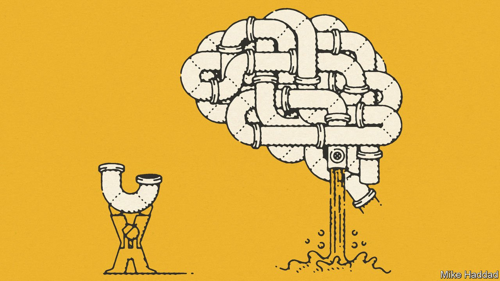

###### The glymphatic system and dementia

# Alzheimer’s researchers are studying the brain’s plumbing 

##### Tweaking it may delay development of the disease 

 

> Apr 2nd 2022 

IN MOST BODILY organs waste matter is cleared out by the lymphatic system. Unnecessary proteins, superfluous fluids and so on are carried away by special vessels to lymph nodes, where they are filtered out and destroyed. The more active the organ, the more of these vessels there are. The exception is the brain, which has none. It was thus thought until recently that brain cells broke down nearby waste products in situ.

But a paper published in 2012 reported that the brain has a plumbing system of its own to flush out the junk. Researchers working in the laboratory of Maiken Nedergaard, at University of Rochester, in New York state, showed that cerebrospinal fluid—the liquid which suspends the brain and acts as a cushion between it and the skull—was actively washing through the organ by hitchhiking on the pulsing of arteries and veins that happens with every heartbeat. The fluid was collecting trash and carrying it out of the brain to lymph nodes for disposal. Now, ten years later, the discovery of this “glymphatic” system, so called because of the involvement of brain cells known as glia, has opened up new opportunities for the treatment of brain disorders.


Brainwashing

From the first studies of the glymphatic system, it was clear it might be involved in preventing Alzheimer’s disease. Alzheimer’s is caused by a build-up of two types of proteins, amyloid-beta and tau. These aggregate to form plaques and tangles that stop neurons working properly and eventually lead to their death. When it is functioning normally, the glymphatic system clears out amyloid-beta and tau. However, in older people, or those with Alzheimer’s, this process is slower—leaving more potentially harmful proteins behind.

Giving the brain a power wash, by improving the flow of glymphatic fluid, is a potential avenue for treatment. Though the field is in its infancy, most attempts to do so have focused on an interesting quirk of the system. This is that glymphatic fluid moves through the brain only during sleep. The plumbing is disabled during waking hours, and is most active during the deepest sleep stages, switched on by slow-wave brain activity.

That discovery has changed how researchers think about the role of sleep, and also about the link between sleep and neurological disorders. For many diseases, including Alzheimer’s, a lack of sleep earlier in life increases the risk. Dr Nedergaard thinks that inadequate glymphatic clearance is the reason. Even a single night of sleep deprivation can increase the amount of amyloid-beta in the brain.

Many drugs affect sleep, sometimes as a side-effect of their main purpose. A study published in Brain earlier this year followed almost 70,000 Danes who were being treated for high blood pressure, using beta-blockers. Some, but not all, types of beta-blockers are able to enter the brain by passing through the blood-brain barrier. This is a system of tight junctions between cells lining blood vessels in the brain, which exists to stop the admission of molecules that might upset the function of the organ. Once there, these beta blockers affect normal patterns of sleep and wakefulness. That, in turn, promotes glymphatic circulation. Those in the study who took barrier-crossing beta-blockers every day were less likely to develop Alzheimer’s than people taking beta-blockers which could not enter the brain.

Another medicine, suvorexant, which is used to treat insomnia, also shows promise. In one recent study, mice with a mutation that causes early-onset Alzheimer’s in people, and similar symptoms in rodents, were given this drug. Mutated mice receiving suvorexant experienced less build up of amyloid-beta. Even more remarkably, the drug also reversed their cognitive decline. In a maze test, mutated mice on suvorexant performed as well as healthy, unmutated ones. A preliminary human trial of this effect is now under way.

Sleep-promoting drugs can, however, have bad side-effects. Indeed, in many cases, including the Danish study, they increase the risk of death from other causes. Other people are therefore trying to boost glymphatic clearance by different means.

One project, examining mice genetically engineered to be prone to Alzheimer’s, found that increasing slow-waves during sleep, thus boosting fluid flow through the brain, reduced the amount of amyloid build up. This work involved “optogenetics”, in which cells are genetically engineered to respond to light, which is obviously a non-starter for a treatment for people. But a similar effect can be induced harmlessly in humans by non-invasive electrical stimulation.

Call the plumber

Some studies report that such stimulation can improve memory formation in the elderly. And it may also be relevant to the young and fit. America’s Department of Defence is paying for at least two projects which have the goal of developing wearable caps to improve glymphatic flow during sleep in this way. Lack of sleep is a big problem in the armed forces. During combat, getting a solid eight hours can be hard, and lack of sleep inevitably affects a soldier’s performance.

As well as emphasising the importance of a good night's sleep, the discovery of the glymphatic system has highlighted other ways that a healthy life can promote a clean and tidy brain. In mice, exercise improves glymphatic flow, flushing out amyloid-beta. By contrast, high blood pressure, which prevents the normal pulsing of arteries and veins that drives the system, reduces fluid movement. In this context it is no surprise that hypertension during middle age increases the risk of developing Alzheimer's disease later on in life.

The glymphatic system’s discovery has had effects outside Alzheimer’s research, too. Traumatic head injury, Parkinson’s disease and mood disorders are all linked to glymphatic clearance. There is hope, as well, that this newly found plumbing may help with the delivery of brain drugs. Getting medicines past the blood-brain barrier is notoriously difficult. Injecting them into the cerebrospinal fluid directly, then allowing them to wash throughout the brain during sleep, may be simpler.

Decades of Alzheimer’s research has left behind a graveyard of failed drug trials. The brain’s plumbing network is providing new targets, and new ways to think about treatments for the disease. The glymphatic system, then, is at last being tapped. ■

To enjoy more of our mind-expanding science coverage, , our weekly newsletter.

