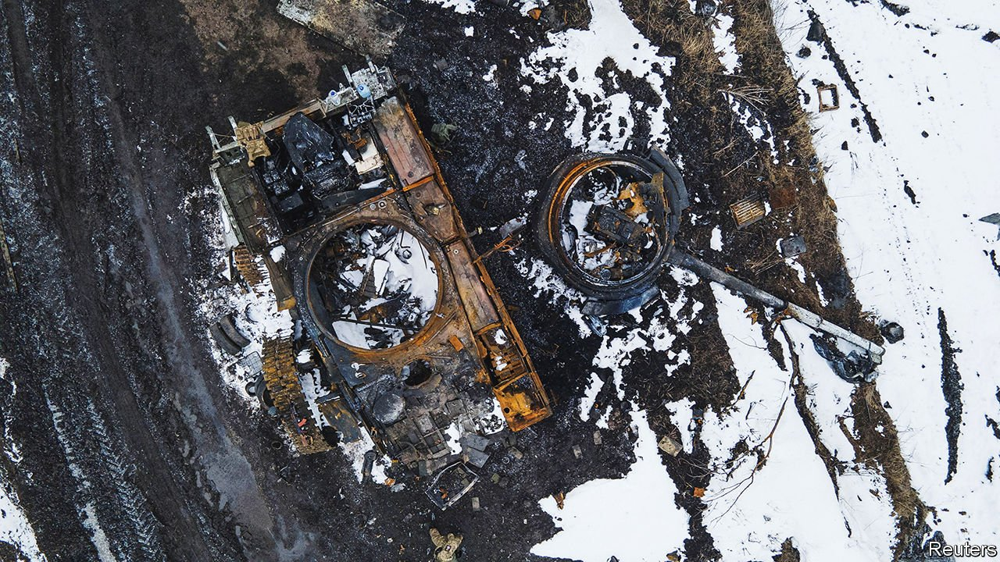

###### Anti-anti-tank weapons

# How tanks can survive against cheap, shoulder-fired missiles 

##### The war in Ukraine will boost the development of anti-anti-tank weapons 

 

> Apr 2nd 2022 

RUSSIAN TANKS have been having a torrid time during the invasion of Ukraine. According to Oryx, an open-source intelligence blog, at least 153 of them have been destroyed so far, along with 312 armoured vehicles. (The figures for the Ukrainian side are 26 and 57 respectively.)

Many of these have been blown up by cheap anti-tank guided missiles (ATGMs) . Western countries have shipped thousands of such weapons to Ukraine, ranging from  via Swedish-designed NLAWs to German-made Panzerfaust-3s. The war has been a powerful demonstration of the threat they pose to modern armour, says Jon Hawkes, a land-warfare guru at Jane’s, a British military intelligence firm. Some Russian tank drivers have resorted to welding  to their vehicles in a dubious effort to add extra protection.


It is ironic that ATGMs have proved so effective, since Russia—and the Soviet Union before it—was a pioneer of so-called “active protection systems” (APSs) designed specifically to defeat them. Unlike armour, which is intended to limit damage to a vehicle if it is hit, APSs are there to stop missiles striking in the first place. Armies around the world are experimenting with, and deploying, them. The war in Ukraine will add urgency to that task.

APSs come in two varieties, dubbed “soft-kill” and “hard-kill”. Soft-kill systems divert a missile by interfering with its guidance systems—for instance, by dazzling them with infrared light or lasers. Hard-kill systems are intended to destroy missiles in flight.

The war in Ukraine shows the limitations of the soft-kill approach, says Jack Watling of the Royal United Services Institute, a think-tank in London. “You need a good technical understanding of the system you’re trying to defeat.” The potpourri of ATGMs fielded by Ukrainian soldiers comes with many different guidance systems. Jamming all of them is impossible.

But hard-kill systems have problems, too. You need sophisticated radar to detect incoming missiles, and precise aim to hit them. Anti-tank missiles travel at hundreds of metres a second, so quick reaction times are vital.

The Soviet Drozd system, one of the first hard-kill APSs, was initially deployed in the 1980s, in the wake of the USSR’s invasion of Afghanistan. It fired shells full of shotgun-like pellets at incoming missiles. Afghanit, Drozd’s most recent successor, is built into Russia’s brand-new T-14 tanks. But Russia has struggled to construct enough of these. As best as analysts can tell, few APS-equipped tanks have so far been sent into Ukraine.

The army that is furthest along with hard-kill APSs is Israel’s. Its Trophy system is designed by Rafael, a firm in Haifa, and is fitted to the country’s Merkava tanks. Trophy fires a tight spread of precisely aimed projectiles, the idea being to minimise the danger the system poses to nearby friendly infantry. Israel’s army claims that Trophy has defeated many anti-tank rocket attacks in Gaza—though Mr Hawkes notes that such attacks are probably from older, less sophisticated ATGMs. Trophy has attracted interest from abroad, too. America and Germany have equipped some tanks with it and Britain is running trials.

There are downsides to such defences. APSs take up weight, space and power—all precious commodities in a tank. Western tanks, in particular, says Mr Watling, have little room to grow heavier without compromising performance. And hard-kill systems may protect against only a handful of incoming rounds, since debris from a successful interception is likely to damage the delicate radar on which the system relies. Crafty enemies could rake tanks with machine-gun fire to disable this radar before the fact, says Mr Watling.

But a defence does not have to be perfect to be useful. Mr Hawkes talks of multilayered, “onion-style” defences, in which screening infantry spot threats, smoke can obscure a tank’s location, and armour then protects the target if all else fails. Russia’s experience in Ukraine suggests adding another layer to that onion could prove useful indeed. ■

To enjoy more of our mind-expanding science coverage, , our weekly newsletter.

