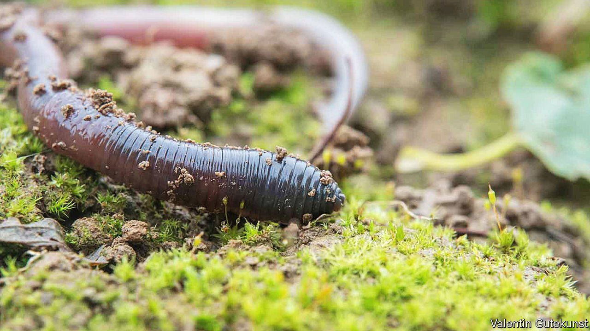

###### Ecological science

# Invasion of the earthworms 

##### The soil ecology of North America is being turned over 

 

> Apr 2nd 2022 

EARTHWORMS’ BENIGN image as aerators, drainers and fertilisers of field and garden belies a darker secret. They are actually fierce competitors with other invertebrates, voraciously consuming rotting plant matter and tiny organisms such as protists, nematodes, bacteria and fungi, all of which might otherwise sustain a wide variety of soil dwellers.

That much is well known, not least from research conducted in northern North America. Here, worms were wiped out during the last ice age, which ended 12,000 years ago. They started returning, in the form of European interlopers, only a few centuries in the past. What have not been investigated much until now are the consequences of this subterranean carnage for surface-dwelling critters. But that has just been corrected by Malte Jochum of Leipzig University, in Germany, and his colleagues, in a study just published in Biology Letters.


Dr Jochum and his team worked in a forest overlooking Barrier Lake, in Alberta, Canada, where the earthworm invasion has been tracked for three decades. That has permitted the identification of areas with low (four worms per square metre, on average), medium (43 worms per square metre) and high (106 per square metre) populations.

Within each zone of abundance the researchers marked 20 plots with individual areas of two square metres. They identified all of the plants therein and used vacuum-suction collecting devices to “hoover” up as many as possible of the above-surface arthropods (mostly insects and spiders) in each plot. They then sorted, identified and measured these animals to calculate their abundance, biomass and species richness.

Altogether, the collectors picked up 13,037 individual arthropods—and discrepancies between plots were quickly obvious. Those with abundant earthworms were depauperised of arthropods compared with ones where worms were rare. Plots with the most worms in them had 61% fewer individual arthropods, 18% fewer arthropod species and a 27% diminution in total arthropod biomass, compared with those with the fewest.

So-called detritivores—which compete directly with worms for food—suffered worst. There were 80% less of them in areas of worm abundance, compared with those of worm scarcity. But herbivores and omnivores suffered, too. Only for carnivorous arthropods, such as spiders, was there good news. Their numbers were up 41% in worm-rich plots, compared with worm-poor ones.

Why predators did well is unclear. Some, perhaps, were eating worms directly. Others may have taken advantage of the stripping of cover for their prey caused by worms pulling the leaf-litter underground for later consumption.

The knock-on effects of this carnage further up the food chain, among invertebrate-eating amphibians, reptiles, birds and mammals, remain obscure. Species that like to consume worms are presumably doing better, while those that prefer their meals crunchy, rather than squishy, will be doing worse. Whether this matters in the grand scheme of things is debatable. But for those who prefer their ecosystems pristine, this work confirms that earthworms are certainly not the unalloyed good which some people make them out to be.

To enjoy more of our mind-expanding science coverage, , our weekly newsletter.

