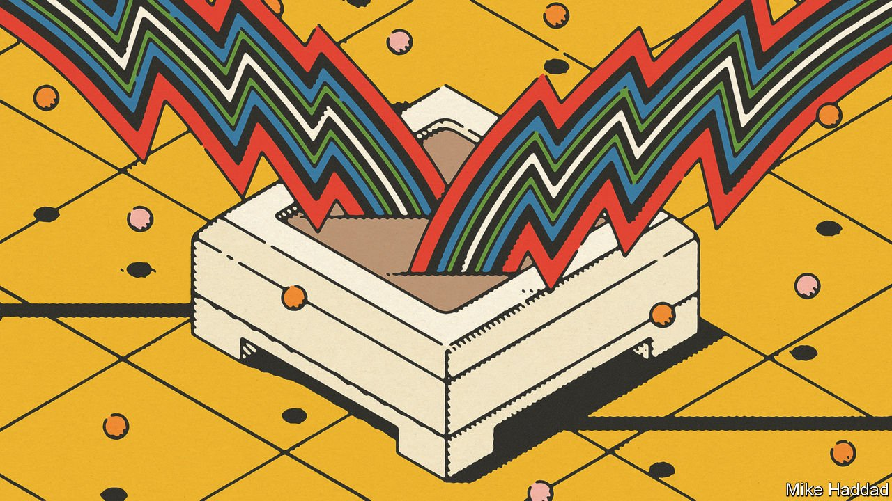

###### Alternative energy

# Sensors that scavenge their power are all the rage 

##### They can run on light, heat and even vibrations 

 

> Apr 2nd 2022 

PERCHED AS IT is above a harbour on the Dingle peninsula, on Ireland’s Atlantic coast, Mike Fitzgerald’s office has an unparalleled view of the domain he hopes to conquer: the open sea. As founder and boss of Net Feasa, a name derived from the Irish word for knowledge, Mr Fitzgerald’s ambition is to fit a sensor to each of the millions of shipping containers that are moving around the world. By using these to track the locations of, and conditions experienced by, those containers, and transmitting that information back to the people who need to know via satellite when a container is at sea and via a mobile-phone network when it is in port or on land, he believes firms will be able to maximise the efficiency of supply chains.

And supply-chain oversight is but one of the benefits small, remotely connected sensors can bring. People already interact with many of them—sometimes knowingly, such as those in smart watches, sometime less so, such as those which regulate temperature and lighting in their offices. Some folk, indeed, talk grandly of the result being an interconnected network akin to an “internet of things” (IoT).


Whether or not that comes to pass, there will be a lot more such sensors in the future. In 2017, researchers at ARM, a chipmaker, predicted that the world would have a trillion of them by 2035. Even more sober estimates run into the tens or hundreds of billions. And they will all need power. Lest battery-makers start rubbing their hands in glee at this new market, though, Mr Fitzgerald, and others like him, have a different idea. Their version of this future will not be battery powered. Instead, the sensors populating it will scavenge for a living.

Net Feasa is building sensors to do just that. They are powered by vibrations, heat and light, using technology developed in collaboration with Mike Hayes of the Tyndall National Institute, in Cork. The electricity thus generated is then stored in devices called supercapacitors, whence it is instantly available. Only in case of dire energy starvation need the system call on the backup battery installed in it. As a consequence, that battery should never need replacement. All of this is packed into a device a few centimetres across, which is designed to fit unobtrusively on a shipping container’s doors. And these devices are already proving themselves in early trials.

Secret source

Net Feasa is not alone. Sensors that draw power from the environment, either to supplement a battery or to replace it, are starting to spread. Managers at EnOcean, a German company that is one of the leading firms in the field, estimate that some 20m of the firm’s products have been installed in a million buildings around the world.

The most advanced are those that use light. Their power-packs are similar to solar cells, but are adjusted to cope with the fact that the artificial interior lighting they are scavenging is both weaker than sunlight and of a different colour. Such photovoltaic sensors are used to measure levels of illumination, temperature, air pollution and even (of particular interest at the moment) airborne pathogens. Automatic systems fed these data can then adjust lighting, heating, ventilation and air-conditioning levels appropriately.

Photovoltaic sensors can also track products on assembly lines and monitor quality during manufacture. They offer eyes and ears in sterile chambers and provide early warning of shortages or leaks. They generate vast quantities of data as well, which can be used to maximise efficiency—though firms that employ them in this way tend to be secretive about the details. A study published in 2019 on the industrial applications of all sensor types in Germany, Switzerland and Austria by EY, a consultancy, estimated the combined boost to revenue from their extensive deployment could be as high as 34%, depending on the sector involved.

Obviously, photovoltaic harvesting has restrictions, for it is suitable only in places where the lights are usually on. That works for offices and those parts of factories where people operate. But for many industrial applications, especially those being carried out in the dark, a more useful source of scavenged energy is heat. The trick of turning this into electricity was discovered two centuries ago, and has been improving ever since. It usually involves a device called a thermocouple, made of sheets of two appropriate materials laid face to face. When one side is hotter than the other, electrons move between the sheets, generating a current.

Turning up the heat

One firm which makes energy-harvesters that work this way is Perpetua Power, in Oregon. Its devices are designed for inaccessible locations where battery replacement would be impractical. Perpetua’s sensors have been installed on oils wells in the freezing conditions of Alaska and the desert heat of California, to measure the pressure at the well heads. They have, as well, been fitted to steam-flow gauges under the streets of New York, to make sure customers are billed correctly for their use of the city’s district-heating system.

ABB, a Swedish-Swiss firm, also makes temperature sensors that rely on thermoelectric harvesting. Customers in the food industry use it to ensure ovens are sufficiently hot, while owners of industrial plants can check their cooling systems are working properly. And thermal harvesters can even be embedded in the concrete foundations of buildings, or affixed to internal beams, to flag up structural weaknesses and mechanical problems.

Another field in which energy-scavenging sensors are being deployed is transport. It is here that vibrations and movement come into their own. Perpetuum, a firm spun out of the University of Southampton, in Britain, in 2004, and bought in 2021 by Hitachi Rail, designs sensors powered by piezoelectricity. This is a phenomenon whereby certain materials generate current when stressed or deformed. Perpetuum’s products monitor the condition of railway rolling stock—an abundant source of vibration. Sensors installed in wheels, gearboxes and motors are able to assess those components’ health by looking out for thermal and vibrational telltales of mechanical defects. They can also watch the condition of the track. Several countries’ railway networks make use of them to varying degrees, including those of America, Australia and India.

Shake, rattle and roll

ReVibe Energy, a Swedish firm, has similar aims. Its sensors, which rely on electromagnetic induction rather than piezoelectricity to convert vibrations into energy, can be fixed to carriage wheels to monitor their position as well as the stresses on their bearings. ReVibe’s technology is being applied to mining as well, to look out for unusual patterns of movement in machines involved in the crushing and transport of aggregates.

There is also one further source of movement, which might be exploited to run sensors. This is the human body itself, which it is becoming increasingly fashionable to adorn with sensors. A plausible way to convert body-movement into electricity is to employ devices called triboelectric nanogenerators (TENGs). These convert friction into electricity using a method that goes back at least as far as the Ancient Greeks, namely rubbing together two so-called triboelectric materials (amber, the Greek word for which is elektron, and wool were once popular) to create a static charge. TENGs turn this party trick into a useful resource by conducting the charge so generated away as a current.

TENGs, invented a mere decade ago, might plausibly be incorporated into sensors attached to human bodies or clothing. Bodies are continuous generators of motion, whether from breathing, gesticulating or running for a bus. The flexibility of many triboelectric materials makes them ideal for sewing into fabrics, where they could harvest the body’s movement in order to power sensors that monitored vital statistics such as breathing and pulse rate during exercise. Such sensors might also do well in the hands of clever marketing types, with the phrase “batteries not included” being not a warning but a boast. ■

To enjoy more of our mind-expanding science coverage, , our weekly newsletter.

