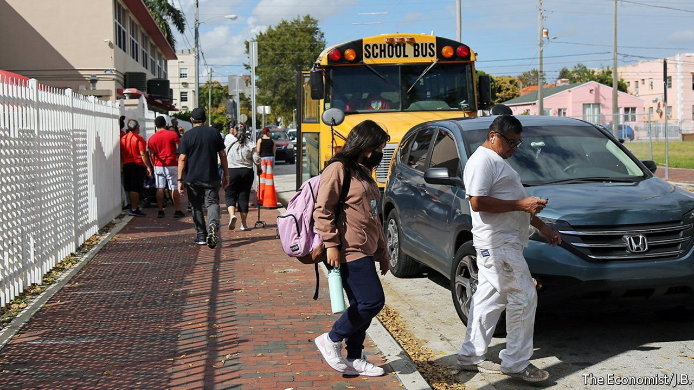

###### Making policy

# A peninsula that makes waves in policy formation 

##### Florida has a history as a policy laboratory 

 

> Mar 30th 2022 

IT IS BEST known as the home of “Florida Man”, infamous for oddball residents committing dubious deeds involving alligators and the like. Yet Florida has a record of creating policies that catch on elsewhere. An early example came in 1889, when it became the first state to adopt a poll tax, requiring people to pay to vote, in effect keeping black voters away from the ballot box, says Darryl Paulson, an academic. There are many other examples of pioneering policies, for worse or better. In 1967 lawmakers passed the first highly regarded “sunshine” law requiring public meetings to be open. This became one of America’s first open-meetings laws. Voters added to it in 1992 through a constitutional amendment guaranteeing the right of access to government meetings and records.

Other policies are more problematic. In 2005 Florida was the first state to pass a “stand-your-ground” law at the urging of the National Rifle Association, which makes it easier for people to claim self-defence. It has since spread to other states, with troubling consequences. Recently the law was invoked at a murder trial in Pasco County, Florida. The defendant was a former cop who shot a man in the chest at a cinema after a bag of popcorn was thrown at him. (In February, a jury found him not guilty.)


Education is another example of policy innovation. Jeb Bush, governor from 1999 to 2007, pushed through school choice, allowing students to use vouchers to attend charter and private schools with public funds. In 1999 Florida started America’s first statewide voucher programme. Under Rick Scott, Mr Bush’s successor, it was also the first to offer vouchers for students who were bullied to switch schools. Today almost half of Floridian students, from kindergarten to high school, participate in school choice. Florida’s public schools are in the middle of the pack, ranked 23rd out of 50 by Education Week. But its education initiatives have been popular, especially in poor families, says Bob McClure, president of the James Madison Institute, a think-tank.


California has been an incubator of progressive policies and Texas of conservative ones. Florida’s record is more mixed, befitting a closely divided state. With the state legislature under Republican control since 1996, policies that emerge from Tallahassee have tended to skew to the right. “Time and again, we lead the charge when it comes to conservative innovation,” says Kevin Cabrera of Mercury, a public-affairs firm, who was Donald Trump’s campaign director in Florida in 2020. Voters have been more progressive. Ballot initiatives have approved constitutional amendments to re-enfranchise felons and bar gerrymandering.

Political meddling has often obstructed change. Lawmakers voted to keep some government information out of public reach. Giving ex-felons the right to vote is another example. As of 2016, Florida claimed more than a quarter of America’s disenfranchised population, with one-fifth of black people unable to vote due to their felony records. In 2018 nearly two-thirds of voters approved restoring voting rights to ex-felons, but in 2019 the legislature passed a law requiring all court fines to be paid first, in effect blocking many from the ballot box.

Covid led to more new policies. Mr DeSantis has used his governorship to position Florida as a state of resistance against the federal government. He was early to outlaw mask and vaccine mandates. Florida was the first state to pass a law fining firms that imposed vaccine requirements and is now penalising school districts that defied the governor’s orders and required masks, a policy that some believe to be unconstitutional.

By taking a hardline stance, Mr DeSantis put prosperity and popularity ahead of public health. It is a wager that has paid off politically, elevating his and Florida’s profile, even though more than 70,000 Floridians died of covid. Yet predictions that Florida would lead America in deaths proved false: the state has a total death rate of 332 per 100,000 people, the country’s 15th-highest, close to New Mexico, which had stricter stay-at-home policies.

Is Florida visionary or merely haphazard, responding to political currents and day-to-day pressures? Mr Schale, the Democratic strategist, says the motive behind Florida’s policymaking is a will to be taken seriously. “There’s the sense we’re the unrespected stepchild of big states, and there’s the desire to be seen in the big boys’ club,” he says. Others see Florida’s record as mixed and inconsistent. Because population growth has been so rapid, policymakers have struggled to keep up with sensible and consistent policies, says Mr Paulson. Florida once led America in pushing for standardised testing and accountability for public-school students. But recently Mr DeSantis led the campaign to do away with annual testing, to boost his popularity. In Florida, one first plus another can sometimes equal zero. ■

