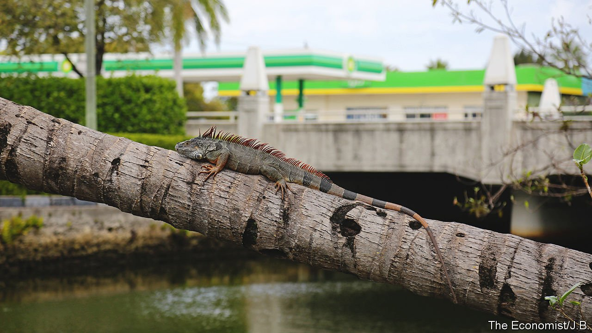
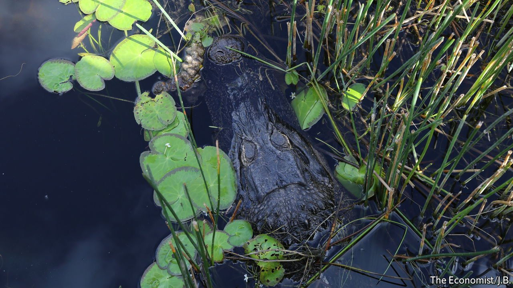
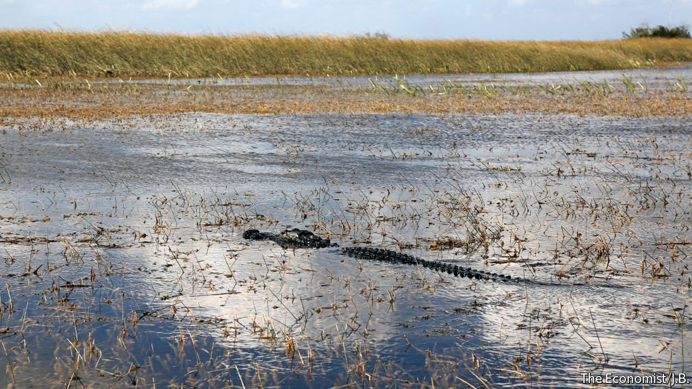

###### The environment, water and climate

# Florida faces a triple threat to its environment 

##### The environment is Florida’s biggest attraction, but also its biggest vulnerability 

 

> Mar 30th 2022 

CENTURIES AGO, manatees were symbols of dreams. Early explorers mistook them for mermaids. Now the gentle mammals are symbols of nightmare. Last year 1,100 manatees—around a seventh of those in Florida—died, the worst year since record-keeping began in the 1970s. Pollution-fuelled algal blooms have killed the seagrass they eat, leaving many to starve to death. Concerned researchers on the east coast Indian River Lagoon have started to feed manatees lettuce to sustain them. The manatees’ deaths shocked Floridians, but they are an “even bigger event than people realise, because it means that the environment has reached a tipping point”, says Craig Pittman, author of “Oh, Florida!: How America’s Weirdest State Influences the Rest of the Country”.

The environment is at once both Florida’s biggest asset and its greatest liability. Tourists visit and people move in because they are drawn to nature: the beaches, freshwater springs, reefs and national parks. Yet Florida is like an ecological O. Henry story, written with an ironic twist. Wittingly or not, people undermine what they love most through pollution, development and carbon emissions. Algal blooms that kill seagrass are fuelled by fertiliser run-off from gardens and farms, breached septic tanks and other pollution, in turn killing marine life and making beaches unattractive. The blooms spread more quickly in warmer waters, and temperatures have risen with climate change.


Water and swamp

Florida’s environment, already inherently fragile, has been further taxed by the explosion of a built one. The Florida panther, the official state animal, has been killed by habitat destruction and car collisions. Today fewer than 130 Florida panthers are left in the wild. The Everglades, which used to be double its current size, has been drained and filled in for development. As a reminder of how much man has changed the state, Disney World is built on land that once formed part of the Everglades ecosystem. Invasive species like iguanas and pythons have arrived in greater numbers.

Florida’s House of Representatives recently released a risk-assessment report commissioned from the consultancy Willis Towers Watson. Of 72 initial risks catalogued, 22 are linked to the environment, sea-level rise and climate change. With the purview of a ten-year time horizon, the report focuses on the most pressing problems, including water, sea-level rise and extreme weather that is becoming more frequent. Florida has experienced around 40% of hurricanes in America, more than any other state.

These are all difficult generational problems. The state must decide how much to weigh population growth, which fuels the economy, against the cost of investing for long-term benefits that will be appreciated long after today’s leaders have left office. And the problems are technically challenging too.

 


Consider water. “Without significant intervention” water quality and scarcity “will add up to a severe crisis over the coming years and decades”, the report says. Water problems belong in several buckets. Sometimes Florida has too much, with rainfall and sea-level rise causing flooding. Sometimes it has too little, contributing to drought and scarcity due to insufficient storage capacity. (On average, Florida has experienced a severe and widespread drought at least once a decade for the past 100 years.) Year-round there are concerns about quality, with specific instances like a leak in 2021 at the Piney Point phosphorus plant that led to 205 tonnes of nitrogen being dumped in Tampa Bay. More day-to-day worries include agricultural run-off and septic tanks, which treat one-third of the wastewater in the state and can sometimes contaminate water supply, since rising groundwater causes septic systems’ failure and the release of toxins from untreated sewage.

It may seem surprising that the Republican-controlled Florida House wants such a deep-dive on environmental concerns, but on this issue state Republicans sound more like Democrats than does the national party. “Republicans in Florida are more collectively connected to nature and understand nature as part of the economy,” says Dawn Shirreffs of the Environmental Defence Fund, a non-profit group. Mr DeSantis was elected in 2018 as an environmentalist, who supported bans on fracking and offshore drilling. He is no Teddy Roosevelt, animated by a personal connection to nature. Instead, he made a savvy political calculation, understanding voters’ fears over climate change.


This is a change from Rick Scott, his predecessor, who banned staff from uttering the words “climate change”. Mr DeSantis has said he does not want to do “left-wing” stuff and is unwilling to tackle the underlying cause of global warming by reducing carbon emissions, but he often speaks about the environment, including the need to restore the Everglades. The state legislature had agreed since 2021 to invest around $670m to fund “resilience” work in projects for communities vulnerable to sea-level rise. Mr DeSantis has also created a “chief resilience officer”, although this position has spent much time vacant and under-resourced. He is trying to walk a tightrope, bringing attention to environmental issues without putting in place regulations that would alienate businesses or curtail development.

Privately many say that the state is not doing enough, considering the extent of Florida’s environmental problems. There have been many headlines on Everglades projects, and both state and federal funding has been diverted there, some of which predated Mr DeSantis. Yet not much has changed, says Michael Grunwald, author of “The Swamp”, who says the problems, including a lack of water storage capacity, “are as bad as they ever were”.

Stronger moves needed

Some issues require bolder action and investment on a completely different scale. A task-force convened by Mr DeSantis to study blue-green algae recommended measures including state inspections of septic tanks, but not all of its suggestions have been implemented. “Florida is like a sick patient,” says Jonathan Webber of Florida Conservation Voters. “We brought the patient to the doctor’s and the doctor gave us a prescription, and then we threw the prescription in the trash.”

 


Current state funding will convert less than 4% of septic systems into sewers. But population growth and new development are expected to expand the number of septic systems by almost a quarter over the next ten years (the state has 2.6m septic systems, 12% of America’s total). This is an area needing huge investment. To convert septic tanks into sewers costs around $40,000 per residence, so doing it for just a quarter of today’s septic tanks would cost the state $26bn. Lack of action carries costs, though. Willis Towers Watson estimates that, without action, chronic contamination of the water supply will result in $73bn-80bn in damages over the next decade.

Sea-level rise is even costlier. Some 20% of Florida’s property is at substantial risk of flooding, and that will rise to 24% by 2050, according to First Street Foundation, a research group. Key West demonstrates the need to plan for the future. Teri Johnston, the mayor, says the cost of raising roads and making other adjustments for sea-level rise has been “astronomical”. The county is doing shoreline work to reinforce beaches, and the city has changed regulations around height limits for buildings, so they can be built higher above flood elevation. “We’ve invested millions, but it’s going to take billions, with a b,” she says. Tallahassee has provided some funding, but not enough direction, leaving most of it up to counties. “I would like to see more money, more strategy, more support for the entire state,” says Ms Johnston.

Mr Scott eliminated the Department of Community Affairs, which served as the central-planning group for where to develop, bowing to pressure from property firms that complained of red tape. Today there is no statewide strategy for managing population growth alongside environmental protection. “In a state as fragile as Florida, careful planning on where we’re putting homes is vital, and that’s not happening like it used to, at least on a state level,” says Mr Webber. He says that right now, “It’s the Wild West for real-estate developers.” ■

For more coverage of climate change, register for , our fortnightly newsletter, or visit our 

