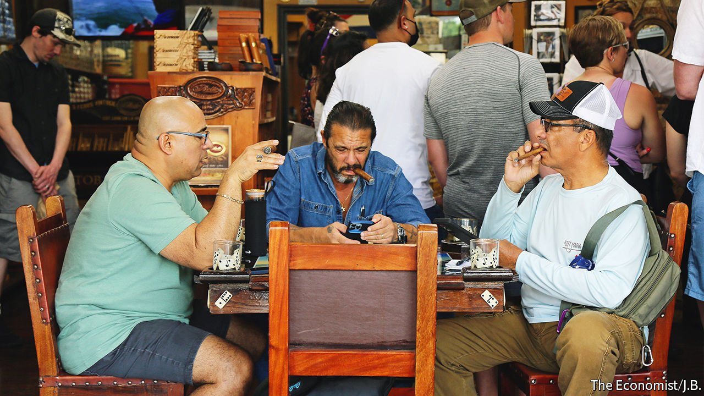

###### Miami’s makeover

# The bid to make Florida’s biggest city a tech hub 

##### An ambitious mayor is trying to transform Miami’s appeal 

 

> Mar 30th 2022 

URBAN RENEWALS rarely trace their origins to Twitter, but then Miami is no conventional city. “How can I help?” Francis Suarez, Miami’s mayor, asked on Twitter in 2020, after a tech entrepreneur suggested moving Silicon Valley out of the Bay Area. Mr Suarez has an enthusiastic following as he tries to rebrand Miami from a party paradise into a hub for digital finance and technology. He even sports a T-shirt carrying a “#HowCanIHelp?” tagline.

With the highest share of foreign-born residents of any metro area (more than half its people were not born in America), Miami is a vibrant city with a strong Latino influence. Its diversity is on display in the political leadership. Miami-Dade County is led by Daniella Levine Cava, a New York-born Democrat with Jewish heritage, and Miami city has Mr Suarez, a Republican whose father served as the first Cuban-born mayor.


Cubans arrived in the 1960s, turning Miami into a base for anti-communist organising. Mr Suarez wants to attract a different sort: coastal techies and others wanting to move from high-cost, high-tax states to a sunny climate. A handful of venture capitalists and investment firms have moved to Miami, as have some cryptocurrency exchanges. Mr Suarez was the first mayor to say he would accept his salary in bitcoin and has proposed allowing Miamians to pay bills in cryptocurrency. His embrace of crypto has attracted both interest and scepticism: some see it as the latest example of Miami playing host to a speculative bubble.

The city of nearly 500,000 has plenty of boosters. “The magic of this place is that people are happy,” says Keith Rabois, a venture capitalist who decamped from the Bay Area. “If you’re here right now, you’re actually shaping what this city is going to be versus joining an institution of what it already is,” adds Jeff Zalensky, a restaurateur who moved his firm’s headquarters from New York during the pandemic. He says that Mr Suarez’s approach to helping people relocate businesses to Miami is quite unlike other cities whose politicians fail to offer much support. “Isn’t that what public officials are supposed to do, help the people that are coming to their cities succeed?” he asks.

Can Miami be the “city of the future” that Mr Suarez touts? For Latin America-focused businesses it certainly has advantages. Its weather, lifestyle and eastern time zone are attractive for a jet-set crowd with global ties. The fact that Miami is not dominated by a single industry, as Silicon Valley is by tech, also enhances its appeal, says Grant Gittlin, an investor who has relocated. Of the top ten corporate employers in Florida, two are based in Miami: Navarro Discount Pharmacies, a chain of drug stores, and Royal Caribbean Group, a cruise line.

Yet the city has challenges. “No matter what people say about Miami, it’s mostly filled with people bringing resources from other areas and is still a difficult place to build a career,” says Richard Florida, author of “The Rise of the Creative Class”. He points out that by share of knowledge workers the Miami metro area ranks 50th out of 53 large metros with over a million people and 42nd for the share of adults with a bachelor’s degree or higher.

There is no top-notch university spewing out computer-science graduates, a drawback for an aspiring tech hub. Rising sea levels will become a problem. Housing is already one. Miami is one of the least affordable cities in America. Homelessness is at a record low, but it is a matter of time before an “explosion of massive street homelessness of our workforce”, predicts Annie Lord of Miami Homes for All, a non-profit group. “How is it that in a service economy, where we have pretensions of being a tech and finance hub, there isn’t a place for the labour force to live?” she asks.

Mr Suarez has hitched his career to Miami’s success. But urban challenges such as housing, education and labour supply are harder to deal with than receptive entrepreneurs. Mr Suarez makes no secret of his ambitions for higher office. He is expected to run for governor once Mr DeSantis vacates the post and is one of a growing cohort of Floridians with presidential aspirations. Plenty of Miami enthusiasts will be asking how they can help him navigate his political ascent. ■

