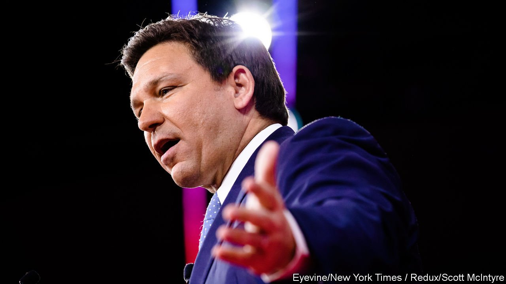
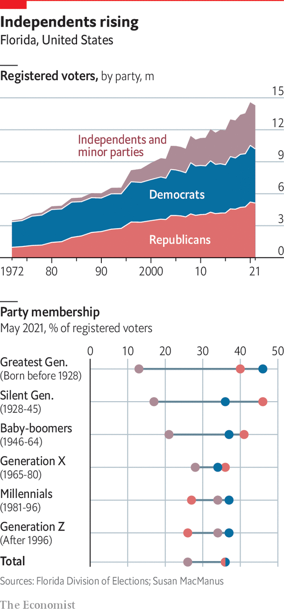
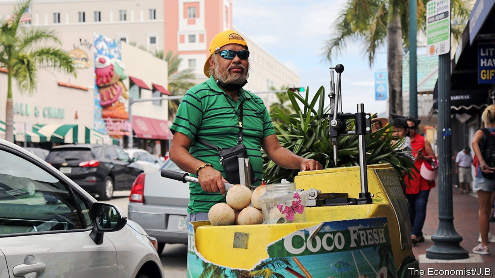
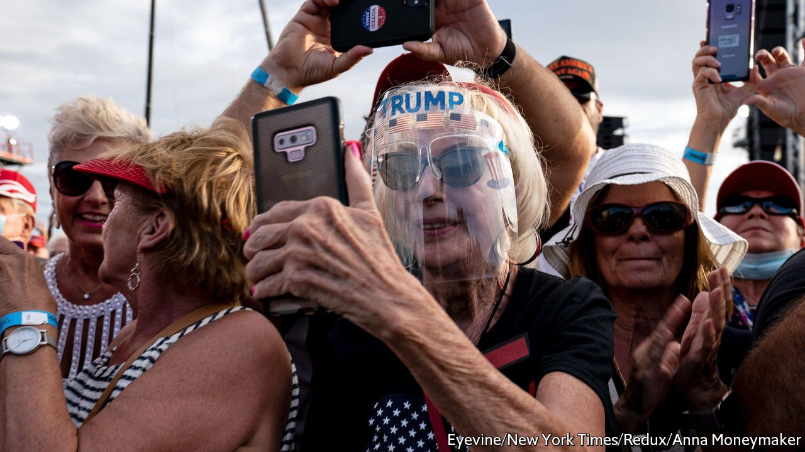

###### Politics

# The colour purple 

##### Is Florida still a swing state—or a Republican one? 

 

> Mar 30th 2022 

FROM GIANNI VERSACE to Ron DeSantis, Floridians like making fashion statements. On the website for the governor’s re-election campaign, fans of Mr DeSantis can buy “Escape to Florida” T-shirts, featuring prominent Democrats who have visited recently. Those looking for a head-to-toe makeover can opt for “Freedom over Fauci” flip-flops, denigrating Joe Biden’s chief medical adviser. Accessories include “Let us alone” beverage coolers and two golf balls with the tagline “Florida’s governor has a pair”.

Wardrobe choices aside, politics is a serious business in Florida, since elections have often been so close. The most famous example was in 2000, when George W. Bush and Al Gore were in a dead heat, triggering a recount and a Supreme Court ruling that handed Mr Bush the presidency, with a recorded majority of a mere 537 votes. Three more recounts occurred in Florida in 2018 alone. The three most recent gubernatorial elections have all been decided by margins of 1.2% or less.


Although Senate, governors’ and presidential races are intensely competitive in Florida, the state’s government has been under firm Republican control for decades. A Democrat was last elected governor in 1994. Between 2002 and 2020, Republicans won 25 statewide elections and Democrats only six. With Republicans close to a super-majority in the state House of Representatives, Democrats’ numbers are so attenuated they have no hope of halting laws they dislike. Evan Jenne, the House minority co-leader, describes Democrats’ experience as “lying down on the train track, even though we know it will drive right over us”.

In November Republicans are likely to beat Democrats in the mid-term elections and use this to highlight further inroads in the Sunshine State. Already they are trumpeting the idea that Florida is a former swing state that they have now permanently won. They point to voter-registration data from 2021, which for the first time showed the number of Republicans as higher than Democrats. It was only by some 43,000 people out of 14.3m registered voters, but that is a striking change from a decade ago, when Democrats’ registration exceeded Republicans by 558,000 voters.

 


News reports suggest the national Democratic Party is retrenching in Florida to focus on other competitive states, like Wisconsin, bolstering this image of mounting Republican strength. “There is definitely scepticism from national donors about Florida, and it’s scepticism that’s warranted,” says Steve Schale, who helped Barack Obama win Florida in 2008 and 2012. He adds that “a lot of Democrats’ money has been lit on fire in the state” with nothing to show for it.

Still swinging

Yet cut through Republicans’ chest-pounding, and the reality is that Florida has flared red but may not stay that way. It has seen political transformations before. When he was elected in 1998 Jeb Bush (George W.’s brother) became only the third Republican governor of Florida since Reconstruction. “We went from an evolution of being a blue state to a purple state, and now we’re between purple and red,” says Alex Sink, the former chief financial officer, who narrowly lost as a Democratic candidate for governor in 2010.

After Mr Obama carried Florida in 2008 and 2012, Democrats hoped demography was on their side, with growing populations of Hispanics and black people expected to vote blue. Today more than a third of Florida’s voters are non-white. Hispanics account for 17% of voters, non-Hispanic black people 13% and Asians 2%. Yet Hispanics are more diverse than in other American states, where they tend to be of Mexican origin, and there are plenty of blacks from the Dominican Republic, Haiti and elsewhere who do not share other American black people’s Democratic leaning. Demography is not destiny in Florida, at least not yet.

 


Democrats’ weakness can be explained by four factors. First is a disorganised and disempowered state party. As outsiders intent on taking power in the 1990s, Republicans invested time and money in voter registration and fielding candidates. Democrats had been in power for so long in Florida (as in much of the South) that they did not develop a formal and strategic organising structure to match the Republicans. If Democrats could do only one thing to change their fortunes, they would invest more in voter registration, says Mr Schale. Recently Democrats announced they would spend $2.5m to boost registration, but that is a piddling amount considering the vast size of the state.

A second, connected factor is weaker fundraising. Democrats struggle to raise the same amount as Republicans, which is encapsulated in this year’s governor’s race. As of February 1st Mr DeSantis had raised $81.5m, nine times more than the combined total of the three leading Democratic candidates. “Democrats are always a day late and a dollar short,” says Amy Mercado, a Puerto Rican Democrat who was elected as Orange County property appraiser in 2021 and formerly served in the legislature.

A third explanation is Republicans’ successful messaging to Hispanics. “Florida has been the showcase for where you see the Hispanic vote trending a little bit Republican,” says Ms MacManus of the University of South Florida. Republicans typecast Democrats as socialists, a dirty word for many in the state who fled socialist regimes. They are not just Cubans, who account for 29% of eligible Hispanic voters in Florida. Around 8% of Hispanic voters are Colombian, 3% Venezuelan and 3% Nicaraguan. “The Hispanic vote is a problem for Democrats,” says Annette Taddeo, the state senator and candidate for governor, who thinks Democrats “are not fighting back enough against the socialist label”. Puerto Ricans are a growing force in Floridian politics as well. Tens of thousands moved to Florida after Hurricane Maria in 2017. Puerto Ricans relocating from other American states tend to register as Democrats, but those from the island often choose no-party affiliation, making them more open to Republican outreach.

 


A fourth issue is the arrival of transplants from other American states. Around 41% of “baby-boomers” in Florida, aged 57-76, register as Republican, against 37% as Democratic, and they turn out in greater numbers. To see this, take a walk around The Villages, a retirement community that was America’s fastest-growing metro area in the past decade and may double in size in the next 15 years. Its 80,000 residents zoom around on golf carts and have an activity schedule that might have been written by a general. An essential campaign stop for Republican presidential candidates, The Villages voted overwhelmingly for Mr Trump. Residents often feel like “they’ve paid their dues and taxes wherever they’ve come from so their kids could go to school, and they don’t have an allegiance here,” explains Cris Andersen, vice-chair of the Sumter County Democrats, who lives in The Villages. “They want to reduce government spending for other people, just not them, so they don’t want to fund Medicaid but don’t want Medicare to be touched,” she explains, referring to health care for the poor and elderly.

As more people of all generations move into Florida from other states, the impact of migration on the state’s politics matters more. There are two schools of thought. One is that people will vote with the values of the states they leave, which are often blue. When covid is the main issue, Florida tilts Republican, but as the pandemic subsides and people vote on a more varied set of concerns, it is going to look more like a purple state and could eventually turn blue, reckons one veteran Republican. Some recent transplants may arrive and react badly to the anaemic level of social services and want the government to have a greater role.

An alternative narrative is that new Floridians are going to make the state even more Republican. Chris Sprowls, speaker of the Florida House, thinks there is already proof of how new arrivals will vote in registration data. “They seem to be registering as Republicans…and realising that there’s a reason they chose to come here,” he says, crediting Republican policies. Jack Abraham, a technology investor who relocated to Miami from the Bay Area, says he has seen “left of centre” people who spend time in Florida “move a little more right on the political spectrum than they were before”. It is also possible that recent transplants, including wealthy financiers and techies, could invest more in Republican campaigns in Florida, further sharpening the fundraising divide between Republican and Democratic campaigns.

Florida will see close electoral battles in future, but the battlefield will become more complex as Republicans and Democrats vie to win over Independents. Nominally independent voters disgruntled with both parties, who are known as no-party affiliation (NPA), are the fastest-growing “party” in Florida, with a share rising from 20% in 2004 to 26% now. (Nationally, the share of independents is growing too.) Worrying for both parties, NPA status is popular among Florida’s fastest-growing groups: Hispanics and Asians, as well as the young. More than a third of millennials and Generation Z are registered NPAs, versus 21% of baby-boomers. Some 40% of Asian voters and 36% of Hispanics are NPAs.

These swing voters tend to be more “candidate-centric” than “party-centric”, says Ms MacManus. This puts the onus on both Democrats and Republicans to run candidates that excite NPAs. Dan Gelber, the Democratic mayor of Miami Beach, recently wrote a letter to Manny Diaz, the chair of Florida’s Democratic Party, suggesting that they open up primary contests to NPAs, so that they can nominate candidates who will appeal to them. “Ironically, these are the folks that unquestionably determine every close election, yet they are treated as an afterthought,” writes Mr Gelber. Democrats still have much thinking to do. ■

