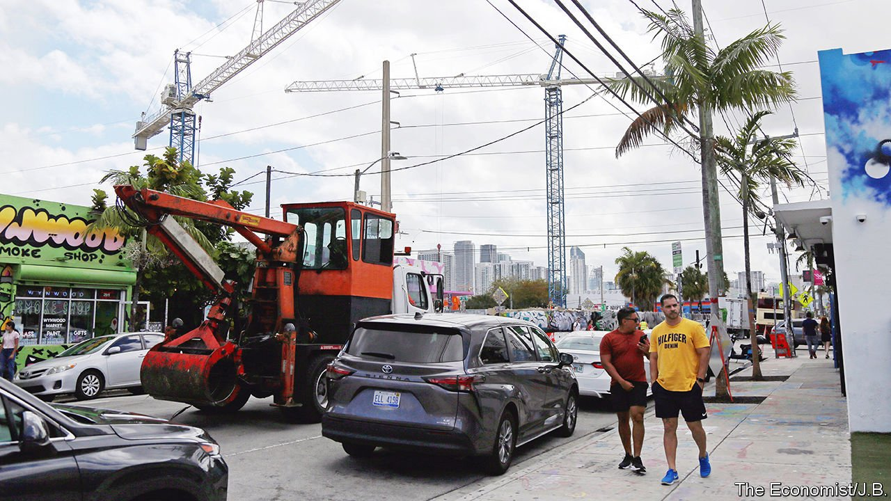
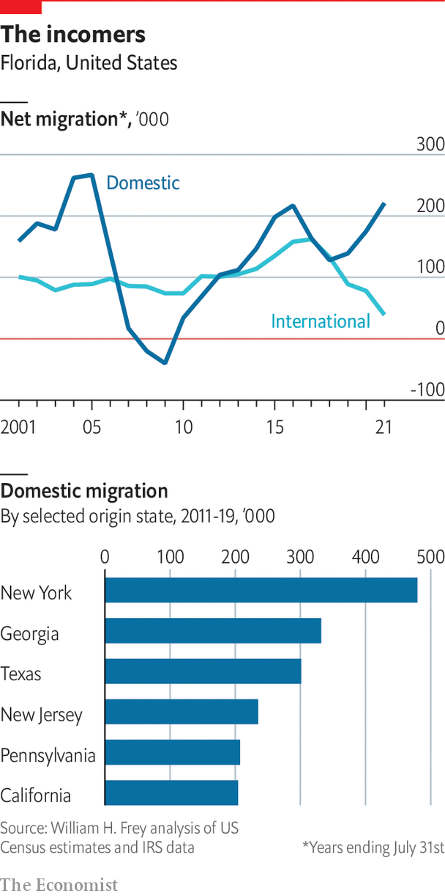
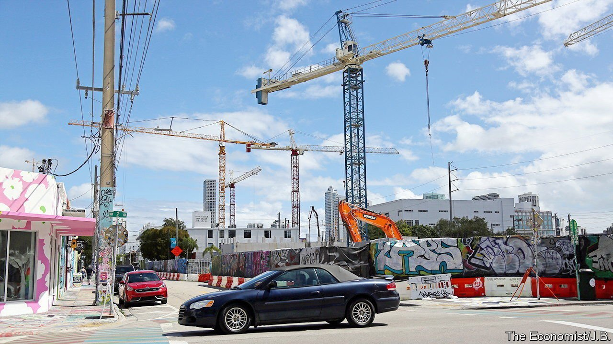

###### The economy

# The economy sees repeated boom and bust cycles 

##### Rapid growth is heating up the Sunshine State 

 

> Mar 30th 2022 

LONG BEFORE Walt Disney arrived in 1963 to survey the swamp land he planned to convert into a “magic kingdom”, Floridians understood how fantasy could boost their allure. In the 1800s St Augustine was a “pitifully poor fishing village”, so it was embellished to draw visitors, says Jim Clark, a historian. The fabled fountain of youth, which the Spanish explorer Juan Ponce de León supposedly found here, was the creation of an industrious woman who in 1910 scattered the site with Spanish artefacts. Gasparilla, a pirate-themed festival that attracts more than 300,000 people to Tampa each year, is also an invention: José Gaspar, for whom it is named, seems not to have existed.

It is said that Floridians feast on catfish in the summer and Yankees in the winter. In fact, they are an all-season staple. In 2019 tourism contributed $97bn to the economy and 13% of jobs. Around 130m people visited the Sunshine State, paying a 6% sales tax on most of what they bought. With no personal income tax, 82% of the state’s revenues come from transaction taxes, including sales and excise tax, against a national average of 48%.


Florida’s mascots are Mickey Mouse and the orange. The state produces 70% of the country’s citrus. But production has declined every year since 2003, as Americans drink less orange juice. This year Florida will have the smallest orange crop since 1945, due to declining demand and a bacterial infection. The largest farm sector in Florida is not oranges but plants and flowers, notes Michael Grunwald, author of “The Swamp”, a history of the Everglades.

 


Tourism and citrus may be symbols, but property is Florida’s heart. Generating around $160bn a year, the development, leasing and sale of real estate represents almost a fifth of state GDP. Aubrey Jewett, a political scientist at the University of Central Florida, says the state “relies on population growth as an economic model”. Cranes are as ubiquitous as beach chairs. Eight of the country’s top-ten hottest neighbourhoods for 2022 listed by Redfin, an estate agent, were in Florida. Seven were in the Sarasota area, a more affordable alternative to southern Florida that has seen house prices rise by 50% since March 2020. In December 2021 Miami’s rents shot up by nearly 50%, the most of any metro area, says Realtor.com, a website. In 2021 house prices in Florida rose by 26%, according to Zillow, which tracks housing data.


Migration is a big contributor. From July 2020 to June 2021, 220,000 more Americans arrived in Florida than left, 30% more than the average over the previous six years. It has been the top destination for American movers since 2014. Adding in foreign immigrants, Florida took in a net 260,000 migrants in 2020-21, equivalent to adding a city the size of Orlando. Sun and tax advantages are not new, but covid, the decision to keep schools and businesses open and the spread of remote working have caused many people to rethink their location.

“Work-from-home is the biggest thing to affect the growth of Florida since air-conditioning,” says Willy Nunn, boss of Homes by WestBay, Tampa’s largest private housebuilder. Whereas 15% of buyers of his firm’s homes once hailed from other states, that share has tripled since covid, with most coming from New York, New Jersey, California and Pennsylvania. The age of people moving to Florida is changing. “Planned communities” that once lured mainly retirees are now attracting younger families, says Lesley Deutch of John Burns Real Estate Consulting. According to Blake Gable of Barron Collier, a developer, communities that were around two-thirds retirees have shifted to two-thirds families.

Bubbles and squeak

Property speculation has altered the state before. In the 1920s southern Florida hosted “one of history’s wildest land booms, with speculation rivalling the Dutch tulip craze and immigration exceeding the California gold rush,” according to Mr Grunwald. Out-of-state buyers rushed to purchase land and houses. After the infamous fraudster Charles Ponzi was released from a Massachusetts jail, he relocated to Jacksonville and began another “Ponzi” scheme with a Floridian twist, selling sub-divided, underwater lots to unsuspecting investors. Then two successive hurricanes, in 1926 and 1928, bankrupted developers. By 2006 Florida was once again at the heart of a bubble as the subprime capital of America. When the market collapsed, people moved and tourists cancelled holidays, a double whammy for an economy so heavily reliant on sales tax and property.

As with these previous bubbles, the current one will change Florida. One way is through its industry mix. As more companies, including financial firms and technology outfits, move in, that should diversify the economy. With an ageing population, health care is the largest employer and is expected only to grow. Defence is another big employer, with Florida hosting 21 military bases, the largest number for any state after California. So is the space industry, which transitioned after the end of NASA’s space shuttle in 2011 into private space firms that offer top-paying jobs. Yet Florida still needs a greater diversity of industry and companies to reduce its dependence on property with its dramatic booms and busts.

Another way Florida could change is in its value-proposition and affordability. Underlying the state’s success has been the ability to attract cheap labour for tourism and development. Florida lacks a diverse array of star firms that pay high wages. Publix, the supermarket chain, is the largest employer. Next is Jabil, a manufacturing giant with a small public profile. The mean hourly wage in Florida is just around 90% of the national average.

 


Not only are house prices rising; so are insurance costs, due to extreme weather, fraud and lawsuits. In 2021 the state accounted for 8% of American property claims but 75% of lawsuits. Florida has America’s highest home-insurance costs. Average premiums in 2021 were $3,600, 158% above national levels. In the past two years rates for homeowners have risen by 25%, against a national average of 4%, according to the Insurance Information Institute, a research group. “Property insurance is the Achilles heel of Florida’s real-estate market,” says Jeff Brandes, a Republican state senator, terming it a “backdoor tax people pay to live in Florida”.

The Sunshine State is “converting from a low-cost, low-wage state to a high-cost, low-wage state”, says Dan Gelber, mayor of Miami Beach. This has meant staff shortages. Some growth in central Florida is driven by people moving out of expensive southern cities like Miami, says Amy Mercado, property appraiser for Orange County (which includes Orlando) and a former legislator.

A third way that Florida could change is its seasonality. Traditionally its population ballooned in winter, as “snowbirds” from the north flocked in, but depopulated in the summer. This meant erratic year-round receipts for businesses. Now “people are falling in love with Florida as a year-round destination, not just as a second home or vacation stop,” says Adam Putnam, a former state agriculture secretary. He sees this as a “big shift” and “game changer” which will be “enormously consequential for everything from schools to road infrastructure”. More people will require more public spending on infrastructure and other services but also contribute greater revenues to city and local governments.

Optimists hope that more people will still move to Florida. Yet longtime Floridians think it is a matter of time before the good times stop rolling. “In this state, there’s always a bust,” says Alex Sink, the state’s former chief financial officer. “Don’t ask me what the next one will be, but there will be one.” ■

