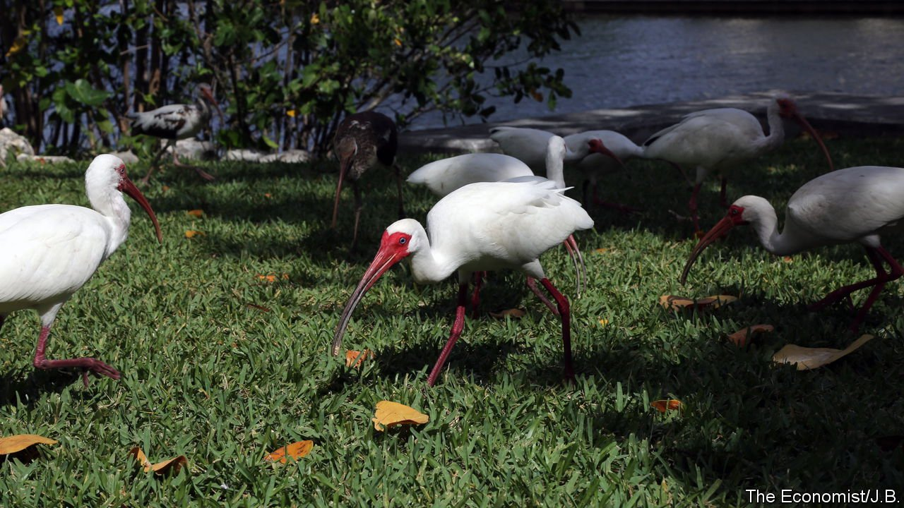
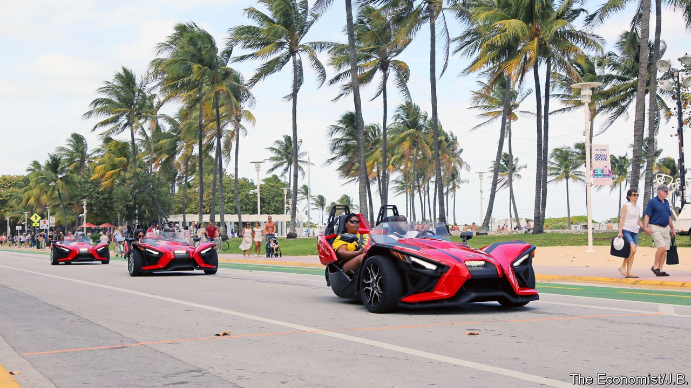

###### The way ahead

# What Florida can teach America 

##### Which side of paradise? 

 

> Mar 30th 2022 

AFTER SHE published her anti-slavery novel “Uncle Tom’s Cabin” and watched the country wage a civil war, Harriet Beecher Stowe became a snowbird, spending winters in the Jacksonville area. She was enchanted by the state but enraged by visitors’ exploitation of it, as they slaughtered wild birds to use their feathers in fashionable hats. “Florida has been considered in all respects as a prey and a spoil to all comers,” she wrote in “Protect the Birds”, published in 1877. She complained that Florida’s “splendid flowers and trees, its rare and curious animals have been looked upon as made and created only to please the fancy of tourists”.

Florida is still “prey” and “spoil” but to many more people than Ms Stowe could have imagined. Florida’s rapid growth has defied expectation and even reason. Replete with swampland and whipped repeatedly by extreme weather, Florida is among America’s least hospitable long-term habitats for humans, yet they continue to flock there. “There are two overwhelming conclusions we’ve drawn about migration to Florida: people know the risk and they move there anyway,” says Glenn Kelman, boss of RedFin, an online property firm.


Florida’s environmental fragility is one of the fault-lines in the state’s history. Southern Florida is but one catastrophic hurricane away from devastation. Even Flagler’s fortune could not withstand the impact of a big hurricane on his Overseas Railroad. “People are constantly ruining Florida; Florida is constantly ruining them back,” writes T.D. Allman in “Finding Florida”.

Some Floridians might be forgiven for paying less attention to the future. Retirees may just want to enjoy a sun-soaked life now, not to worry about the environment decades hence. But other people look farther beyond the horizon to see what storms might be brewing—whether actual or figurative.

A land apart—or a pioneer

What can Florida reveal about America? In many ways, it is a land apart from the rest of the country. Yet a state as diverse as Florida is also a mini-America, with its political divisions condensed into single blocks. The rise of minor parties and voters with no-party affiliation should be a reckoning for the two main national parties. Immigrants and transplants want a positive message about the future, not a dire one, which should be a wake-up call to Democrats to refine their campaigning to signal optimism and opportunity. The lurch to the right of Mr DeSantis and other Republicans, who prioritise social issues such as abortion over practical economic concerns of ordinary Floridians, is a political calculation that may yet backfire.

Nowhere are the intergenerational divisions that scar America clearer than in Florida. The elderly who retire there feel little connection to the state or much desire to invest in its future. Meanwhile, the young require more than “freedom” (Florida’s favourite rhetorical export) to thrive. With such austere investment in citizens and good government, there is a vast gulf between older migrants who import their fortunes and savings into Florida and those who want to build lives there, but face lower wages.

Florida is a test-bed for the limits of libertarian policies. The early 2020s may be remembered as America’s “Florida years”, with Mr DeSantis’s embrace of policies, such as anti-lockdown provisions, that put his state on the national stage. But now that Florida feels the pain of soaring house prices and displacement of the labour force by new arrivals, some voters’ faith that the free market alone is enough to fix things has been shaken.


Republicans don’t like talking of inequality and affordability because they think it plays into the hands of Democrats, says one lawmaker in Tallahassee. So Florida’s leaders are doing little to resolve the acute problems of the average voters, such as affordable housing. If Mr DeSantis is going to use Florida as a showcase for what he can do for the country as president, there are early warning signs. Having a covid policy that favoured businesses staying open should not be mistaken for having a comprehensive, strategic plan for economic and social success.

Many big challenges do not line up with particular administrations. The state, like America-writ-large, needs long-term investment and better planning. Environmental concerns are a prime example. Florida’s leaders subscribe to the philosophy that “more is more”. Mr DeSantis continues to celebrate growth, but adding the equivalent of a new Orlando every year will come at a cost, especially if it is ill-managed. With the department that once oversaw this having been scrapped, there is no longer an agency or person developing a growth strategy for the state, looking at where developers should build and where people should be encouraged to move. The result is a free-for-all that worsens environmental problems.

 


Americans may roll their eyes at Florida’s sun-seekers and see it as a far-off state with little relevance to their lives. That is short-sighted. Although politicians with ties to Florida have a dismal record of running for president (Mr Trump, former New York resident, notwithstanding), Washington may see another. Four Floridians—Mr Trump, Mr Scott, Mr Rubio and Mr DeSantis—are possible presidential contenders in 2024. The chance that either Mr Trump or Mr DeSantis could make it to the White House is on a par with the chance of a hurricane striking that year: not guaranteed, but not improbable.

The cycle of nature continues to humble those who have set their sights on Florida. The state is early to experience the effects of global warming—but hardly alone. Property-insurance rates are one indicator. Dramatic rises reflect a negative outlook and concern from insurance companies about hitching their financial future to Florida’s.

If, against the odds, Florida makes the essential investment and other changes necessary to protect it from the worst effects of severe weather and climate change, it will hold lessons for the country. Marjory Stoneman Douglas, an environmental activist, once called the Everglades a test: “If we pass it, we get to keep the planet.” Jonathan Webber of Florida Conservation Voters has a new twist: “If we save Florida, we get to keep the country.” ■

