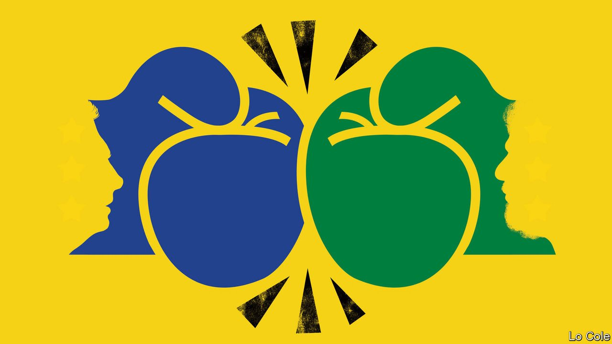

###### Bello

# Brazil’s presidential election in October will be about the economy 

##### Luiz Inácio Lula da Silva is ahead but Jair Bolsonaro is still in the running 

 

> Apr 2nd 2022 

“THIS IS NOT a fight of left against right,” Jair Bolsonaro, Brazil’s conservative populist president, told a rally in Brasília on March 27th. “It’s a fight between good and evil.” His opponents see the election on October 2nd, in which Mr Bolsonaro will seek a second term, in similarly apocalyptic terms. Many worry that Brazilian democracy would not survive another four years of Mr Bolsonaro, an avowed authoritarian who is contemptuous of the judiciary and the separation of powers. With the stakes so high, Brazil is on the threshold of a dirty and divisive campaign in which disinformation will be the norm and, some fear, violence a possibility.

Mr Bolsonaro’s victory in 2018 was a surprise. Long an obscure backbench congressman, he turned that contest into a referendum on the left-wing Workers’ Party (PT), which had governed Brazil between 2003 and 2016, and its leader, Luiz Inácio Lula da Silva, who was barred from running by a prison sentence for corruption. Mr Bolsonaro, a former army captain, also won votes by appealing to traditional values, by espousing a harsh line on crime and by exploiting social media. Chance helped, too: he was stabbed by a deranged individual a month before the vote, which brought him sympathy and kept him quiet when he had much to lose by talking.


Mr Bolsonaro ended “the kleptocratic state” and is the “best president since the military government” of 1964-85, claims Frederico D’Avila, a soya farmer from his party in the state legislature of São Paulo. Mr D’Avila displays a poster in his office extolling Augusto Pinochet, Chile’s former dictator, and Margaret Thatcher, a deregulating British prime minister. He shrugs off the president’s mishandling of the pandemic, which involved denying both the seriousness of covid-19 and the value of vaccines.

This is a minority view. Mr Bolsonaro’s approval rating is just 24%. And this time around he is no longer a novelty. Corruption and social conservatism may carry less weight as election issues than in 2018. The president faces an uphill battle against Lula, whose sentence was annulled by the Supreme Court on procedural grounds last year. The latest polls give Lula around 45%. Though many Brazilians would prefer a third option, no other candidate has more than 8%.

The election will mainly be about the economy. Mr Bolsonaro’s economy minister, Paulo Guedes, promised privatisations, plus radical reform of taxes and spending. He has achieved little of that. Emergency payments to 68m Brazilians in 2020 helped the economy bounce back from the pandemic. But it has since stalled. Income per person has not increased under Mr Bolsonaro and unemployment stands at 11%, as it did before the pandemic.

Ahead of the election, Mr Guedes has abandoned fiscal prudence. The government has cut taxes and is giving a renewed dollop of aid this year to 18m poorer Brazilians. That is a factor in a modest recent rise in Mr Bolsonaro’s support. But inflation, running at 10.5%, is quickly eroding the value of the aid. “The economy will get worse between now and the election,” thinks Zeina Latif, a consultant.

Meanwhile Lula, with no rivals to his left, is moving to the centre. He is poised to name Geraldo Alckmin, a former governor of São Paulo from the centre-right, as his running mate. Investors, disillusioned by Mr Guedes’s failures, are giving Lula the benefit of the doubt, says Ms Latif, recognising his pragmatism.

But many analysts expect a closer result than the polls suggest. That is because Lula, skilful politician though he is, has many vulnerabilities as a candidate. He and his party are still associated with corruption in the public mind. Though many poorer Brazilians remember the economic growth and social progress of his presidency in 2003-10, others recall his chosen successor, Dilma Rousseff, driving the country into its deepest slump in a century.

Mr Bolsonaro could still win, in other words. But a bigger worry is how he would react to his probable defeat. Imitating Donald Trump, his role model, he has tried to undermine confidence in Brazil’s electronic voting system, despite its impeccable record. He has vowed not to leave quietly. He has many supporters in the police and army; his loosening of gun laws means there are now more firearms in the hands of far-right groups and gun clubs. Degraded though they have been by Mr Bolsonaro, Brazil’s democratic institutions have survived so far. Their biggest test is to come.

Read more from Bello, our columnist on Latin America:

 (Mar 26th) 

 (Mar 19th) 

 (Feb 26th)

