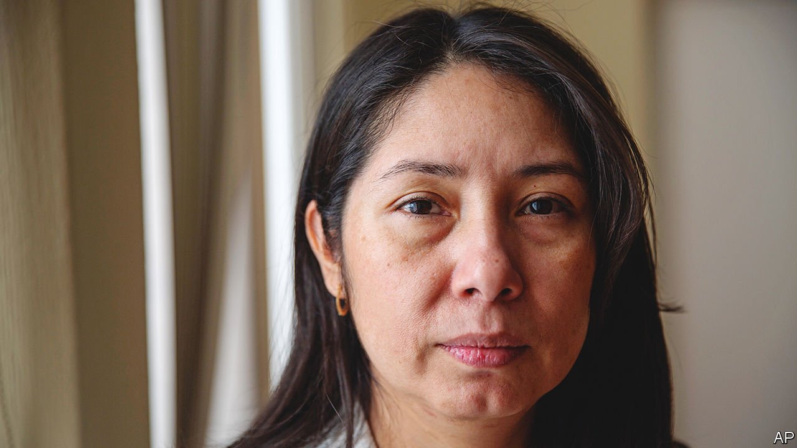

###### Injudicious judges

# Central America’s legal systems are increasingly corrupt 

##### In Guatemala alone some 15 legal officials have been forced to flee in the past year 

 

> Apr 2nd 2022 

“THE LAW IS a business,” says Juan, a 34-year-old who sells legal documents, including copies of the constitution, on a busy street opposite Guatemala’s highest court. “The laws I sell don’t apply; rather those with money get their way.” It is a common view in a country in which gun-toting men sometimes guard judicial offices, ostensibly to protect their inhabitants.

Corruption and impunity damage Central America in many ways, from the drain of public funds into private pockets to a dearth of investment owing to unreliable justice systems. In the Northern Triangle countries of Guatemala, Honduras and El Salvador, some $13bn each year is stolen through corruption, estimates the Council on Foreign Relations, a think-tank in New York. That does not include tax evasion or forgone investment.


In February El Faro, an investigative outlet based in El Salvador, published allegations that Alejandro Giammattei, Guatemala’s president, received illicit funds during his presidential campaign in 2019. (He denies wrongdoing.) On February 15th Juan Orlando Hernández, a former president of Honduras, was arrested on suspicion of aiding drug gangs. He will be extradited to the United States. Last year Mr Hernández’s brother was sentenced to life imprisonment in New York for drug-trafficking.

It is highly unlikely that either Mr Giammattei or Mr Hernández will be charged in his home country. In 2019 Mr Giammattei’s predecessor got rid of a UN-backed body which, for over a decade, had helped the attorney-general to investigate politicians and businessmen suspected of corruption, including two former presidents. Mr Hernández and Nayib Bukele, El Salvador’s president, have scrapped similar bodies in the past few years. (Xiomara Castro, the president of Honduras, wants the UN to set up an anti-corruption unit.)

Politicians and criminals constantly seek ways to influence the courts. Last year Mr Bukele forced all judges over the age of 60 or with more than 30 years of service to retire, rendering a third of posts vacant overnight. This allows him to stuff the judiciary with loyalists. Over the eight years that Mr Hernández was in power Honduras’s legal system was infiltrated by drug money, claims Lester Ramírez of the Association for a More Just Society, an NGO. He has documented cases of criminals paying off paralegals and magistrates’ drivers.

If money does not work then criminals or corrupt officials often resort to intimidation, instead. In Guatemala many lawyers, facing threats of prison or death, are fleeing north. Some 15 legal officials have been forced out of the country over the past year, including Juan Francisco Sandoval, who headed the office of special prosecutor against impunity, and Erika Aifán, a judge who had presided over cases involving bigwigs. She fled to the United States and resigned on March 21st after receiving death threats and lawsuits. The attorney-general, a friend of the president, tried to strip her of the immunity from prosecution she enjoyed as a judge. Speaking in her cramped office last year, she described how, “gradually, the barriers of protection around us are being dismantled.” ■

