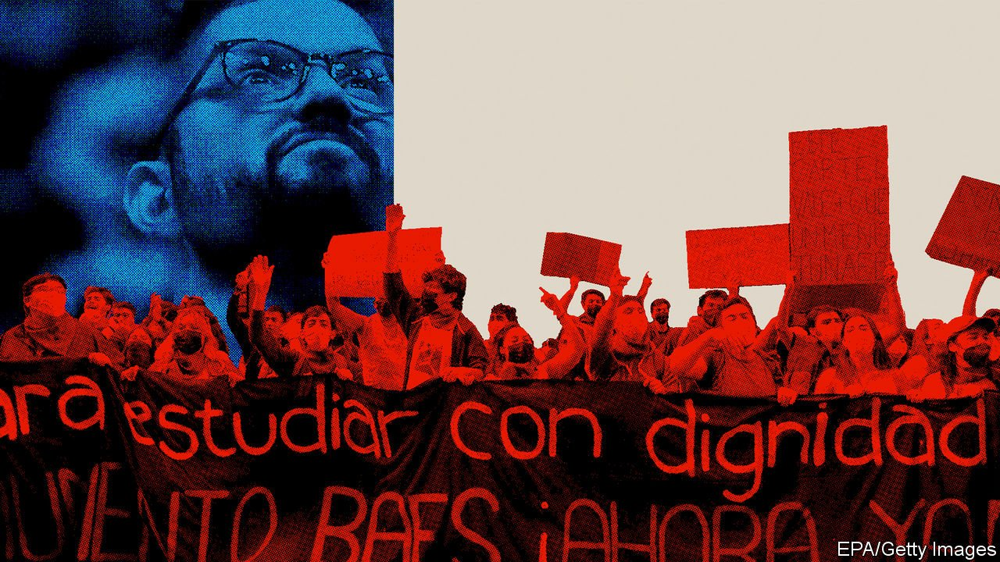
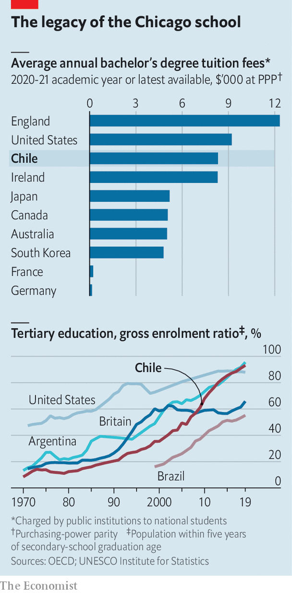

###### From protester to president

# Chilean education lurches to the left 

##### Gabriel Boric vows to forgive student loans and reduce testing in schools 

 

> Apr 2nd 2022 

ALEXIS MARAMBIO grew up in a tiny flat in La Pintana, a poor neighbourhood of Santiago, Chile’s capital. For most of his life he shared a room with his brother; his sister slept in her parents’ bed until she was 13. Leak stains still blotch the walls. Bars on the windows keep out thieves and most sunshine. “This is the raw side of Chile,” he says.

But Mr Marambio, who is now 30, defied the odds. He was the first in his family to go to university. His parents worked day and night to pay for some of his expenses, and he owes around $20,000 in student loans. Education was his ladder out of poverty. After working for the local mayor and then for a polling firm, he moved to a nicer part of town and bought his parents a house. On a visit to La Pintana a former neighbour greets him: “My boy, you’ve come back to visit the poor!”

 


His story reflects the success of Chile’s education system. Since the country returned to democracy in 1990, the number of students enrolled in post-secondary institutions has quintupled (see chart). By the mid 2000s seven in ten newly enrolled students were from the first generation of their families to attend university. Unsurprisingly, this expansion has cost money. Fully 59% of spending on tertiary education comes from households, compared with an average of 30% across the OECD, a club mostly of rich countries. Tuition fees in Chile are the highest in the OECD relative to purchasing power after Britain and the United States (but, as in both countries, financial support is hefty).

Yet discontent with education has led to some of the biggest protests in Chile’s history. In 2006 children demonstrated against perceived inequality in schooling; in 2011 university students did the same. Large, violent protests in 2019 were partly about college fees. It was as a student leader that Gabriel Boric, the newly elected 36-year-old president, rose to fame, along with many in his cabinet. “The fight for public, free and good-quality education was a fight for a different model of society,” he told a crowd in November. As president, he says he wants to reform education. But in its zeal for change, his government could make Chile’s problems worse.

Chile’s school system has long been unusual. Under the dictatorship of Augusto Pinochet, who ruled from 1973 to 1990, the country widened the use of standardised tests and set up a voucher scheme which provided public funds to privately run schools based on the number of children that enrolled. The idea was to increase competition and choice. Most parents chose voucher schools. Between 1981 and 2020 the share of children in voucher schools shot up from 15% to 54%. The share in government-run schools fell from 78% to 33%; the share in expensive private schools that did not take vouchers remained around 10%.

Some analysts credit the system for improving results. Chile scores the highest in Latin America on a test conducted by the OECD on the science, maths and reading skills of 15-year-olds around the world. Yet others fear that the voucher schools increased the gulf between rich and poor. Until 2016, when Michelle Bachelet, a former left-wing president, introduced a series of reforms, these schools often selected students using their own criteria, such as primary-school grades or whether parents were married in the Catholic church. They could also charge top-up fees.

A study from 2016 by Gregory Elacqua and Humberto Santos, two academics in Chile, compared the degree to which rich and poor kids were educated separately under the voucher system in Santiago with what would have occurred if students had attended the school nearest their homes. They concluded that schools were more segregated than neighbourhoods. This contradicts the claim that voucher schools simply reflect the societies they serve.

Richer Chileans also do better at university. In order to get into one, students must take an admissions test similar to the SAT in the United States. More than half of those who achieve top scores come from the 10% who go to elite (ie, non-voucher) private schools. Students who do not score well largely end up in less prestigious technical institutes. This means that many poorer students finish higher education with big debts and degrees that employers do not value much. Fully 54% of students who have taken out the main student loan have defaulted or are in arrears, compared with 32% of student debtors in America.

Successive presidents have tinkered with the system. Sebastián Piñera, the centre-right president during the protests in 2011, lowered the interest rate on the main student loan from 6% to 2%. In 2016 Ms Bachelet made university free for the poorest 60% of students. This bung to students was popular, even if the reform meant that there was probably less public money than there might have been for primary and secondary education. Between 2012 and 2018 public spending on tertiary education increased more in Chile than in any other OECD country, while public spending on non-tertiary education increased only somewhat faster than the OECD average.

Mr Boric has promised to improve state-run primary and secondary schools, but has so far provided few details. He has pledged to continue some of Ms Bachelet’s reforms, alongside increasing funding for public nurseries. However, he also wants to remove “market dynamics” in education, meaning competition. He wants to eliminate some standardised tests and replace an “extensive and content-filled curriculum” with one that emphasises creativity, gender, multiculturalism and the environment. Some teacher evaluations could be scrapped.

Fabián Guajardo of Nodo XXI, a leftist think-tank, says this will reduce pressure on teachers and students, something the teachers’ unions have long favoured. Cristián Cox Donoso of Diego Portales University in Santiago likens it to “tearing down a building that has taken two decades to build”. Policymakers need “to know every year if reading, maths, science, history and social-science targets are being achieved or not, to help them to respond better,” he says, but “the romantic left...wants to get rid of this.” The new education minister used to be a teacher.

Mr Boric also plans to forgive all student debt and extend the free public college scheme. His team puts the cost of forgiving student debt at $4.7bn. Other estimates are higher, if defaulted debts that are already being paid off by the state are included. In December Mr Boric estimated that the total cost of the policy would be $12bn, or 3.4% of GDP. The details of the plan are still being hashed out, but it is likely to be implemented over 20 years.

Mario Marcel, the new finance minister, appears to understand that forgiving student debt is a sop to the middle class. “What one wouldn’t want is for student debt forgiveness to be paid for by workers or slum-dwellers,” he says. He believes the policy should be funded by raising taxes. He aims to raise the total tax take from 21% of GDP to 26% in four years.

It will be hard for Mr Boric to back down from these promises. His supporters want their student loans written off, and will be furious if they are not. As the new president knows all too well, young, educated Chileans are not afraid to make their discontent heard on the streets. ■

