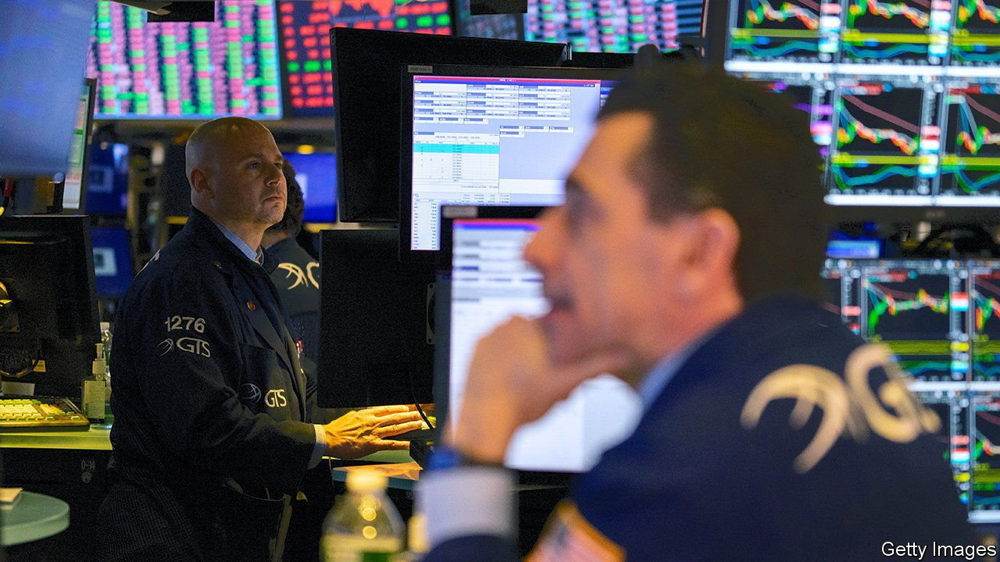
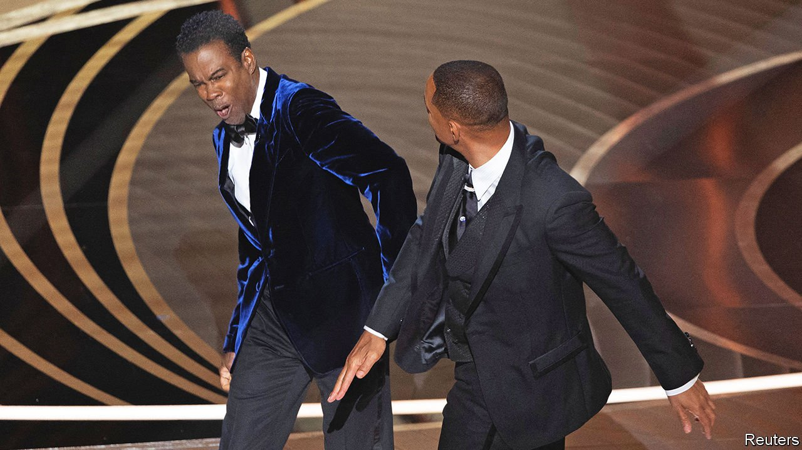

###### The world this week

# Business 

#####  

 

> Apr 2nd 2022 

The yields on short-term American bonds rose significantly, an indicator that markets are expecting hefty interest-rate rises from the . Pressure on bond yields was felt globally. Japan’s central bank offered to buy an unlimited amount of government bonds, an intervention designed to protect its 0.25% cap on Japan’s ten-year yield. Yields on two-year American Treasury notes briefly rose above those on the ten-year note for the first time since 2019 (government bonds with longer terms usually offer higher yields). Such an inversion of the yield curve is often taken as a sign that a recession is on the cards.

The cost-of-living crisis


Consumers in Britain borrowed an extra net £1.5bn ($2bn) on credit cards in February, the highest monthly figure since records began in 1993. The data suggest that with inflation at a 30-year high, people are taking on more debt to maintain household spending as prices increase. Andrew Bailey, the governor of the Bank of England, warned this week that consumers face a “historic shock” to their incomes because of inflation, fuelled mostly by energy prices.

Germany’s annual inflation rate is expected to come in at 7.3% for March, according to the country’s statistics office, the highest rate since German reunification in 1990. Inflation in Spain surged to 9.8%, the highest in that country for almost 40 years.

HP said it would buy Poly, which makes devices for video-conference communications, in a transaction valued at $3.3bn. The computer-maker said the deal would bolster its business in hybrid working. It reckons that 75% of office workers are investing in improvements to their home office set-ups; revenue in the “office meeting room solutions” industry is expected to triple by 2024.

The co-chief executive of SK Hynix, a South Korean chipmaker, said his company was interested in buying Arm through an investment consortium. Nvidia’s proposed $60bn acquisition of the British chip designer collapsed recently because of competition concerns. SK Hynix stressed that it does not yet have a specific plan to take over Arm.

Tesla announced its intention to split its stock, though it didn’t say when and what the ratio would be. The electric-car maker has split its stock before, in 2020, when shareholders were given five new shares (so reduced in value by four-fifths) for every one they owned. Stock splits are intended to drum up interest from investors who might be put off by the high price of a company’s shares. Alphabet and Amazon both recently laid out plans for 20-1 stock splits.

No longer here for the beer

Carlsberg and Heineken were among the latest companies to announce that they are leaving Russia. Carlsberg holds roughly a quarter of the Russian market for beer through its ownership of Baltika, which it will now dispose of.

Russia’s main stockmarket reopened trading in all its listed companies. This came a few days after trading in 33 equities was allowed to resume following a month-long shutdown because of the invasion of Ukraine. The MOEX index dropped by 2.2% on the first full day of operations.

Oil prices fell sharply, as America prepared to announce another large release of oil from its strategic reserve.

A regulatory filing revealed that the stock options Intel granted to its new chief executive, Pat Gelsinger, last year were worth $169.5m, much more than the company had initially calculated. Mr Gelsinger’s total pay package for 2021 came to $178.6m. That is more than the $98.7m Apple awarded to Tim Cook, which sparked a shareholder revolt.

Fred Smith decided to step down as chief executive of FedEx, which he founded 50 years ago. Mr Smith came up with the idea of a logistics firm based around transport hubs in an economics paper when he was a student at Yale in 1965. The paper received a poor grade from his professor; FedEx is now a global giant with annual sales of $84bn.

A private-equity consortium agreed to take Nielsen private in a $16bn buy-out. Nielsen’s main business, measuring advertising reach across network and cable television, is still viable. But the deal is also an investment in Nielsen ONE, a new platform that measures viewing across streaming, network and digital channels.

 


“CODA” became the first film released primarily over streaming to win an Oscar for best picture. “CODA” is available on Apple TV+, which has beaten Netflix and Amazon Prime, its bigger rivals, in having one of its streaming movies win the award. The main event at the ceremony, however, came when , perhaps channelling his boxing skills from an earlier acting role, hit Chris Rock, the host, onstage for insulting his wife. It was another first for the Oscars.

