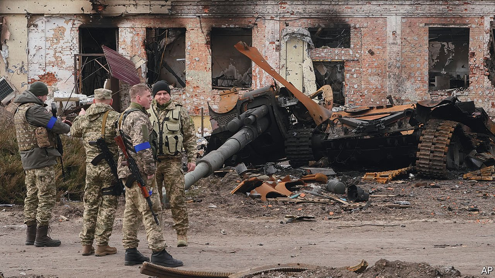
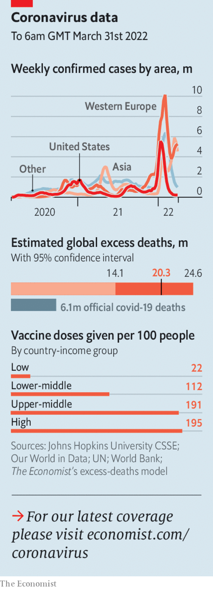

###### The world this week

# Politics 

#####  

 

> Apr 2nd 2022 

Russia said it would , the Ukrainian capital, and another northern city, Chernihiv, to concentrate on eastern Ukraine. More shells fell on both cities, but there were reports of withdrawals by Russian troops. Russia said it had achieved its goals near Kyiv, despite having conspicuously failed to capture the city. Ukrainian celebration was muted. The invading army may be inept, but it is huge, and continues to commit atrocities.

The jaw-jaw


Face-to-face peace talks resumed in Istanbul. Progress was slow. Ukraine does not want to give up territory. Vladimir Putin, Russia’s dictator, needs to claim some kind of victory. Ukraine hinted that it might accept being neutral, if it receives security guarantees it trusts. The Red Cross said “time is running out” for people trapped in Mariupol, a city devastated by indiscriminate Russian bombardment. The number of ; many more are internally displaced.

Roman Abramovich, a Russian oligarch who owns but no longer controls Chelsea football club, attended the talks. Reports suggested that he and two Ukrainian negotiators had been poisoned in Kyiv on March 3rd. Ukraine’s foreign minister cast doubt on the story, but warned negotiators not to eat or drink anything.

Germany triggered the first phase of an emergency plan to deal with a  of gas supplies from Russia, after Vladimir Putin insisted that purchases from “hostile” countries be paid for in roubles. Germany relies on Russia for around half its natural gas.

Joe Biden said that Mr Putin “”. He later clarified that he was “expressing moral outrage”, not calling for regime change in Russia.

Azerbaijan said it was prepared to negotiate with Armenia amid fresh tensions over the disputed enclave of Nagorno-Karabakh, which is populated mostly by Armenians. Armenia has accused Azerbaijan of breaking a ceasefire agreement, brokered by Russia after a conflict in 2020.

The foreign ministers of  Israel, America and four Arab states— Bahrain, Egypt, Morocco and the United Arab Emirates—held an  in the Negev desert. Israel and several Arab regimes share a fear of Iran. America and others are struggling to reach a deal to curb Iran’s nuclear ambitions.

Naftali Bennett, Israel’s prime minister, said his country was facing a “new wave of terrorism” after 11 people were killed in three separate attacks by Palestinians in eight days. The assailants were shot dead during the attacks.

Tunisia’s president, Kais Saied, dissolved parliament, which has been suspended since last year, after lawmakers met virtually to rescind decrees that he has used to consolidate his grip on power.

Eight UN peacekeepers were killed when their helicopter crashed in eastern Congo. The government said rebels from the M23 group shot it down, which M23 denied.

The police in London recommended 20 fines in relation to the “partygate” covid-19 lockdown breaches that occurred at Downing Street and other ministerial offices. The police made it clear that individual events, and therefore individuals, would not be identified.

Florida’s governor, Ron DeSantis, signed a bill into law that forbids classroom instruction on sexual orientation or gender identity for children below the age of ten. Detractors fear that the “Don’t Say Gay” law, as they call it, is so vague that teachers could be sued for the mere mention of a homo sexual relationship.

The Biden administration was reportedly ready to lift a covid-19 measure that speedily expels migrants on public-health grounds, even those who are seeking asylum. Scrapping “” would probably add to the number of people trying to cross the border from Mexico.

Nayib Bukele, the president of El Salvador, imposed a state of emergency after 87 people were killed in a three-day explosion of gang violence. The government said it had arrested more than 1,000 gangsters. On Twitter Mr Bukele posted photos and videos of half-naked suspects, who he said were gang members, with their hands held behind their heads.

President Jair Bolsonaro began his campaign for re-election ahead of  in October. Mr Bolsonaro is trailing in the polls behind Luiz Inácio Lula da Silva, who was president from 2003 to 2010.

Going, going…?

Imran Khan seemed on the brink of being ousted as prime minister of Pakistan after losing his parliamentary majority, when a party left his ruling coalition and some members of his own party turned against him. Mr Khan is believed to have lost the tacit support of Pakistan’s powerful army. He will soon face a no-confidence vote.

 


A virtual conference for donors to  Afghanistan got under way. The UN launched its largest-ever appeal for a single country. It hopes to raise $4.4bn; only 13% of that has been committed so far. Donors wish to help hungry Afghans, but not to prop up the Taliban regime that seized power last year. The Taliban announced that, despite a previous promise to the contrary, girls would not be allowed to attend secondary school.

The  said it had come to a security agreement with China. Leaked details suggest that Chinese ships, soldiers and police will visit “to protect the safety” of Chinese inhabitants and projects. Australia and New Zealand, which have been the islands’ main security partners, responded with alarm.

In an effort to curb an outbreak of covid, the authorities in Shanghai decided to lock down the city in two phases. First came the eastern half, which includes the main financial district. That prompted workers to move into their offices. Next will be the more populous western half. China is facing its biggest wave of cases since the start of the pandemic.

