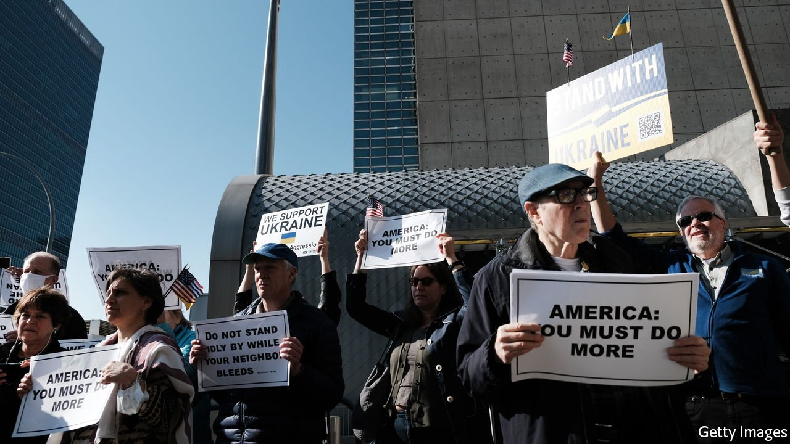
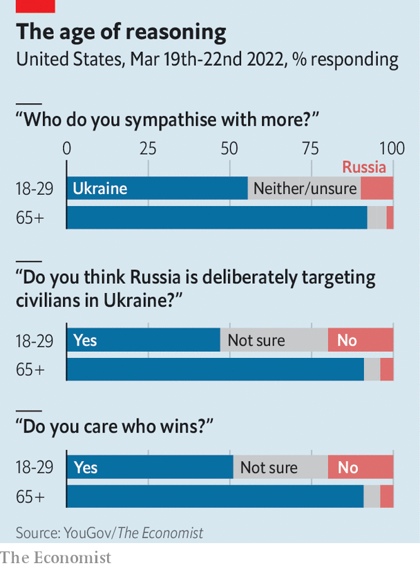

###### Public opinion

# Americans’ views on the war reveal a striking generational divide 

##### Memories of the cold war may be part of the explanation 

 

> Apr 2nd 2022 

IN THE MONTH since Russia invaded Ukraine, Joe Biden has called Vladimir Putin a “war criminal” and a “butcher”. New polling from YouGov/ The Economist suggests that younger Americans are far more equivocal in their views on Russia and the war.

Among some 1,500 people polled between March 19th and 22nd, 73% said they sympathise more with Ukraine than with Russia. Yet this disguises a big generational gap. Whereas 92% of those aged 65 and over said they sympathise more with Ukraine, just 56% of those aged 18-29 did—a difference of 36 percentage points.


Younger Americans are also less bothered about the war’s outcome: barely half of those under 30 said they care who wins, compared with 90% of those over 65. And although Antony Blinken, America’s secretary of state, has formally declared that Mr Putin is deliberately targeting civilians, younger Americans are not so sure. Just 47% of under-30s said Russia was targeting civilians intentionally. In contrast, 91% of older Americans agree with Mr Blinken.

 


YouGov/ The Economist also conducted polls in France and Britain during the fourth week of March, and there, too, a generational gap exists—though a smaller one. What might explain it?

One possible reason is that, on average, younger people tend to be less engaged in politics. Younger people who said they were interested in politics were more sympathetic to Ukraine than their less-engaged peers. But the gap between well-informed older Americans and well-informed younger Americans is still wide, at 28 points, so that can be only part of the story.

Perhaps the war seems distant to young Americans disillusioned by faraway conflicts in Afghanistan and Iraq. Historical fears of Russia may play a role, too. Americans 65 and older came of age during the cold war. Those aged under 30 were born after 1992, when the Soviet Union had collapsed. Yesteryear’s experience may still colour today’s views.

For exclusive insight and reading recommendations from our correspondents in America, , our weekly newsletter.

