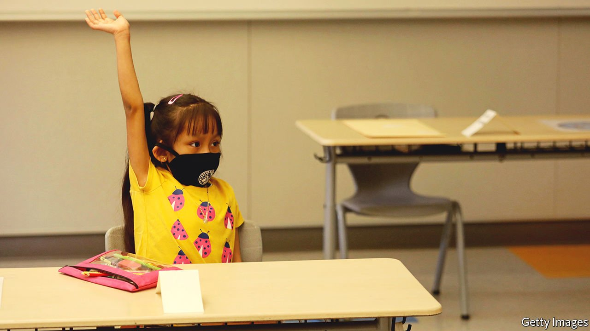

###### College bonds

# Los Angeles provides every first-grader with cash for college 

##### Automatic college savings can go a long way 

 

> Apr 2nd 2022 

A GIANT EXERCISE in giving away money to children is under way. On March 21st Los Angeles Unified, America’s second-largest school district, enrolled every first-grader into a free college-savings-account programme, depositing $50 for each child. With 44,000 pupils, Opportunity LA is the biggest college-savings scheme for children in the country.

Children’s savings accounts (CSAs) typically help towards a specific purpose, usually college or buying a home. Many barriers exist to amassing savings, especially for the poor. Foremost is a lack of funds to put away for later, but bad experiences with banks—worries about credit scores, for example, or fears about overdraft fees—also put people off. An automatic programme can encourage families to invest.


Opportunity LA will enable families to use the savings account for college fees and associated costs, such as tests and supplies. The funds can be used for any two- or four-year programme at an accredited institution. If families pay in extra money and file taxes in the county, they will receive a matching contribution (up to $25 each year). If a pupil leaves the district, the funds are forfeited and any family contribution returned. Families can opt out of the plan, but few are expected to do so.

Such efforts elsewhere have had success. SEED for Oklahoma (SEED OK) began 15 years ago. Newborns were randomly selected to receive $1,000 for the state’s college-savings plan, and compared with those not chosen. Families who got the money experienced long-term benefits. They were more likely to have opened an additional college-savings account for their children, and they had greater expectations for their child to complete graduate school.

SEED OK’s beneficiaries have yet to graduate from high school, but other studies have found positive outcomes from college savings, automatic or otherwise. One study found that poor children who expect to graduate from college and have up to $499 in their accounts are three times more likely to graduate.

Since SEED OK, other automatic programmes have started. In 2011 San Francisco became the first publicly funded universal CSA project in America. Two years later, Maine was the first state to require parents to opt out if they wished to avoid automatic enrolment; participation grew from 40% to 100%. Other states followed. A universal programme is expected to launch this spring in New York City, the largest school district, and California’s governor intends to launch a statewide programme soon. Seeds are being scattered across America.

For exclusive insight and reading recommendations from our correspondents in America, , our weekly newsletter.

