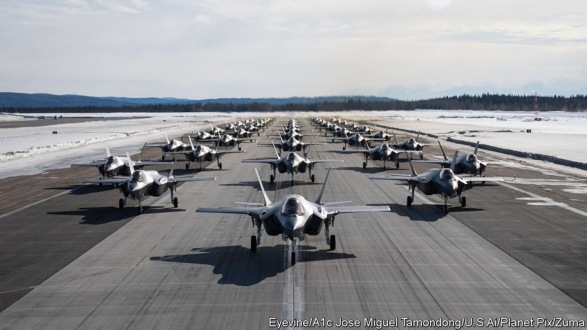

###### Defence spending

# The Biden administration’s defence-spending proposal is a muddle 

##### It looks hasty and lacks a needed sense of strategy 

 

> Apr 2nd 2022 

BY INVADING UKRAINE, Vladimir Putin has revitalised the world’s democracies and strengthened NATO’s resolve, President Joe Biden told an audience in Warsaw on March 26th. Two days later he submitted a budget to Congress that included $813bn in defence spending. He called it “one of the largest investments in our national security in history”.

The administration’s numbers may not match its rhetoric. America’s defence budget accounts for a whopping 40% of global military expenditures. But the proposed additional spending of $17bn above the total of $796bn expected this year represents an increase of only 2%.


That is lower than the budget’s projected rate of inflation of about 2.5%, which some economists think is optimistic, given the pace of price rises so far this year. The administration prefers to highlight the 4% increase in the base budget for the Department of Defence. The department’s budget excludes such things as spending on nuclear warheads by the Department of Energy, and supplemental outlays (for example, to help Ukraine and resettle Afghans who worked with America).

“This is going to be a real-terms cut in defence spending,” says Todd Harrison of the Centre for Strategic and International Studies, a think-tank in Washington, DC. He predicts that Congress, which can modify the president’s request, will add a hefty slice of extra spending—perhaps another $30bn—just as it did for the current year. “The politics on the defence budget have really changed substantially in the past two months. A year ago, we were hearing progressives in the Democratic Party talk about trying to cut the defence budget by 10%. Those calls have gone silent.”

As a share of GDP, defence spending has in fact fallen over the years, from 4.7% in 2010 to about 3.2% this year. The navy’s fleet is set to shrink. And a nuclear-capable sea-launched cruise missile is being cancelled. Leading Republicans have called for a budget that adds 5% above inflation. If, as seems likely, they take control of one or both houses of Congress in this year’s mid-term elections, they will have the clout to push for bigger increases.

The president’s request is something of a muddle. Although issued late, it does not take account of money that Congress recently agreed to spend, not least on Ukraine. Officials acknowledge that it may have to be reviewed later in the year. What is more, the request was not preceded, as was expected, by the publication of a national-security strategy.

Officials insist that the war in Ukraine has not changed their underlying analysis: Russia presents an acute menace and China is the longer-term challenge. Over the years the breakdown of spending has shifted from the army to the navy and especially the air force—a trend that continues in the president’s request—to strengthen the latter two in Asia in particular.

And a growing share, an extra 9.5%, has gone to “research, development, test, and evaluation”, not least in artificial intelligence. This helps to maintain America’s military edge in the long term, but generates little new capability in the meantime. That suggests the administration does not think it will be at war with China soon, despite the warnings of some commanders that China could try to invade Taiwan before the end of the decade. ■

For exclusive insight and reading recommendations from our correspondents in America, , our weekly newsletter.

