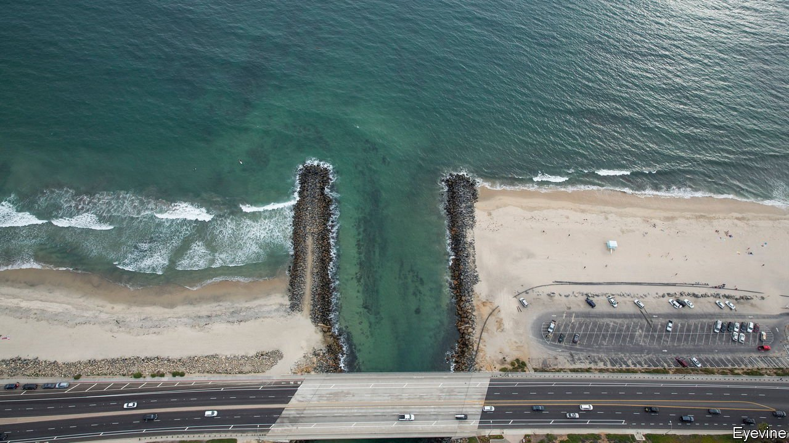
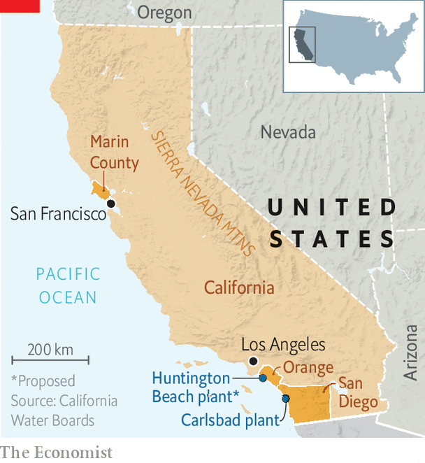

###### Hold the salt

# The promise and pitfalls of desalination 

##### California needs to diversify its water supply as the West dries up. How much can desalination help? 

 

> Apr 2nd 2022 

CARLSBAD STATE BEACH is a Southern California idyll. Palm trees adorn the cliffs above the sand, and surfers paddle out for the waves. From the beach it is impossible to tell that a huge desalination plant not half a mile away is sucking in seawater to produce 50m gallons of new drinking water each day. It is the largest in America—for now. Soon it may share that title with a proposed sister plant 60 miles (97km) north in Huntington Beach. But only if that one is built.

Poseidon Water, the developer that also built the Carlsbad plant, first proposed the Huntington Beach facility in the 1990s. But it has taken the company more than two decades to persuade Californians of the plant’s necessity. Many Orange County residents remain unconvinced or even hostile to the idea. Now the firm is waiting for a final permit from the California Coastal Commission. Without it, Poseidon says the project is dead in the water.


The fight in Huntington Beach has sparked a wider debate over what role desalination should play in preparing California for a drier future. A recent study found that the current drought is the driest 22-year period the south-west has seen in at least 1,200 years. Climate change has diminished snowpack in the Sierra Nevada mountains, shrivelling the rivers which feed California’s reservoirs. The state recently told farms and cities they would receive only 5% of their normal allocation from the State Water Project, a series of dams, canals and pipelines. Might desalination help make up the difference?

The arguments against desalination are well known. Environmentalists fret that the plants’ intake systems and the salty brine they discharge back into the ocean harm marine life. The reverse-osmosis process used to separate the salt from the water is energy-intensive. And desalination is the most expensive option among alternative water sources. An analysis from the Pacific Institute, a think-tank in Oakland, estimates that the median cost for a big seawater-desalination project is $2,100 per acre-foot of water (an acre-foot is about 1,230 cubic metres). Large water-recycling projects, the next-priciest option, cost roughly $1,800 an acre-foot.

 


To understand the costs and benefits of desalination in practice, look to San Diego. Investing in desalination seemed prescient when the San Diego County Water Authority (SDCWA), which supplies water to 3.3m southern Californians, began planning the Carlsbad plant in 1998, for two main reasons. First, when rivers run low, much of California can tap underground aquifers for drinking water and agriculture. But the far south-western corner of California does not have a large ground water basin, meaning the region long relied on water imported from elsewhere.

Second, a severe drought starting in the late 1980s cut the county’s water supply by 31%, says Sandra Kerl, SDCWA’s general manager. Those cuts (and an acrimonious relationship with water officials in Los Angeles, who controlled local supplies) scared local managers into exploring alternative water sources, such as desalination, to prevent rationing in future. Today, 10% of the county’s water comes from the Carlsbad plant and San Diegans can breathe easier in times of drought.

Now consider the costs. Over the past decade water prices have risen faster in San Diego than in Los Angeles. Kelley Gage, SDCWA’s director of water resources, argues that rates will climb across the state as other cities invest in recycling or shoring up leaky infrastructure. Desalinated water is also used inefficiently. Pristine water from the Carlsbad plant enters a centralised plumbing system just like treated water from the Colorado River, for example. “Utilities have to think about the fact that this water is too good to be flushed down toilets and used for watering lawns,” says Newsha Ajami, a water expert at the Lawrence Berkeley National Laboratory.

As San Diego was scrambling to diversify its water supply, demand was decreasing. Thanks to conservation efforts, per-person water use in California’s big cities has declined since 2000 even as populations have soared. Some San Diegans wonder if their expensive plant was necessary.

Desalination makes more sense in some parts of California than others. The Golden State’s water wonks point to the central coast, which often suffers from drought. Adrian Covert, vice-president of public policy at the Bay Area Council, a business association, suggests Marin County should also consider desalination. A wealthy county just north of San Francisco, Marin has the need—it is dependent on local rainfall—and the cash to invest.

Pipe dreams

Water-policy nerds favour desalination as a last resort, preferring conservation, recycling and capturing stormwater. “It’s all about lawns and leaks,” says Felicia Marcus, a former chair of the California State Water Resources Control Board. Yet most experts agree that desalination could play a larger role in the state’s water mix as technology improves. “Desalination is ripe for innovation,” says Peter Fiske, also of Lawrence Berkeley National Lab. Researchers are studying how to make plants more flexible through automation, whether the brine discharged back into the ocean can be used for something, and the economics of desalting water using solar power.

California is not the only state mulling desalination. Doug Ducey, Arizona’s Republican governor, wants to invest $1bn in the technology. The Biden administration has allocated $250m in funds from the bipartisan infrastructure law for desalination projects (a proverbial drop in the bucket). If and when desalination does take off, Ms Marcus warns that technology alone cannot “drought-proof” the state: “The idea that you can somehow build enough facilities to support urban California through desal is a pipe dream.” ■

For exclusive insight and reading recommendations from our correspondents in America, , our weekly newsletter.

For more coverage of climate change, register for , our fortnightly newsletter, or visit our 

