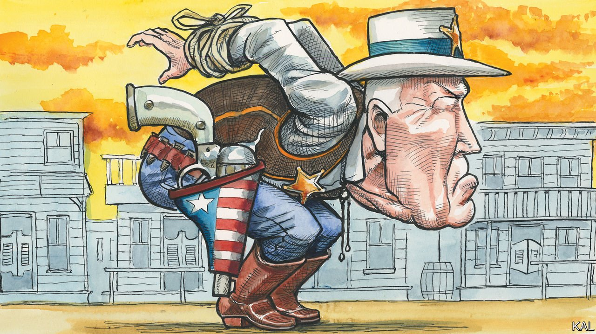

###### Lexington: Tripping over himself

# What Joe Biden’s gaffe says about his end-game in Ukraine 

##### Nine ad-libbed words mask his caution in dealing with Vladimir Putin 

 

> Apr 2nd 2022 

“I AM A gaffe machine,” Joe Biden once admitted, disarmingly. For proof consider his speech in Warsaw on March 26th. Vladimir Putin’s carnage in Ukraine was part of a global “battle between democracy and autocracy”, he declared, closing with an impromptu line: “For God’s sake, this man cannot remain in power.” Was Mr Biden advocating regime change in Russia? No, his aides hastened to say, soon followed by the president himself.

The political gaffe, the commentator Michael Kinsley memorably observed, is when a politician inadvertently speaks the truth. Mr Biden’s many slips often involve him getting muddled or, as in 2012, being unable to catch a double entendre. Seeking to cast Barack Obama as a hard man of world affairs, the then vice-president cited Teddy Roosevelt’s dictum about speaking softly and carrying a big stick. “I promise you, the president has a big stick.”


Mr Biden’s words in Warsaw were different, deliberate and in keeping with insults—“war criminal”, “butcher”—he has been hurling at Russia’s leader. Critics charge that, in suggesting he seeks Mr Putin’s downfall, Mr Biden will harden Russia’s resolve on the battlefield and at the negotiating table. This misses the mark. The reproach rings especially hollow coming from Republicans who still bow to the dangerously wayward and Putin-loving Donald Trump. (On March 29th he urged Mr Putin to reveal dirt on the Biden family.) There is little doubt the world would be better without Mr Putin; and he already thinks America is out to get him.

Rather, Mr Biden’s failing in Warsaw is what might be called the Reverse Roosevelt Doctrine: speak loudly and carry a small stick. To Poles and Ukrainians in the audience, Mr Biden’s most fervent lines carried disturbing implications. Telling Mr Putin “don’t even think about moving on one single inch of NATO territory” sounds like giving him carte blanche to do his worst in Ukrainian territory. “We need to steel ourselves for the long fight ahead” implies that he will do nothing to stop horrors quickly.

The parallels he drew—the Hungarian uprising of 1956, the Prague spring of 1968 and Solidarity’s strikes in Poland in 1980—all referred to events behind the iron curtain, where America had little influence. Mr Biden did not mention, say, Iraq’s invasion of Kuwait in 1980 or Serbian atrocities in Bosnia and Kosovo in the 1990s, which America halted through military action. Intervention in Ukraine, Mr Biden says, would risk “World War III”.

Finding a course between preventing Russia’s takeover of Ukraine and averting nuclear escalation involves much semantic and legal contortion. What weaponry is defensive, or what action escalatory? Mr Biden sends Ukraine anti-tank weapons, but not tanks; anti-aircraft missiles but not military aircraft. He is at pains to say what he will not do: no to American troops on the ground, no to no-fly zones. His response to Mr Putin’s madman nuclear threats is reassurance that America will not get involved. Mr Biden invoked the words of the late Polish pope, John Paul II, “Be not afraid.” Yet it is the president who seems frightened of tangling with Mr Putin, not the other way around.

How to explain this caution? The first and most obvious reason is that Russia has a bigger stockpile of nuclear weapons than America does, and a greater doctrinal propensity to use them. Even Mr Biden’s fiercest critics agree that getting into a war with Russia would be a bad idea. The second factor is Mr Biden’s aversion to America’s over-reliance on force, given the quagmires in Iraq and Afghanistan. Military action should be a last resort, not the first, he thinks; and should be used only when vital interests are at stake. His economic sanctions on Russia, he believes, are “a new kind of economic statecraft with the power to inflict damage that rivals military might”.

Left unsaid is that Ukraine is probably not as important to Mr Biden as, say, Taiwan. America sees Russia as a disrupter, and China as the only challenger to its supremacy. Another of Mr Biden’s gaffes last year is telling. Asked whether America would defend Taiwan from a Chinese attack, he replied: “Yes, we have a commitment to do that.” The White House rushed to clarify that the president intended no change in America’s “one-China” policy, or its doctrine of “strategic ambiguity” about defending the island. For Taiwan, then, Mr Biden does seem ready to risk nuclear war.

A cynical possibility, which many Ukrainians believe, is that Mr Biden wants a drawn-out war to exhaust Russia, at the cost of much Ukrainian blood. That may be too Machiavellian. There is little sign that the Biden administration has thought much about the end-game. It says it will not dictate the terms that Volodymyr Zelensky, Ukraine’s president, should accept. This is disingenuous given that Mr Biden in effect sets limits on what Ukraine can achieve. If Mr Zelensky does not have the weapons with which to evict Russian forces, he will have to give up territory; if NATO will not admit Ukraine, he will have to accept neutrality.

Shoot the bear?

Now that Russia is bleeding in the battlefield, prominent Americans want Mr Biden to go all-out to help Mr Zelensky rout the Russian army. Victory would revitalise democracy and might even bring down Mr Putin. Mr Biden, however, prefers the long game. Ukraine is bravely holding its ground, Russia is being weakened and China is paying a political cost for embracing Mr Putin. Only Russia’s leader knows what would make him resort to nuclear weapons, but a senior American defence official thinks the triggers probably include “the prospect of all-out conventional defeat of Russia’s military” or a threat to the Russian state (in other words, a threat to Mr Putin).

What about Mr Biden’s chin-jutting in Warsaw? It is probably moral outrage, as he says, with perhaps some cheap rhetoric. The president may be loose in his tough talk, and cautious to a fault in his actions. But in the nuclear age that is surely better than emulating a swashbuckling militarist like Teddy Roosevelt. ■

Read more from Lexington, our columnist on American politics: (Mar 26th)

 (Mar 19th) (Mar 12th)

Read more of our recent coverage of the 

