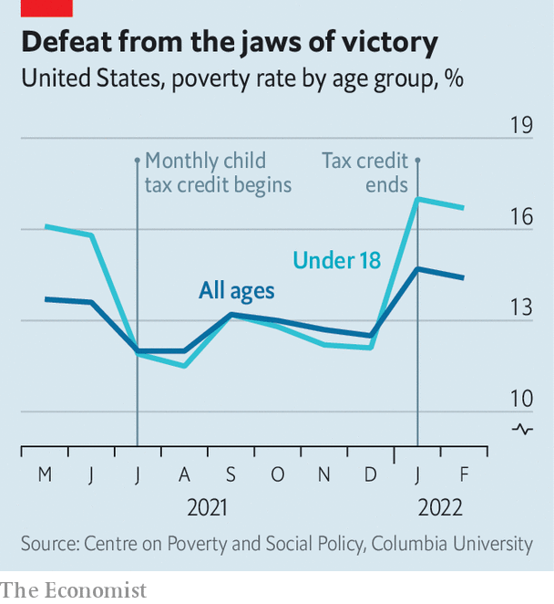

###### Child allowance

# Why America’s most successful anti-poverty programme is going cold 

##### The triumph of a giant experiment in child welfare is being squandered 

 

> Apr 2nd 2022 

RENUKA MAHARJAN is a dedicated woman. Over the past two years she has made a regular trip on public transport across three boroughs of New York City, requiring two changes and one hour in either direction, to reach The HopeLine, a food bank in the Bronx. Waiting in the cold outside it one morning, she says the food and nappies (a rare offering) are worth it: “Only my husband is working. I have to take care of my two babies, so this helps a lot.”

Rather than being supplements to the safety net, food banks such as The HopeLine have become something like stopgaps. The world’s richest country has done an especially poor job at looking after its youngest. Among industrialised countries, America has consistently ranked among the worst for its child-poverty rate. The reason for this is no real mystery: the welfare state does not redistribute much to the poorest families. Many of the countries with far lower rates of child poverty, such as Canada, Hungary and Poland, have achieved their success by creating child allowances—regular payments to parents of modest amounts of cash.


So there were grounds for optimism when America began an experiment—little noticed but grand in scope—with a child allowance. Created by the American Rescue Plan, the gargantuan stimulus bill that President Joe Biden signed in March 2021, the scheme began making monthly payments in July to the families of 60m children (most of the 73m in the country). These amounted to $300 a month for each young child and $250 for older ones.

For Ms Maharjan, who kept making her long trips to the Bronx, the monthly cash was enough to go from scraping by to begin “investing” in her children. “That helps a lot, especially for minimum-income people like me,” she says. She looks crestfallen as she remembers that the payments stopped in December—after Democrats, by failing to agree on much of the president’s agenda, could not approve an extension.

Those six months provided a full-scale experiment for whether European-style safety-net programmes could work in America. Sceptics doubted that the Internal Revenue Service would be able to turn itself into a quasi-welfare agency in a matter of three months. A senior White House official notes that Social Security and the Affordable Care Act required years of preparation before beginning.

The early assessments were rosy. Scholars at Columbia University developed a monthly measure of child poverty that is much speedier than the official annual data. Between June 2021 and July 2021 their estimates registered a large drop in the child-poverty rate—from 15.8% to 11.9%. Put another way, the number of children in poverty fell by 40%. That was the result of all covid-related relief programmes, but the monthly payments alone drove a 25% drop in poverty in their first month.

 


As uplifting as the result may have been, the converse is as dismal. Since the payments lapsed, the researchers calculate that most of the gains made against child poverty have been reversed (see chart). In December 2021, the rate was 12.1%. “By the end of the six months, in December, we saw close to 4m children being kept out of poverty,” says Megan Curran, policy director at Columbia’s Centre on Poverty and Social Policy. By February 2022, it had returned to 16.7%—meaning 38% more children (or 3.4m) were in poverty.

Rather than revel in a rare policy victory, America has instead managed to snatch defeat from its jaws. “We have had such a high rate of poverty because we’ve essentially treated America’s children like they are someone else’s children,” says Michael Bennet, a Democratic senator from Colorado, a longtime champion of a policy derided as Utopian until the pandemic hit. (Mr Bennet’s brother works for The Economist; he was not involved in writing or editing this article.) Mr Bennet has had a bittersweet experience: watching an idea he fostered become reality, but only briefly. “We cut childhood poverty, almost in half. And then we let it lapse and doubled childhood poverty,” says Mr Bennet.

Most pre-existing federal support programmes for children have means tests, work requirements or conditions on the use of cash. The generous child tax benefits lacked all of these features, yet seemed especially successful at reducing poverty. That is not because the old regime of child tax credits lacked generosity (offering a maximum annual benefit of $2,000 compared with $3,600 for the enhanced credit) but because it was poorly designed as an anti-poverty tool. Low-earning families often did not have enough income to justify receiving the full credit. Absurdly, half of African-American and Hispanic children were not getting the full benefit because they were too poor.

The admirably broad scope of the new policy may have limited its longevity, however. A plan to extend the benefits was one component of Mr Biden’s Build Back Better agenda, which floundered in congressional negotiations in December 2021 after Senator Joe Manchin, a pivotal Democrat of West Virginia, announced his opposition. Mr Manchin voted to create the expanded policy at the start of the Biden administration; of late, he has become concerned that it may exacerbate inflation, worsen the national debt and encourage sloth among working adults.

Efforts by his Democratic colleagues to convince him otherwise have so far been unsuccessful. “Senator Manchin has always supported the existing child tax credit that is still in place despite the pandemic emergency enhancement sunsetting at the end of 2021,” says a spokesperson for the senator, cautiously. “He continues to support policies that reward hard-working families as the effects of costly inflation taxes strain their budgets.”

Observers of the political dynamics in Washington, DC, seem pessimistic on the chances of something like the monthly scheme persisting. But a narrow compromise may still be found, correcting the inadequacies of the old design and assuaging Mr Manchin’s fears. “I’m happy to pay for it. I would say let’s extend it for ten years and let’s pay for it,” says Mr Bennet, the Colorado senator. “I can’t think of anything we could do that would make more of a return on our investment than this.” ■

For exclusive insight and reading recommendations from our correspondents in America, , our weekly newsletter.

