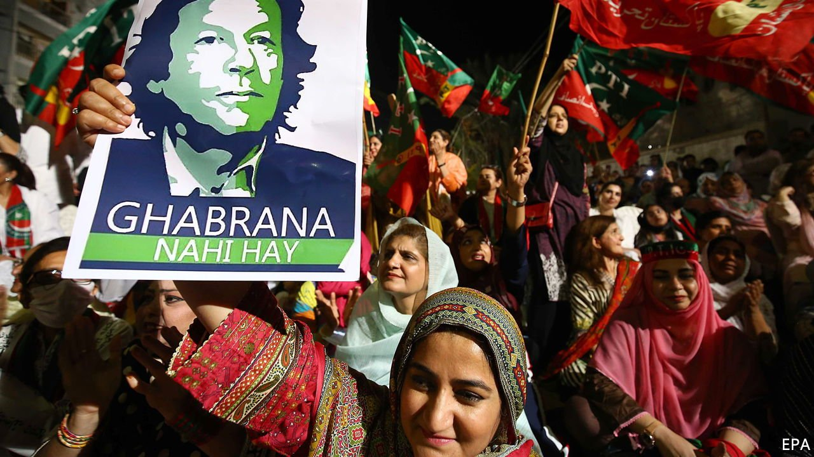
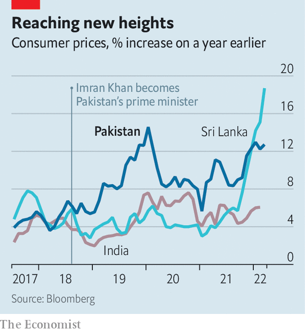

###### Not cricket

# Imran Khan is trying every trick in the book to stay in power 

##### Pakistan’s prime minister has pitched his country into a constitutional crisis 

 

> Apr 9th 2022 

IF IMRAN KHAN’S opponents hoped their push to unseat him would move at the blistering pace of a Twenty20 cricket match, the Pakistani prime minister has instead dragged them into the slog of a five-day Test. Tension had been building as Mr Khan’s precariously ruling coalition frayed. It looked as if enough defectors had joined the opposition to bring down his government in a no-confidence vote in Pakistan’s National Assembly on April 3rd. But the prime minister, who captained Pakistan’s triumph in the 1992 World Cup cricket final, bowled a googly. He declared the bid to unseat him a foreign conspiracy, dodged the floor vote, dissolved parliament and called for fresh elections.

Opposition legislators cried foul. They said Mr Khan had violated the constitution by getting the deputy speaker of the assembly, a close ally, to quash the vote on vague grounds of a national security threat. The Supreme Court was called in to umpire the mess. The judges have refused to be rushed. On April 6th they held a third day of hearings, and were due to resume on April 7th. Pakistan is meanwhile in constitutional deadlock.


If the judges rule against Mr Khan, the no-confidence vote will be held and he will almost certainly be out of power, less than four years into his five-year term. A new government, probably a broad coalition led by Shehbaz Sharif, the brother of Mr Khan’s predecessor Nawaz Sharif, would then be in charge.

The court could rule instead for fresh elections under a caretaker government. By law such a vote should take place within 90 days, but officials say it might take longer to prepare. This could give Mr Khan what he wants, which is time to mount a counter-offensive against opponents he berates as corrupt. The court could also simply dither. The longer the legal stand-off ensues, the less inclined the judges would be to reconstitute the assembly and reimpose the vote, the opposition fears.

The crisis has flared quickly and reflects a rapid downturn in Mr Khan’s fortunes. The 69-year-old won power in 2018 on an anti-corruption platform, promising to dislodge the country’s venal political elite. He also vowed to create an Islamic welfare state.

But though he had some success averting damage from the pandemic, extending a social safety net and offering health insurance, Pakistan’s worsening economy is hurting ordinary people. Inflation is almost 13% (see chart). The Pakistani rupee trades at more than 180 to the dollar, 50% more than when Mr Khan took charge. The World Bank says GDP per person has fallen from nearly $1,500 in 2018 to $1,200 in 2020. Mr Khan’s confrontational style and insistence on jailing “corrupt” political opponents also left little room to manoeuvre while defending a slim majority.

 


But many believe the biggest factor in his fall has been a breakdown in relations with the chief of the army staff, General Qamar Javed Bajwa, though Mr Khan denies a rift. The army for its part has always insisted, implausibly, that it is politically neutral. For years, Mr Khan’s opponents have charged that he owes his ascent solely to the powerful, unaccountable military establishment that has ruled Pakistan directly for much of its history and pulled strings for much of the rest.

General Bajwa and Mr Khan appeared to clash in October over who should be head of the armed forces’ formidable Inter-Services Intelligence (ISI), a sprawling agency with covert fingers in many pies, including Afghanistan. The suspicion that Mr Khan wished to disrupt the military line of succession in order to have his own man in the top job proved too much for General Bajwa, some analysts believe.

Mr Khan’s railing against America and its allies may also have alarmed the army. The prime minister appeared in Moscow, shaking hands with Vladimir Putin, on the very day that Russia invaded Ukraine. That was perhaps seen as an embarrassment—though not by Mr Khan, who has roused supporters by declaring that America is conspiring with the opposition to oust him for daring to pursue his own foreign policy, and for seeking good relations with Russia and China. Yet Mr Khan has given no evidence of any plot and America dismisses the charge as baseless.

Cosy relations with the army are unlikely to resume, whatever the Supreme Court rules. This could spell trouble for Mr Khan, regardless of whether his fate is handed back to parliament, or to the polls. Yet the prime minister’s populist gambit—casting his looming parliamentary defeat as international persecution abetted by a traitorous opposition—may prove tactically deft. Polling by Gallup suggests that 36% of Pakistanis buy the conspiracy line. Among shopkeepers in a commercial district of Rawalpindi that voted for his party in 2018, many accept his claim that the West is out to get him. “America will never want Imran Khan in power, because he is not a yes-man,” says Mohammed Zahid, who sells embroidered women’s tunics. “External powers don’t like that our country now has true leadership.” ■

