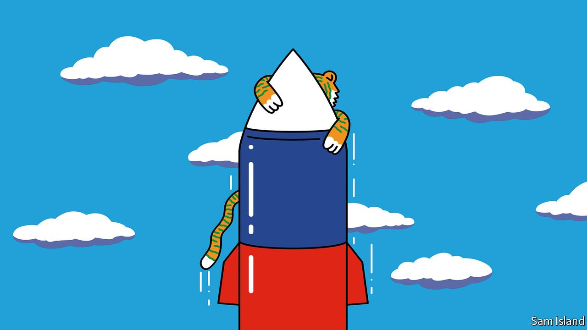

###### Banyan

# India’s vaunted strategic autonomy is a mirage 

##### The country remains economically and militarily dependent on outsiders 

 

> Apr 9th 2022 

IN THE EARLY evening of March 9th a supersonic cruise missile blasted skyward from a site in northern India. Within 200 seconds it had streaked across the Pakistani border. When it smacked to the ground just minutes later, it was 124km inside the territory of India’s nuclear-armed enemy. Luckily no one was harmed. Lucky, too, that Pakistan did not respond to the intrusion, except to ask an embarrassed India what had gone wrong.

The answer is still not clear, though India did say that there had been a regrettable mishap. What is known is that the wayward projectile was a BrahMos missile. Estimated to cost some $2m each and fired from land, sea or air, the nuclear-capable weapon is one of the most potent India possesses. It is also among the most visible products of a deep, decades-long partnership between state-run Indian and Russian arms-makers. Even its name, combining the Brahmaputra and Moskva rivers, suggests a sangam, or confluence, of interests.


This entanglement is one of the reasons why, seven weeks into Russia’s war on Ukraine, India finds itself in an uncomfortable position. The trouble is not just the sight of so much Russian armour, of exactly the sort that still makes up most of India’s own arsenal, getting smoked on the plains around the Dnieper. It is also the attachment of the Indian state to a historic partner that could do something so capricious, destructive and stupid as to try to devour Ukraine.

That has forced Indian diplomats into a marathon of fast talking and fancy footwork. The question they have struggled to answer is one that Joe Wilson, a Republican congressman from South Carolina and self-declared “friend of India”, pressed on Lloyd Austin, America’s defence secretary: how, he asked in a congressional hearing on April 5th, could a fellow democracy like India be persuaded to join its “natural allies” in the West?

Some Indian officials are blunt about the dilemma. “We know Putin is a shit,” says one lawmaker from the ruling party, before explaining that reliance on critical Russian spare parts and technology limits room for manoeuvre in Delhi. Defending India’s 11 successive abstentions in UN forums since the invasion—except for a strongly worded statement that “unequivocally condemned” the massacre of civilians in the suburbs of Kyiv—others speak of a long tradition of non-alignment. They note that just as leaders in Delhi declined to condemn Russia, they similarly abstained from blasting America when it stomped into Iraq. Some more boldly say that Ukraine is Europe’s problem, that India is simply asserting its own freedom to choose, and who says India belongs to the West anyway?

India’s Western suitors, keen not to alienate a country that is key to their own plans for managing China, have now muted their criticism of its position. Within India, the government’s prickly resistance to what is portrayed as Western high-handedness and hypocrisy has been popular. For the time being, then, it looks like India may pay little price for breaking with the democratic pack over Ukraine. Indeed, it may profit from buying discounted Russian oil.

Yet the self-congratulatory patter now echoing in Delhi’s corridors of power, about having told bossy Westerners where to get off, may be premature. The Ukraine crisis has sent fawning envoys scurrying to India’s capital. But it also reveals the country’s underlying weaknesses. Dependence on imported arms is one of these. The BrahMos project, for example, is 24 years old. Most of its inputs are now Indian-made, but Russian parts remain crucial.

Economic vulnerabilities, such as a near-total reliance on imported fossil fuels, have also come into sharp relief. Facing crucial state elections in February, India’s government held down petrol prices from mid-December to mid-March. Now soaring back up to Ukraine-boosted global levels, they are causing a painful shock. No wonder those Russian oil discounts look so tempting.

Josh Felman and Arvind Subramanian, a pair of economists, argue in a recent article that India’s rulers may be fooling themselves into believing that the country’s apparent military and economic heft translates to major-power status. In fact, an undersized domestic market for consumption and a small tax base with which to pay for defence upgrades mean that India remains a middling power in need of rapid, sustained economic growth. Their advice: India “must look past the illusion of size and reconcile itself with strategic realities”.

Read more from Banyan, our columnist on Asia: (Apr 2nd)

 (Mar 26th) (Mar 19th)

