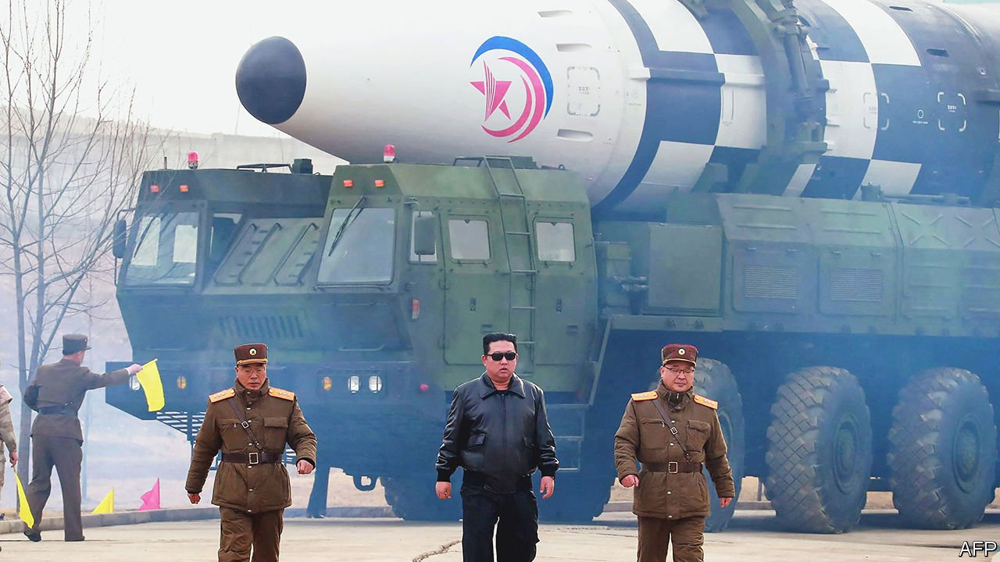

###### Bursting into Hwasong

# North Korea is testing ICBMs again. Nuclear weapons may be next 

##### A heated exchange between the two Koreas hints at rising tensions 

 

> Apr 7th 2022 

AT A CEREMONY on April 1st Suh Wook, South Korea’s defence minister, boasted that South Korea could “accurately and swiftly strike any targets in North Korea”. Kim Yo Jong, a high-ranking North Korean official and the sister of Kim Jong Un, the country’s dictator, quickly fired back, accusing the “scum-like guy” of “senseless bluster” for threatening a “pre-emptive strike”. She later added that the South Korean army would “face a miserable fate little short of total destruction and ruin” if it were to attack.

The colourful exchange comes at a time of rising tensions. For over four years the North has refrained from testing nuclear weapons or the intercontinental ballistic missiles (ICBMs) needed to deliver them to America’s shores, supposedly because the weapons’ development had been completed. Now both programmes appear to be coming out of hibernation.


In late February and early March North Korea conducted two big rocket launches which it claimed were to test reconnaissance satellite equipment. American spooks suspected those launches were laying the groundwork for future weapons tests. Then on March 24th something went up that both sides agreed was an ICBM. North Korea said it was a Hwasong-17, a previously untested missile larger than anything in its arsenal. It backed up this claim with footage of the launch, which paid homage to 1980s action movies. In it a leather-jacketed Mr Kim taps his watch, dramatically tears his sunglasses from his face and nods gravely, as if signalling the start of the action. The launch itself is filmed from several angles.

America and South Korea said the video was doctored. The launch, they said, was probably of the smaller Hwasong-15, which has already been tested. That is plausible. North Korea has faked missile-test footage before. Colin Zwirko, an analyst at NK News, a Seoul-based outlet, thinks the regime may have been trying to make up for a launch that failed on March 16th. Which ever missile it was, North Korea’s self-imposed moratorium on ICBM testing is over.

More worrying still is the prospect that nuclear tests will soon follow. Satellite imagery shows new activity around one of the tunnels at Punggye-ri, North Korea’s only known nuclear-testing facility, which Mr Kim shut down in 2018. Analysts believe that testing could resume by mid-April.

That would coincide nicely with the 110th anniversary, on April 15th, of the birth of Kim Il Sung: Mr Kim’s grandfather and the founder of North Korea’s hereditary dictatorship. A large military parade is planned. Mr Kim likes to celebrate big occasions with a bang. Every nuclear test conducted during his reign has fallen within a week of his birthday, his father’s birthday or the anniversary of the country’s founding.

Domestic worries may be one reason for the renewed activity. Everyday life for ordinary North Koreans has become notably grimmer since the start of the pandemic. Mr Kim sealed the country’s borders, causing severe food shortages and battering the informal markets that provide many locals with a living. Mr Kim might be hoping that tests and martial pageantry will bring a little cheer. If indeed the regime did doctor the footage of the latest launch, the intended audience may well have been viewers at home.

But Mr Kim doubtless also wants to improve his military capabilities and thus his leverage in negotiations with adversaries, with the eventual goal of being accepted as a nuclear power. Though he has already shown that he can send ICBMs skyward, he has yet to prove that the missiles can deliver a payload to their targets. He may also be trying to develop low-yield nuclear weapons. Such devices could sit on shorter-ranged missiles aimed at the South, and help further Mr Kim’s ambition to fire multiple warheads from a single ICBM.

Mr Suh’s term ends in May, along with that of his boss Moon Jae-in, South Korea’s current president, who tried to win over Mr Kim. The incoming president, Yoon Suk-yeol, takes a harder line. He repeatedly endorsed the idea of pre-emptive strikes on the campaign trail. The noise on the Korean peninsula—both from missiles and rhetoric—is about to get much louder. ■

