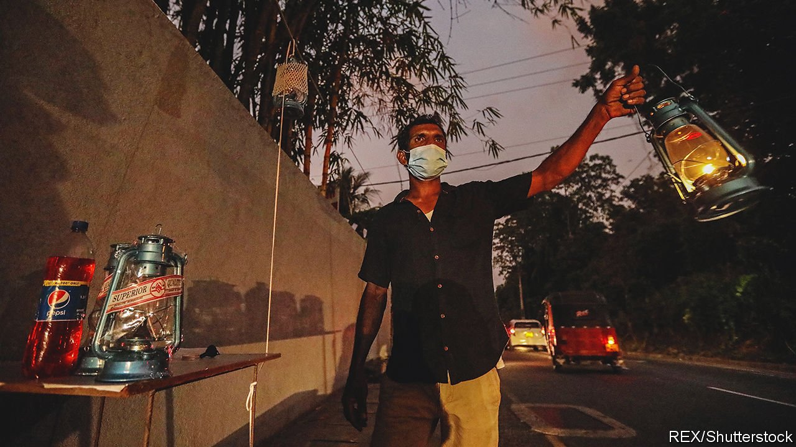
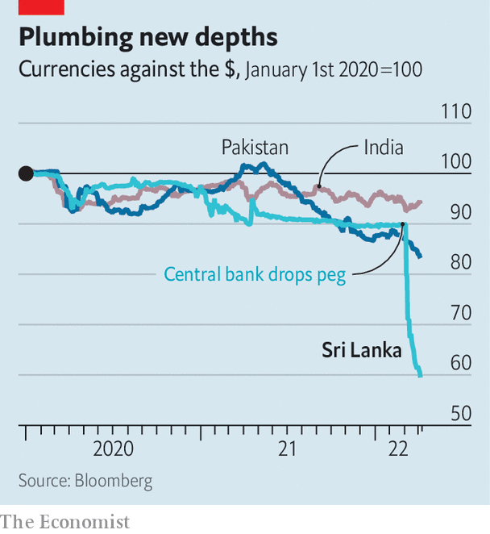

###### Lights out

# Sri Lanka’s economic crisis has created a political one 

##### The government has no majority, no cabinet and no public support 

 

> Apr 9th 2022 

UNTIL VERY recently , still Sri Lanka’s president as The Economist went to press, was secure in his job. After all, he had done much to consolidate his power. Following his election in 2019 he dissolved the legislature and filled the government with relatives and cronies. A thumping win for his coalition in parliamentary elections in 2020 enabled him to change the constitution, handing himself even more power.

Yet over the past few weeks Mr Rajapaksa’s hold on the country of 22m people has been slipping. Sri Lanka’s economy is in free fall. The rupee has declined by more than 30% against the dollar since the central bank abandoned its peg a month ago (see chart). Fuel and food have been in short supply for weeks. Sri Lankans wait hours in the heat to buy cooking gas at —if they can get it at all. Power cuts of up to 13 hours a day have crippled businesses, including the budding tech industry. Exams have been postponed for lack of paper. Hospitals across the country are running out of essential drugs. Even well-off Sri Lankans, usually insulated from such crises, have found themselves facing shortages.


All this is a product of long-running economic imbalances, external shocks and government mismanagement. An earlier Rajapaksa government headed by Mahinda, Gotabaya’s brother, borrowed heavily to finance infrastructure projects that have yet to generate returns. The current one slashed taxes, which bashed government revenue just before the pandemic halted tourist arrivals (a big source of foreign currency). It briefly banned fertiliser imports to save dollars, hitting food production.

 


The government then delayed going to the IMF until March, hoping that returning tourists and help from China would tide it over. But just as tourism began to recover,  pushed up commodity prices yet again, making imported fuel and food dearer still.

Economic hardship has driven people into the streets. Even middle-class types, who usually steer clear of protests and until recently approved of Mr Rajapaksa’s brand of strongman ethno-nationalism, now put the blame for the crisis squarely on the president. “These are people who keep liquor cabinets at home, not those who come to politically-organised protests for a packet of rice and half a bottle of arrack,” says Feroze Kamardeen, a playwright in Colombo.

It has not helped that Mahinda’s son (and minister of youth and sports), was spotted fly-boarding in the Maldives as Sri Lankans struggled to buy food. People are fed up. “Go home Gota!”—the president’s nickname—read the signs mounted on everything from broomsticks to pets’ collars. By “home” they mean America, where Mr Rajapaksa lived for several years.

The government, failing to read the public mood, has responded with a mix of intimidation and ineptitude, producing a political crisis to compound the economic disaster. On April 1st Mr Rajapaksa, apparently spooked by demonstrations outside his home, declared a state of emergency. That gave the army wide-ranging powers to quell unrest. When this failed to dissuade protesters, he imposed a weekend-long curfew and a ban on social media. People returned to the streets anyway.

On April 3rd the president changed tack. He restored social media and dismissed his cabinet, leaving only himself and Mahinda, now prime minister. The next day he lifted the curfew and named four new interim ministers, including a finance minister to replace another Rajapaksa brother who had previously held the job.

Stability remains elusive. Ali Sabry, the new finance minister, resigned on April 5th after just 24 hours in the post. On the same day Mr Rajapaksa’s coalition partners withdrew their support, leaving the government without a parliamentary majority. The president revoked the state of emergency a few hours later. Protesters still want the remaining Rajapaksas gone, but Gotabaya has given no indication that he will resign. The opposition has rejected his call to join an interim government. It seems reluctant to take charge in the middle of a crisis. Sri Lanka cannot afford to run a fresh election.

The country must pay $7bn, roughly 9% of pre-crisis GDP, in debt and interest payments, most of it dollar-denominated, by the end of the year. A $1bn bond payment is due in July. Sri Lanka’s dollar reserves are nearly gone and it has had no access to global credit markets for two years. India has extended credit lines and assistance worth some $2.5bn, and has postponed payments on debt owed to its central bank.

But Sri Lanka urgently needs a stay on other debt repayments to avoid a messy default. It will also need further lines of credit or aid—perhaps through the World Bank’s existing pandemic-relief mechanism—to import food and fuel over the coming months while it negotiates how to restructure longer-term debt and regain access to bond markets.

The lack of a stable government will make those discussions all the more difficult. Initial talks with the IMF began this week but official negotiations may be delayed until the president manages to appoint a new finance minister. Yet a bail-out by the fund is a crucial first step towards solving the crisis. Other creditors are unlikely to agree to new loans or the restructuring of existing ones without its backing.

Things are not entirely hopeless. Both the decision to talk to the IMF and the appointment of P. Nandalal Weerasinghe, a respected economist who was due to take over as the new head of the central bank on April 7th, suggest that the government may have grasped the seriousness of the situation. Whether it can convince furious Sri Lankans that it deserves a chance to fix the mess is another question. ■

