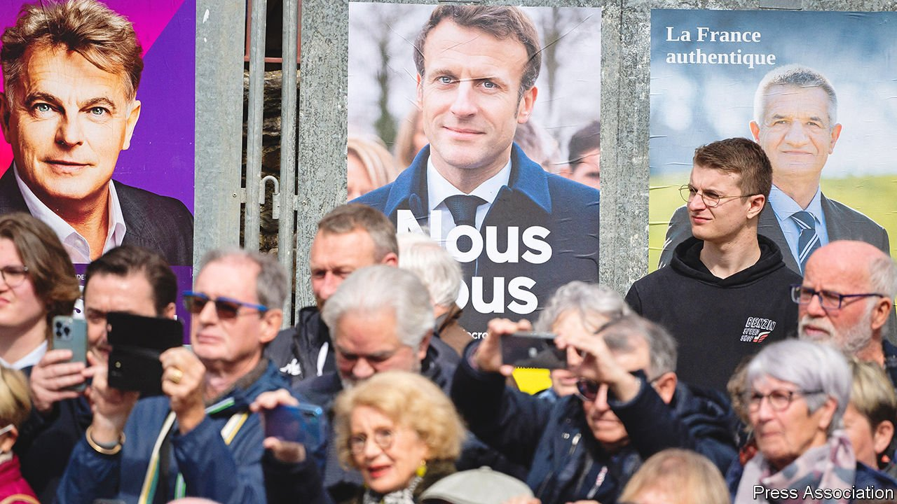
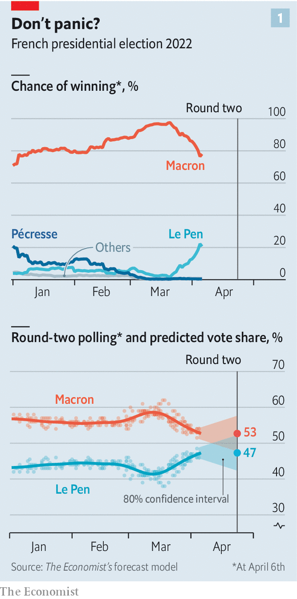
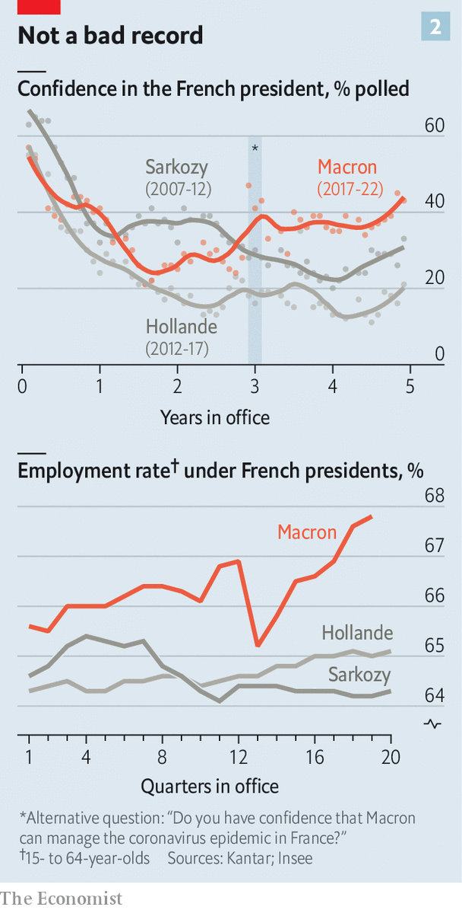
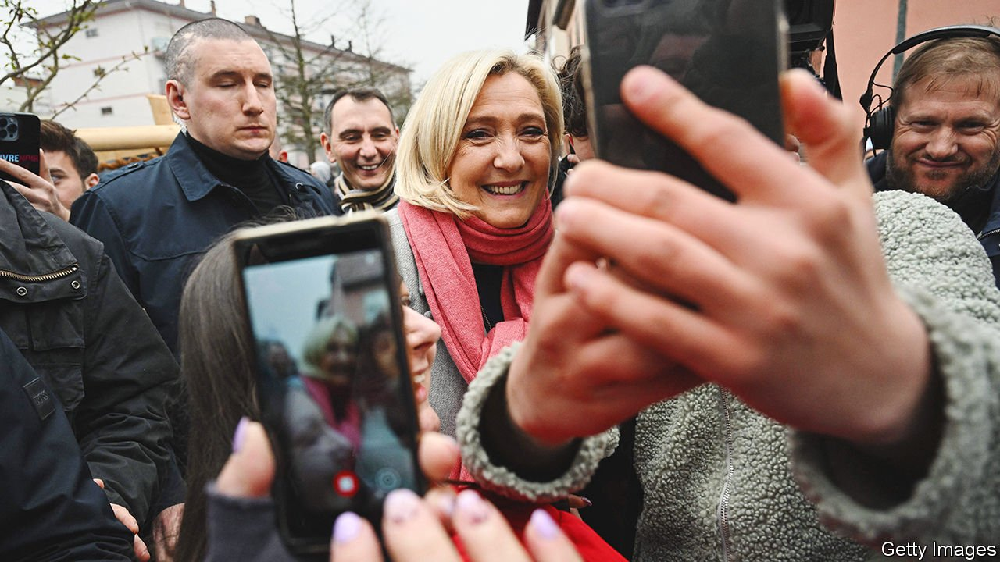

###### Beating the hard right

# France looks likely to re-elect Emmanuel Macron 

##### But his race against Marine Le Pen is a lot closer than it was last time 

 

> Apr 9th 2022 

ON APRIL 6TH 2016 a 38-year-old former investment banker who, two years before, had been appointed as a minister in France’s Socialist government announced that he wanted to change French politics. Standing in front of an audience in his home town of Amiens he declared that the old divisions between left and right were not relevant to 21st-century challenges. Matters such as climate change, or Europe, split the established mainstream parties as much as they held them together. It was time for a “political movement” that would be “neither on the left nor the right”.

The event was the talk of France’s political classes. But maybe only the man on the stage believed that the movement he was starting would go as far as it has. “At the time we didn’t even know if Emmanuel Macron would run for the presidency,” recalls Brigitte Fouré, the mayor of Amiens.


In May 2017 Mr Macron won his first ever elected office, leaving the established Gaullist and Socialist parties in his wake and squarely defeating Marine Le Pen of the National Front to become president of the republic. That June his movement, “La République en Marche”, took 53% of the seats in the National Assembly. Mr Macron had a legislature at his command.

By occupying a broad centrist space, and borrowing talent from both the Socialist Party and the Republicans, Mr Macron has accomplished much in the five years since then. As he returns to the polls—the first round of the presidential election is on April 10th, with the two candidates who get the most votes then pitted against each other in a run-off two weeks later—he has a lead that most other heads of large democracies could only dream of. He looks likely to be the first French president to win re-election while enjoying a majority in parliament since Charles de Gaulle in 1965. But the elections also show the troubling side of the bouleversement in which Mr Macron upended the party system: the resilience of the extremes.

One of the remarkable things about 2017 was that the two mainstream parties managed just 26% of the first-round vote between them, with neither making it into the second round. They will fare even worse this time. As of April 6th, The Economist’s poll of polls suggested that Valérie Pécresse, from the centre-right Republicans, and the Socialists’ Anne Hidalgo would together secure a mere 11% of the vote. The three leading radical populists—Ms Le Pen and Eric Zemmour on the right, and Jean-Luc Mélenchon on the left—will dwarf this figure with a combined 46%. Add in small fry on the fringes and those telling pollsters they will vote for candidates beyond the historic mainstream make up 54% of the electorate.

Mr Macron’s victory in 2017 was in part due to the extremists' success keeping the mainstream out of the second round. In a head-to-head race he trounced the hard-right Ms Le Pen. With Britain having chosen Brexit the year before, and America having put Donald Trump in the White House, this triumph by a charismatic if untested standard-bearer for broadly liberal, internationalist centrism was heralded as a setback for populism of global import.

 


With the Gaullists and Socialists still nowhere, there is a 90% chance that this election’s second round will be a re-run of 2017’s. Its result, though, looks like being a great deal closer: the number of people willing to shift their allegiance to Ms Le Pen from other candidates is much higher than it was. No poll of second-round voting intentions has as yet shown Ms Le Pen as the winner. But our poll of polls puts the likely result at 53% to 47%. In many systems that would be a landslide. Compared with 66% to 34% last time it looks worryingly close. At this stage in 2017 our statistical model of the election gave Ms Le Pen a 1% chance of overall victory. On April 6th this year the equivalent number was 21% (see chart 1).

By the standards of his recent predecessors, Mr Macron’s first mandate must be seen as something of a success (see chart 2). A form of pragmatic, post-partisan policymaking has pushed through a range of reforms—lower taxes, a more flexible labour market, better training and early education, IVF for gay women, and more. Parliamentary politics has become more consensual. There has been scarcely a whiff of rebellion in parliament. It feels quite normal to see Bruno Le Maire, France’s long-serving finance minister and once a presidential primary candidate for the Republicans, working closely alongside Olivier Dussopt, the budget minister, previously a Socialist deputy. Such harmony has made possible, among other things, a post-covid recovery plan that saw France’s economy recover to pre-pandemic levels faster than any other G7 country apart from America.

 


Some of the fruits of his tenure are easily seen in Mr Macron’s native Amiens, a modest northern city of red-brick houses nestled in what were once the battlefields of the Somme, their soil and memories the strongest of all cases for European unity. Unemployment has fallen. Nursery education is now compulsory (and free) for all from the age of three, as it is across the country. In poorer neighbourhoods, early-primary class sizes have been halved and free breakfasts brought in as part of Mr Macron’s promise to tackle inequality with better education.

New businesses have opened their doors, and some existing ones have expanded. Amazon has built a distribution centre on the city’s outskirts, employing over 1,000 people. A tyre plant has expanded; so has one making laundry products. “Over the past five years, economic activity has really developed in Amiens,” enthuses Ms Fouré, the mayor, despite being a supporter of Mr Macron’s presidential rival, Mrs Pécresse. A startup called Ynsect, which breeds and processes insects for animal feed and fertiliser, is building the world’s biggest vertical mealworm farm. “This government has been particularly pro-business,” says Antoine Hubert, Ynsect’s boss. “The number and size of startups in recent years has exploded.”

But there have been close-downs, too. One of the iconic moments of the 2017 campaign was when Mr Macron faced enraged trade unionists burning tyres outside a Whirlpool factory in Amiens; the firm was shipping work out to lower-cost economies elsewhere in the EU and the factory faced closure. The presidential hopeful spent nearly an hour urging them not to believe the “empty promises” offered by the likes of Ms Le Pen, who vowed to stop the factory from closing. “I can’t tell you I’m going to save your jobs,” Mr Macron declared candidly. But he would try.

Today weeds are growing in the car park of the Whirlpool factory; a sculpture made from 18 steel tumble-dryer drums dominates its deserted entrance hall. Twice new owners promised to keep the plant going. Twice they failed. “It’s a disgrace,” says Frédéric Chantrelle, a former union representative. Less than half of the 280 former employees have found another permanent job. Other industrial workplaces have suffered similar fates. Work in distribution warehouses has not replaced the muscular camaraderie of the factory floor. “Socially, the closure has destroyed a lot of people,” says Mr Chantrelle angrily: “We can’t say that Macron as a guy from Amiens has exactly been a lucky charm.”

Disillusion among blue-collar and low-paid workers is one of the reasons the populist vote has not gone away. The single most popular choice for blue-collar voters is Ms Le Pen: 36% say they will back her in the first round, next to 20% for Mr Macron and 19% for Mr Mélenchon, according to Ifop, a polling group. She attracts 28% of the vote of those with incomes below €970 ($1,055) a month, next to 25% for Mr Macron and 21% for Mr Mélenchon.

Let them eat crickets

Discontented working-class voters are hardly a novelty; for the first eleven years of Mr Macron’s life the Communist Party ran Amiens town hall. Part of Ms Le Pen’s success has been attracting more of them to a party which, when her father founded it in the 1970s, was based on xenophobia, anti-Semitism and nationalist nostalgia linked to the loss of French Algeria.

Ms Le Pen has distanced herself from some of that heritage, not least when she changed the party’s name from the National Front to the National Rally in 2018. Mr Zemmour, a former TV pundit, has embraced its most reactionary and xenophobic elements. He promises to “save France” from the “great replacement” of its population by foreigners and Islam; he has been convicted of incitement to racial hatred. At one point he edged ahead of Ms Le Pen in the polls, but as a devotee of Vladimir Putin he was knocked back badly by the invasion of Ukraine. (Ms Le Pen and Mr Mélenchon have also had nice things to say about Mr Putin, but voters have so far minded less, if at all). A large majority of his supporters will probably transfer their allegiance to Ms Le Pen in the second round.

That is hardly surprising. More untoward is the evidence that she will pick up votes from the left and the centre in unprecedented numbers. According to Ipsos, in 2017, 7% of those who had supported Mr Mélenchon and 20% of those who supported the centre-right candidate in the first round transferred their allegiance to Ms Le Pen in the second. This time polls put the numbers saying they will do so at 17% and 34% respectively. Many left-wingers, including 48% of the Green vote and 49% of Mr Mélenchon’s, will abstain or spoil their ballot papers rather than support Mr Macron against her.

No longer seeming beyond the pale is Ms Le Pen’s great success. Some of it is cosmetic; changing the name of a party hardly changes its essence (though there have been some expulsions). As Gilles Finchelstein and Raphaël Llorca note in a study for the Fondation Jean-Jaurès, a think-tank, Ms Le Pen’s written programme is still focused on immigration, “Islamism”, and “national preference” for the French. The fact that Mr Zemmour makes the running on such matters, though, allows her to speak about them less, and to seem more moderate in the process.

She has, on the face of it, moderated her stance on the EU. She no longer talks of abandoning the euro. But her vision of Europe is a long way from Mr Macron’s. She looks for inspiration not to its centre, but to its edge, in the form of Hungary’s “illiberal democrat” Viktor Orban, a thorn in Brussels’ side (see Europe section). After Mr Orban was re-elected on April 3rd Ms Le Pen tweeted a photo of herself beaming alongside him and the message: “When the people vote, the people win!” She calls Mr Macron “the president of chaos”.

By concentrating on the cost of living, pictures with her many cats on social media and a nationalist promise to restore order as a “president of French unity”, Ms Le Pen is offering an improbably calming appeal. She has positioned herself as a leader close to the people and their concerns—something Mr Macron has never managed.

Rural voters respond to this positioning well, with 32% saying they will back her in the first round, compared with 12% in the Paris region. Fine-grained analysis of last time’s results in south-west France by Jérôme Fourquet, a political analyst, shows that her vote was particularly strong in former agricultural communes, places where vineyards have given way to new housing estates and out-of-town shopping centres. They are places where concerns about identity, globalisation and change are easily played to, and Ms Le Pen is campaigning there accordingly.

In “Révolution”, a book he published as a candidate in 2016, Mr Macron himself warned about the danger of neglecting this “peripheral France”. “If we don’t pull ourselves together”, he wrote, “in five years or in ten years the National Front will be in power.” But on taking power he ignored his own warning.

In 2018 it was in this car-dependent semi-rural France, where McDonald’s drive-throughs sit next to newly built roundabouts decked out with kitsch sculpture, that people first put on high-visibility jackets— gilets jaunes—to complain about the way in which an increase in carbon taxation had pushed up the price of motor fuel. Their protests spread throughout the country. As French uprisings always do, they evoked echoes of 1968, 1848 and 1789. The government backed down.

It was the low-point of Mr Macron’s presidency and a wake-up call. He has since tried to put aside his imperious governing style and show that he can connect with ordinary people. But nothing he has done has provided a lasting bridge for the gap between him and them. He has never really shaken off his image as the “president of the rich” and embodiment of the Parisian elite.

Between the tramlines and the oxen

His policies, though, belie that image. By introducing a flat tax of 30% on investment income and ending the wealth tax in favour of a lighter “mansion tax”, he has indeed helped the rich. But France is no outlier when it comes to poverty or inequality of the sort that might explain an unusually high protest vote. Jobs are not just more plentiful; an expansion of apprenticeships and training schemes is helping more young people into work. During the pandemic Mr Macron vowed to spend “whatever it costs” to keep businesses going and people in jobs, and he did, pushing the level of public spending up from 55% to 59% of GDP in 2021. To some extent, though, the reward for success is to have it taken for granted. Unemployment was the voters’ third biggest worry in 2017. Now it does not make the top ten.

Instead, they worry about the cost of living, where Ms Le Pen is focusing her efforts. Mr Macron, who since 2018 has known better than most the political risk of rising fuel costs, has subsidised petrol prices and capped energy-price hikes. Ms Le Pen goes further, promising to cut VAT on petrol and energy bills to 5.5%, to lower motorway tolls and, for good measure, to bring back the wealth tax. Some former supporters are aghast at how left-wing her programme is.

 


A centre-right or centre-left party might easily do much the same. But such has been Mr Macron’s success at building a broad centrist church, and so poor have been the legacy parties' efforts to re-establish themselves, that there is no strong, credible moderate opposition available. Mr Macron’s vision of a realignment to bring together progressive pro-European centrists from the old left and right in order to beat conservatives and nationalists of all sorts has ended up legitimising the populist politics he promised to fight as the only opposition left.

On April 2nd the Macron campaign held a glitzy rally in a packed indoor sports arena in La Défense, west of Paris. In front of a crowd waving EU flags as well as French ones, Mr Macron warned that “the extremist danger today is even greater than it was a few months ago, a few years ago” and that his victory was not guaranteed. Playing to fear, rather than hope, is not his strong suit. But as Roland Lescure, a deputy in Mr Macron’s campaign team, points out, “Pandemics and war don’t lend themselves easily to optimistic politics.”

For all his faults, Mr Macron remains an energetic, serious, ideas-driven leader with a knack of defying expectations. “The way he managed the pandemic was better than we could have expected,” says Cindy, an amateur marathon runner from Montpellier who did not vote for him in 2017 but went to his rally in La Défense. Rasmane Sawadogo, an accountant from Lille who also travelled to Paris for the rally, points approvingly to Mr Macron’s “energy, clairvoyance and pragmatism” over matters such as Europe and nuclear power.

The lines on his face and grey in his hair speak of the crises Mr Macron has faced in the presidency. The less haughty tone he has begun to adopt hints at lessons learned from past mistakes. His campaign’s slogans are “Avec vous” (“With you”) and “Nous tous” (“All of us”).

But the campaign—a toxic one, tinged with genuine worries, half-truths, and outright lies—is not helping him. Among other things, a lack of serious policy debate means that the specific policies on which he is campaigning are unexamined, which may make them harder to implement even if his party and its smaller allies maintain their majority in the legislative elections set for June, especially if his victory over Ms Le Pen is narrow. The change he promised in 2016 is at best only half delivered, and the strangely unifying insurgency that brought him to power is ill-suited to winning over the voters who remain unconvinced. Governing France could turn out to be even harder next time around. ■

For more coverage of the French election, visit our dedicated 

