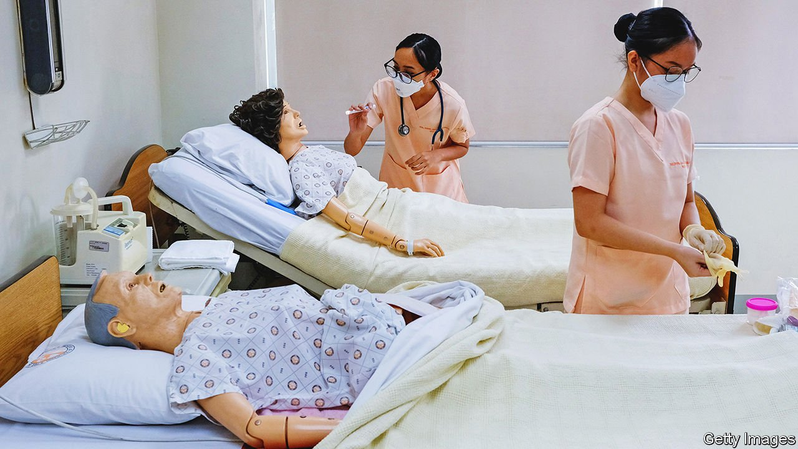
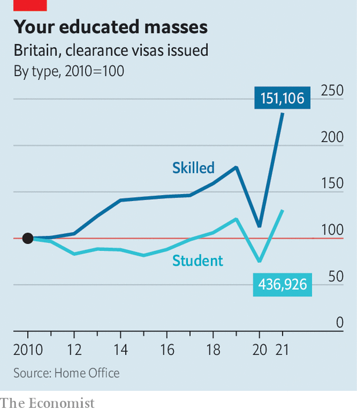

###### Immigration patterns

# Britain has entered a third phase of post-war immigration 

##### The first was post-colonial, the second European. This one is global and middle-class 

 

> Apr 7th 2022 

LAST MAY Raymond Padilla, a former journalist from the Philippines who arrived in Britain in 2005, was elected to Gloucester City Council. Filipino reporters called his victory historic; it also seemed improbable. Gloucester, in the west of England, is not hugely diverse. At the time of the most recent published census, in 2011, only 14% of its inhabitants were anything other than white and British. The city does not even have a Filipino restaurant. When immigrants want a taste of home, they make do with Thai food.

But the number of Filipinos in Gloucester is growing. That is largely because of its hospital, where Mr Padilla works as a nurse. “We’re all over the place because hospitals and care homes are all over the place,” he says. And that growth hints at a profound change in the pattern of immigration to Britain.


Since the second world war Britain has gone through two big phases of immigration. First came migrants from former colonies such as India, Pakistan and Jamaica, who often availed themselves of free movement within the empire and Commonwealth, just as the British colonists had done. As the Sri Lankan writer and activist Ambalavaner Sivanandan put it: “We are here because you were there.”

Then came a European phase. In 2004 Britain was one of only three EU countries to open its labour market to citizens of the Baltic and eastern European countries that had just joined the bloc. In the two decades to 2020-21 the European-born population in Britain rose from 1.5m to 3.9m, and from 35% to 41% of the foreign-born population, according to the Labour Force Survey.

The European phase ended in December 2020 when Britain enacted a new, post-Brexit immigration system. Free movement to and from continental Europe ceased. But Boris Johnson’s government made work permits easier to obtain.

Companies no longer had to prove that they had tried to hire a native Briton for a role, and the salary threshold that skilled migrants are required to clear was lowered from £30,000 ($39,000) to £25,600. For health-care workers the threshold is even lower, at a mere £20,480. In another change, foreign students in British universities are now allowed to work for at least two years after graduating, restoring a right that they had held under the previous Labour government.

 


Sixteen months into the new regime, the consequences are clear. Despite the many disruptions of covid-19, Britain is issuing more work and study visas (see chart). The vast majority are not going to Europeans. In 2021 people from India received almost 99,000 study visas, up from a low point of 16,000 in 2015. Nigerians were granted 10,000 skilled-worker visas and 43,000 study visas—about as many as in the previous four years put together.

Filipinos received almost 10,000 skilled-worker visas, putting them in third place behind Indians and Nigerians. The country has become an essential source of nurses (the picture shows a training session in Manila). In the six months to September 2021, fully 3,040 Philippines-trained nurses joined the National Health Service. That is more than the number of new NHS nurses trained in Northern Ireland, Scotland and Wales put together. Britain’s covid-19 vaccination drive began in December 2020 when a Filipina matron, May Parsons, injected Margaret Keenan.

Britain’s third phase of immigration looks in some ways like the first, post-imperial phase. As well as Indians and Nigerians, Britain is issuing more skilled-worker visas to people from Kenya, Pakistan and Zimbabwe—all former British territories. But the rising number of visas going to Filipinos and others with scant historical ties to Britain, such as Brazilians, reveals the difference. If the first phase of immigration was post-imperial, and the second European, this one is global and middle-class. Britain smiles on nurses, coders and students from everywhere, and on fruit-pickers from nowhere (although they are eligible for temporary-worker visas).

Filipinos are likely to keep moving to Britain, at least for a few years. The government has pledged to hire 50,000 nurses by 2024, points out Billy Palmer of the Nuffield Trust, a health-care think-tank, and “we’re not going to get it from our domestic supply.” An American economist, Michael Clemens, has shown that emigration from a country tends to rise until it reaches a level of income equivalent to about $10,000 per person at purchasing-power parity, before declining. The Philippines happens to be near the peak of the curve.

Another reason to think it will continue is that Britons, who showed their dislike of free movement from Europe by voting to leave the EU, seem happier with the focus on skilled immigrants. Polling by Ipsos MORI shows that the proportion who want to see immigration reduced fell from 67% to 42% between February 2015 and February 2022. Three-quarters of Britons favour letting immigrants take health-care jobs (asylum-seekers coming across the Channel are less popular; see Bagehot).

A bigger problem in the next few years might be attracting enough skilled immigrants. Real wages have stagnated and sterling is weak, reducing the value of remittances. And now that Britain is trying to recruit the global middle class, it is up against other rich, English-speaking countries. “Australia, Canada and Britain are all trying to compete for those skilled workers,” says Kate Hooper of the Migration Policy Institute in Washington, DC. So is America, when politics allows.

In Gloucester, Mr Padilla is doing his bit—and not only by helping new immigrants settle. Sometimes when he rings a British customer-service helpline he is put through to a call centre in the Philippines. Recognising the accent, he switches to speaking Tagalog. At the end of a call, the call-centre worker tends to ask: so, is life better in Britain? He tells them it is. ■

For more coverage of matters relating to Brexit, visit our 

