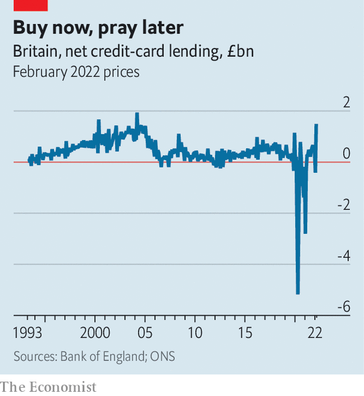

###### Buy now, pray later

# Britons’ use of consumer credit is rising with the cost of living 

##### That makes robust regulation more urgent 

 

> Apr 7th 2022 

“IT WAS EITHER use buy-now-pay-later (BNPL) or starve, so I used it.” Audrey, a pensioner who had been unable to pay for a £40 ($53) food shop, admitted this to Citizens Advice, a charity. “I sort of knew I would struggle to make the repayments but I did not have any other way of getting food.” She decided to spend the money on canned food rather than fresh produce so it would last longer.

Audrey is far from alone. Fintech startups have spent recent years reviving point-of-sale lending, now dubbed BNPL. Business is booming. Klarna, the largest provider by market share, started offering BNPL to British consumers in 2016 and now counts nearly a third of the adult population as customers. Citizens Advice estimates that one in 12 Britons used BNPL loans in the second half of 2021 to buy essential goods such as food and toiletries.


The evidence that BNPL itself causes financial distress is limited. But it can encourage people to spend more than they otherwise might. And, notes Peter Tutton of StepChange, a debt charity, it is frequently used by those who are already struggling. In the year to October 2021, one in three BNPL borrowers had either made a late payment or missed one altogether; of those, 56% had been refused a credit card.

That was before the cost of living started to rise in earnest. The energy price cap, which limits suppliers’ default tariffs, rose by 12% last October. On April 1st it jumped by a whopping 54%. It could spike again by a similar amount in the autumn. Food-price inflation is also rising. In the last six months of 2021 food prices were 1.5% higher than for the same period the previous year. Over the next two months, they rose by a further 3.7%. On April 6th a rise in national insurance, a payroll tax, took effect.

 


It is all going to add up, predicts the Office for Budget Responsibility, to the biggest drop in real household disposable incomes in any tax year since records began in 1956. Running down savings, scrimping more and wearing extra jumpers can all help. But taking out credit is another way to cover the bills. Sure enough, net credit-card borrowing in February was £1.5bn—higher in real terms than in any month since March 2004 (see chart).

Straitened times have a habit of encouraging unsustainable borrowing. The years that followed the financial crisis of 2007-09 saw a boom in payday lending, with firms selling high-cost loans to people who couldn’t pay them back. In 2014 the Financial Conduct Authority (FCA) took over regulation of consumer credit. Four years later Wonga, then Britain’s biggest payday lender, collapsed into administration amid plummeting sales and a surge in compensation claims for mis-selling.

For Stella Creasy, a Labour MP, the parallels with today’s BNPL lenders are uncomfortable. “They’re doing exactly the same thing payday lenders did: it’s getting people into the habit of using debt,” she says. And regulation is proceeding “at a snail’s pace”, despite an FCA review identifying an urgent need for it in 2021. (A legal loophole designed to make invoicing easier means that BNPL loans are unregulated as long as they are time-limited and interest-free.) Results from a Treasury consultation are expected “in the spring”, after which the FCA is likely to solicit yet more input. That leaves a lot of time for more growth before regulation kicks in.

Others worry about the FCA itself. “There is a history of the FCA not acting as quickly or as robustly as it should to protect consumers,” says Damon Gibbons of the Centre for Responsible Credit, a think-tank. The Wonga collapse is one example: an initial redress scheme set up by the FCA in 2014 was limited to just 45,000 customers. The firm ended up owing some 390,000 borrowers £460m, only a small fraction of which it could pay.

Nor is this the only case of the FCA falling short in recent years. In 2019 London Capital &amp; Finance (LCF), a mini-bond issuer, collapsed, wiping out £237m of investors’ savings. A subsequent independent review cited the FCA’s “failure to regulate LCF appropriately”, or to “adequately supervise” its compliance. The regulator has since restructured its supervision arm and appointed a new executive director, Sheldon Mills, to take charge of consumer protection. “We need to be more proactive, we need to be faster, and we need to improve our systems,” says Mr Mills. Given what is coming, there is no time to lose. ■

