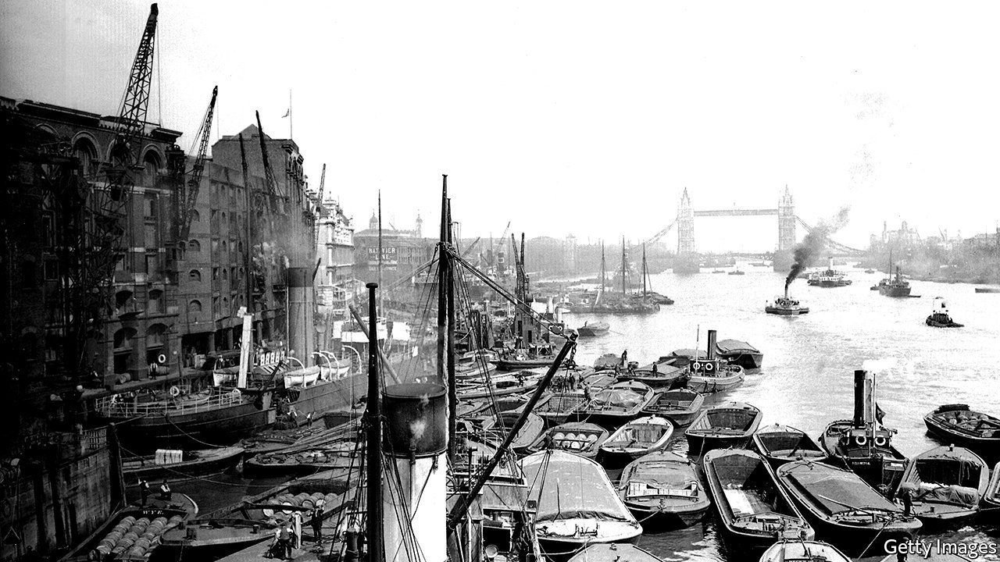

###### Bluer, greener

# Making deliveries via the Thames 

##### Barges and boats instead of vans and lorries? 

 

> Apr 7th 2022 

ON A RECENT Thursday morning, the stretch of the Thames that wends through central London is largely deserted, save for the odd river bus or barge moving in with the tide, carrying empty containers to be filled with rubbish. It’s a far cry from the glory days of the 19th and 20th centuries, when ships moored at the city’s Royal Docks, once the largest in the world.

In the post-war years, new container vessels became too big for London’s Victorian-era docks. Deliveries moved east; the city’s last dock closed in 1981. It is now generally cheaper to transport goods to their final destination by road than by river. Cheaper, but not greener. As firms seek to cut emissions, some wonder if the Thames might be an answer.


Londoners have 700m parcels delivered each year, but the lorries and vans that carry those packages snarl up traffic and pump out fumes and carbon. The Port of London Authority (PLA), which wants to increase river traffic, says that barges carrying heavy freight emit less than half as much carbon as the five or so lorries it takes to haul an equivalent amount of goods. Vans are even more carbon-intensive because they take relatively few goods for the amount of emissions they spew.

Hence rising interest in the river. Since September 2020, DHL, a delivery firm, has delivered 50,000 parcels via the Thames in a pilot scheme designed to cut down on carbon emissions. Electric trucks carry parcels from Heathrow airport to Wandsworth pier. The packages are then ferried to Bankside pier, before couriers take them to their final destination by bike.

Tideway, the firm managing the Thames Tideway Tunnel, a colossal project to upgrade London’s Victorian-era sewer system, brought most of its materials to its 21 riverside sites in barges. The most construction-heavy phase of the project required about 140,000 lorry trips, less than a third of what would have been needed without using the river.

Whether big carbon savings will flow from greater use of the Thames is unclear, however. The Tideway Tunnel is a one-off project, and the motivation for using the river was largely to do with safety. Parcel delivery currently costs five times more by river than by road, estimates WSP, a consultancy. Tides and topography put natural limits on the river’s capacity. How comparatively green the Thames stays depends on how easily firms can cut emissions from other modes of transport.

More river use will also require more infrastructure, in particular wharves and piers. The PLA must retrofit pedestrian piers in the city for parcel unloading, and hold on to those wharves that still exist to store heavy freight. A big increase in commercial traffic would mean tussles with residents and developers, who pay a hefty premium to be close to the water.

Even so, the Thames is set to become busier. The PLA’s goal is for 20m parcels to be delivered annually; scaling up would make river delivery more cost-competitive. Firms want to be seen to cut emissions: DHL has recently expanded its pilot scheme. Worsening congestion on London’s roads may also shift the calculus, especially for time-sensitive deliveries. The river will never regain its status as a dominant commercial artery, but the tide is gently running its way again. ■

For more coverage of climate change, register for , our fortnightly newsletter, or visit our 

