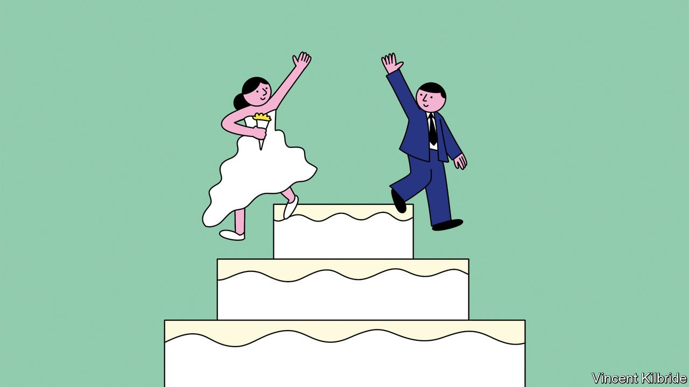

###### Putting asunder

# No-fault divorce begins this week in England and Wales 

##### The marital blame game is finally ending 

 

> Apr 9th 2022 

THOSE WHOM God has joined together, let no one put asunder. Or so the resonant words of the Church of England’s marriage ceremony have it. The laws of England, however, have typically taken a more moderate approach. For the past 150-odd years they have been footnoting that fine phrase with occasions when a little sundering might be suitable after all.

In 1857, for example, English law started to allow divorce on the grounds of adultery, sodomy, rape and (unarguably, if unexpectedly) bestiality. From 1969, the law accepted “behaviour” as another reason, a category largely intended to cover intolerable behaviour and abuse—but one which rapidly expanded. To date English law has accepted as unreasonable behaviour not just abuse but also making “shepherd’s pie too often”, “not stacking the dishwasher properly” and (naturally) “noisy eating”.


What English law has never allowed is for a divorce to take place simply because a couple wishes it to. That changes this week. From April 6th, it will be possible to divorce swiftly in England and Wales without one spouse being at fault. Practically, the change is simple: until now, if you wished to divorce you would have had to pay £593 ($780), fill in the form and tick one of five boxes, such as “Behaviour” or “Adultery”, for the reason, and then give details. From this week you still have to fork out £593 (state monopolies, even digitised, rarely come cheap). But now you will merely tick one box stating, with Hemingwayesque simplicity, that: “I confirm that my marriage or civil partnership has broken down irretrievably.” It is, says Nigel Shepherd, a family lawyer and campaigner for the change, “a long-overdue reform”.

One measure of any reform’s ripeness is the extent to which most people assume that it has happened already. Boris Johnson wrote in 2012 that he had been “flummoxed” when asked whether he supported gay marriage because “I thought it was already legal” (it became so two years later). Similarly, most people might assume it has long been possible to divorce promptly in England without resorting to blame. Instead, for the past half-century, many divorcing couples who wished to end their marriages swiftly found themselves compelled to, as one put it, “wildly vomit bile onto a page and click ‘submit’”. 

The reasons why England’s marital blame game persisted for so long range from legal fudges to religious opposition and moral disapproval. The reason it is changing is because Britain has. More people are more accepting of divorce than ever before. Although absolute numbers of splits are decreasing, largely because marriages are (in 2020 there were 103,500 divorces, compared with a peak of 165,000 in 1993), ease with the idea of divorce is rising. 

In 2018 British people were almost half as likely to disapprove of parents with young children divorcing as they were a decade earlier. Institutionalised stigma has all gone. As Daniel Monk, a law professor, points out in “Fifty Years of the Divorce Reform Act 1969”, divorced people were refused entry to the Royal Enclosure at Ascot until 1955. Now many of those found in that Enclosure—including the first in line to the throne—are themselves divorced. 

Indeed, few families offer a finer potted history of English divorce than the royal one. It was easier for Henry VIII to separate England from the Catholic Church, and his spouse’s head from her neck, than himself from his wives. By the time Edward VIII acceded to the throne in 1936, divorce had become legally easier—but remained socially costly. When Edward informed the prime minister, Stanley Baldwin, that he intended to marry the divorced Wallis Simpson, Baldwin pointed out that this was impossible. Today, not only is Prince Charles divorced, he is married to a divorced woman. 

Increasing social acceptance did not immediately lead to increasing legal simplicity. Divorce and absurdity have been joined together for decades as a result. In the 1930s “hotel divorces”, in which an “adulterous” husband would hire a hotel room (Brighton was popular), a girl and a photographer, in order to be framed in an act of apparent infidelity, were so common that they were satirised by Evelyn Waugh. 

Today, “unreasonable behaviour”, once expected to be a minor cause of divorce, is the commonest reason: in 2019 it was cited by 47% of wives and 34% of husbands. Whether or not the behaviour involved truly is “unreasonable” is rarely scrutinised: divorce petitions are at least 14 pages long and legal advisers (who can deal with up to 70 a day) have only a few minutes to read each one. Until now, says Mr Shepherd, it was “a game you have to play”. 

And not a very amusing one, says Sandra Davis, a specialist in family law at Mishcon de Reya, a law firm, who has represented Princess Diana and Jerry Hall, among others. Although citing unreasonable behaviour can make for interesting cases (she recalls one wife who poured the contents of her husband’s wine cellar down the toilet, and another who immolated her partner’s prized matchbox collection) she does not think it is helpful. “No one takes divorce lightly,” she says. “As night follows day, by requiring blame you build in acrimony.” (Though acrimony will not be absent: some worry that speedier divorces may lead to less time for sharing assets fairly.) 

The blame game did the legal system few favours. Justice might be blind, but she dislikes seeming foolish. Once, the farce of hotel divorces was embarrassing enough to prompt legal change; now, the ludicrousness of citing shepherd’s pie is helping to prompt more change. From 10am on April 6th it will be possible to divorce without blaming people. And the law will look a little less of an ass.

