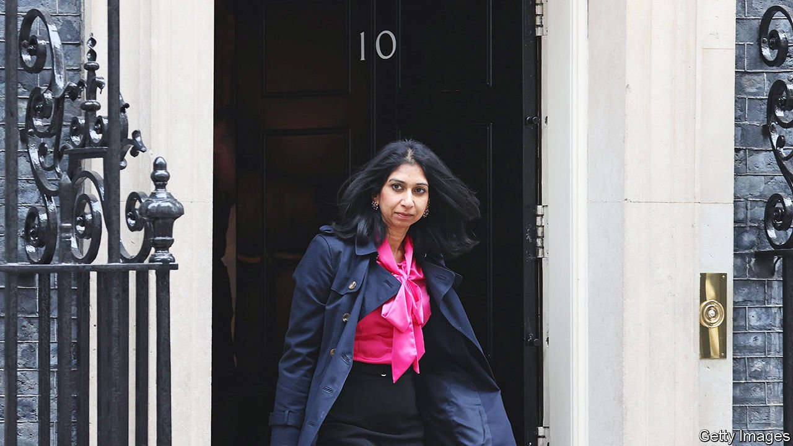

###### The attorney-general

# Suella Braverman, a Johnsonian lawyer 

##### The British government’s chief legal adviser thinks the judiciary needs reining in 

 

> Apr 7th 2022 

FRANCIS BACON declared it “the painfullest task in the realm”. Patrick Hastings QC, who would serve three centuries later, called it “my idea of hell”. The post of attorney-general for England and Wales is one of the oldest in British government, and a difficult hybrid. The holder is a political animal, who attends cabinet and uses the law to get their colleagues’ business done. But they also have apolitical duties, such as authorising prosecutions for contempt of court. Above all, as the government’s chief legal adviser, they must act as an internal check on the government, and be ready to say “no” to the prime minister.

Critics of Suella Braverman, the incumbent, think she is failing in this balancing act, and allowing her political instincts to cloud her legal judgment. But accompanying claims that Ms Braverman is out of her depth are far too dismissive. She is a leading exponent of a constitutional doctrine which has become a hallmark of Boris Johnson’s government.


Ms Braverman, who was appointed in 2020, shrugs off criticism that she has politicised her role. She isn’t an unelected technocrat, she notes, and her predecessors in the Labour governments of the 1960s and 1970s were open about the job’s partisan nature. But she does have tabloid instincts: not for her the submarine-like silence that some attorneys general adopt.

She has appeared in person to ask the appeal court to lengthen the “unduly lenient” sentences handed to a series of high-profile killers. In January, when a jury acquitted four protesters who had toppled a statue of a slave owner, she said she would ask judges to review the law. She declared her support for Mr Johnson and a former aide, Dominic Cummings, when both were accused of busting covid-19 lockdown rules. Since her role includes oversight of the Crown Prosecution Service, many lawyers thought it would have been better to say nothing.

Critics put this down to an unfortunate combination of inexperience and careerism. Appointed to the role at the age of 39, she was the youngest attorney-general since 1802, according to James Hand of the University of Portsmouth. With only a decade at the Bar and not yet a Queen’s Counsel, she was more junior than all but one of her predecessors since 1900. Attorneys-general have historically shunned other ministerial roles; Ms Braverman made her name as a hard-line Brexit minister and has a shot at higher office. This, some think, makes her unsuited to the grave decisions that land on her desk, such as signing off on drone strikes. “I feel rather sorry for her,” says one Tory colleague, considering the pressures of the job.

Her supporters note that all attorneys-general rely on external counsel, and detect the condescension that meets many women in the law. And Ms Braverman is a more meaningful figure than her critics allow. Along with many Tory MPs and several conservative legal academics, she thinks the judiciary has become overmighty in the past two decades. She is a driving force behind a doctrine which seeks to “rebalance” the constitution, and which reasserts the ability of politicians to make policy without being gainsaid by judges.

In 2020 Mr Johnson proposed breaking his EU exit-treaty obligations in order to strengthen his negotiating position, prompting the resignation of Jonathan Jones, the head of the government legal department, and Lord Keen, the advocate-general for Scotland. Ms Braverman provided legal advice justifying the breach of international law on the bald grounds that a sovereign parliament can legislate as it pleases. “She was determined that a legal way would be found to introduce those clauses,” says a former colleague.

In a recent speech she argued that the Supreme Court had wrongly strayed into political terrain when it overturned Mr Johnson’s prorogation of parliament in 2019. “The authority of the judiciary must never again be pitched against the authority of the people,” she said. A good many legal academics are alarmed by what they see as the government weakening long-established checks and balances. But as far as Ms Braverman goes, best not to mistake inexperience for incoherence. ■

