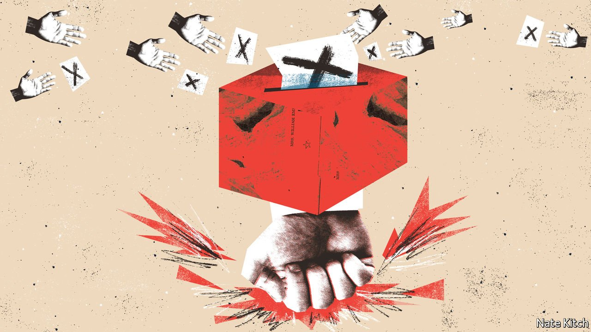

###### Bagehot

# The cruelty of the British state 

##### Voters upset by the treatment of Ukrainian refugees are getting what they asked for 

 

> Apr 7th 2022 

BRITONS WHO have offered to host Ukrainian refugees face a familiar obstacle in the form of the Home Office. But they also have support from some unlikely allies. The Daily Mail, which has railed against asylum-seekers for years, is leading the charge. “Britain is only granting ONE visa for every TEN refugees” shouted the newspaper recently; it would normally only complain if the ratios were reversed. Conservative MPs have attacked Priti Patel, the home secretary, for failing to let people in, rather than for failing to keep them out. Scepticism about refugees has melted among the British public. Support for resettling Ukrainian refugees in Britain (at 76%) rivals the approval ratings for the queen.

Moral panics, when people demand an authoritarian crackdown against the villain of the hour, are common in British politics. Less noticed but just as frequent is the inverse. Call it an ethical spasm. For a brief moment, newspapers, MPs and voters combine to demand a more liberal, generous approach from the government. Moral panics tend to leave a mark. The statute book is littered with knee-jerk but permanent laws on everything from dangerous dogs to paedophiles. Unlike their authoritarian cousin, ethical spasms rarely leave a trace. Once the moment passes, the state turns nasty again.


When it comes to Ukrainian refugees, the Home Office can be forgiven for not predicting the latest twitch. Cruelty is a feature of Britain’s asylum system, not a bug. Welcoming refugees is a reversal of previous policy. Indeed, the department has spent the past year coming up with schemes of near comic-book villainy to deter migrants from crossing the Channel. These plans have ranged from wave machines to processing arrivals on St Helena, an island in the South Atlantic. (A deal to process asylum-seekers in Rwanda is now being mooted.) An engine built to reject people has suddenly been told to accept people, akin to slamming a car into reverse while speeding along a motorway.

Yet at the same time that the government is attempting to remove obstacles for Ukrainians, it is planning to make them higher for others. The Nationality and Borders bill working its way through parliament will make irregular entry into Britain a criminal offence, even if someone is seeking asylum, which is probably illegal under international law. According to one Conservative peer, the proposal is “largely unnecessary…mean-minded and at times approaches the vindictive”. It is nonetheless likely to become law, in this parliamentary session or the next.

The asylum system is not the only area where generosity momentarily interrupts a miserly norm. During the pandemic the government increased universal credit, a benefit payment, when it became clear that millions more would end up on it. Rather than expose middle-class voters to the reality of the day-to-day welfare system, the Treasury coughed up an extra £20 ($26) per week—about £1,000 extra per year—to make it more generous.

If benefits were too low during a lockdown, when it was practically illegal to spend money on some things, then they are probably too low in normal times. Yet Rishi Sunak, the chancellor, felt comfortable removing the temporary increase. In the spring statement last month, Mr Sunak left those still on working-age benefits with a real-terms cut. A plurality of British voters support higher benefits. But Conservative voters tend to want them to be the same or lower. Mr Sunak declined to ramp up benefits for the same reason he opted not to seize the means of production: it is not what Conservative chancellors do.

A recent backlash against brutal policing followed a similar pattern. In 2021 footage of police breaking up a vigil in memory of Sarah Everard, a 33-year-old raped and murdered by an off-duty police officer, triggered outrage. A similar outcry occurred in 2010 during student protests, when truncheon met middle-class student’s skull and the often rough-and-ready tactics of the British police were revealed to a new audience. Yet rather than guaranteeing the right to protest, the government is making it easier for police to arrest demonstrators for vague reasons such as being noisy. The British public’s views on crime and punishment are Old Testament. A politician who promises draconian policing will receive more votes than one who promises a liberal approach.

Nanny for me, but not for thee

There are two explanations why ethical spasms rarely last. The charitable one comes down to ignorance. For most people in Britain, the state is kind. People come into contact with the parts of it that are still just about adequately funded, such as schools and the health-care system. Meanwhile the state pension, a benefit that most people enjoy eventually, has become more generous.

The state is predominantly nasty only to an unfortunate minority. The bulk of Britons are born there and so have little contact with the immigration system. Dealings with police are limited to asking for directions, rather than being thrown headfirst into a van. Most people have jobs and no experience of a harsh benefits system. Once a topic passes out of the public’s eye, it is forgotten.

Another explanation is less forgiving, but more likely. Voters would rather have a nasty state than a nanny state. The two most popular governments of the past few decades—Labour under Tony Blair and the Conservatives under Boris Johnson—have had an authoritarian bent. Hammering protesters and cracking down on asylum-seekers has been a potent mix.

Cruelty is a choice, not a state of nature. But it is a choice voters seem to prefer. A more generous welfare system would result in higher taxes, which Britons are loth to pay for anything other than health care. Politicians with a bias towards kicking people out are more attractive than those who want to let people in. Bluntly, the state is nasty because voters have asked for it to be. The welcome mat has been rolled out for Ukrainians fleeing war. But it will be rolled up again soon enough. ■

Read more from Bagehot, our columnist on British politics: (Mar 26th)

 (Mar 19th) (Mar 12th)

