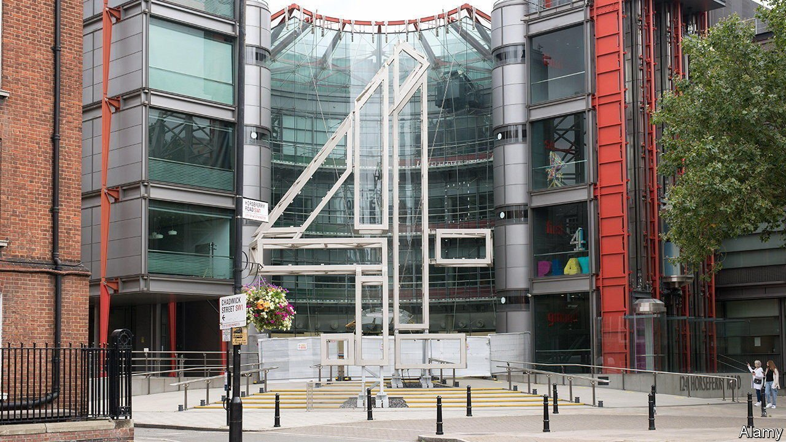

###### A great British sell-off?

# Who might buy Britain’s Channel 4? 

##### Plans to sell a slice of broadcast TV look half-baked 

 

> Apr 7th 2022 

AS IT NEARS its 40th birthday Channel 4 should have plenty to celebrate. The publicly owned channel emerged from the pandemic with a record operating surplus. Frothy shows like “The Great British Bake-Off” are a hit with viewers, while serious ones like “It’s a Sin” impress critics.

Instead the broadcaster is fighting for its life. One threat comes from America, whose deep-pocketed streaming services are snatching Channel 4’s young audience. The other is from the government, which on April 4th announced plans to sell the channel. Nadine Dorries, the culture secretary, said private ownership would enable Channel 4 to compete with Netflix and others. Sceptics, including many Tory backbenchers, see it as an attempt to put the liberal-leaning channel in its place.


The worldwide “streaming wars” have sparked a mania for mergers. Last month Amazon bought MGM for $8.5bn. Discovery’s $43bn acquisition of WarnerMedia is about to close. But Channel 4 is a tricky target. Online-only streamers like Netflix, Amazon or Apple have no interest in a legacy broadcast network. Discovery, which already does business in Britain, has its hands full with the Warner deal and a separate plan to buy BT Sport.

Paramount, another American giant, may be interested. It already owns Britain’s Channel 5, so has experience of its complex national broadcasting rules. By filling a third or more of Channel 4’s schedule with content from its American archive it could save up to £150m ($195m) a year, estimates Matti Littunen of Bernstein, a broker. Yet if the government imagines Channel 4 competing with foreign streamers, it may not want it to be swallowed by one.

If the aim is to create a national champion, ITV might fit the bill. Combining Channel 4 with Britain’s oldest and largest commercial network would create “a gorilla as big as the BBC”, says Claire Enders, a media analyst. But its heft would alert trustbusters. ITV and Channel 4 together control over 70% of Britain’s TV advertising market. Getting the nod would mean persuading regulators that the relevant market was all video ads, including online ones. French authorities are considering just such a case with the proposed merger of TF1 and M6. Their decision, expected by the autumn, may inform British thinking.

The problem for all bidders is uncertainty. Channel 4 must follow quotas for airing news and buying content from particular regions and from independent production companies—which, unusually, keep the rights to their content. The government has not said which of these rules will remain. “Every percentage point of content that has to be made out of London, or through independent producers, or whatever other provision is determined, probably takes…something off any offer price,” says one potential buyer. Analysts expect bids of £500m-1.5bn, depending on what strings are attached.

The government says the proceeds would go to creative industries. But production companies prefer the deal they have. Meanwhile, relaxing obligations to make programmes in the regions would jar with the government’s “levelling up” agenda. Some Tories also fear losing distinctively British content. Channel 4 shows like “Derry Girls” are aimed at British audiences, in contrast to series like “Bridgerton”, Netflix’s gleefully ahistorical Georgian romp. And whereas some households dislike paying for the BBC, Channel 4 makes its money through ads (something Ms Dorries seemed surprised to discover at a parliamentary hearing last November).

Privatising Channel 4 was not in the Tory manifesto, so the House of Lords, where the government lacks a majority, faces no pressure to wave it through. Even if it passes, the tender process and potential competition inquiry would probably stretch beyond the next election, due by the end of 2024. Few senior Tories seem to share Boris Johnson’s enthusiasm for off loading Channel 4; Labour describes it as “cultural vandalism”. Plans to privatise the broadcaster have been floated, and sunk, throughout its life. This one may yet go the same way, says Ms Enders. “You can’t find a banker in the City that hasn’t wasted time on a Channel 4 privatisation.” ■

