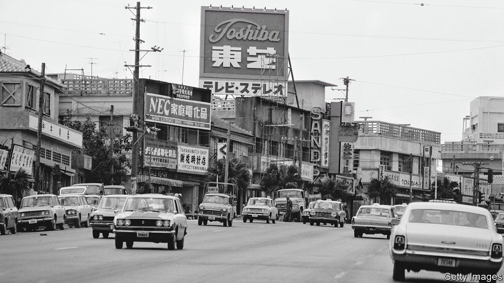
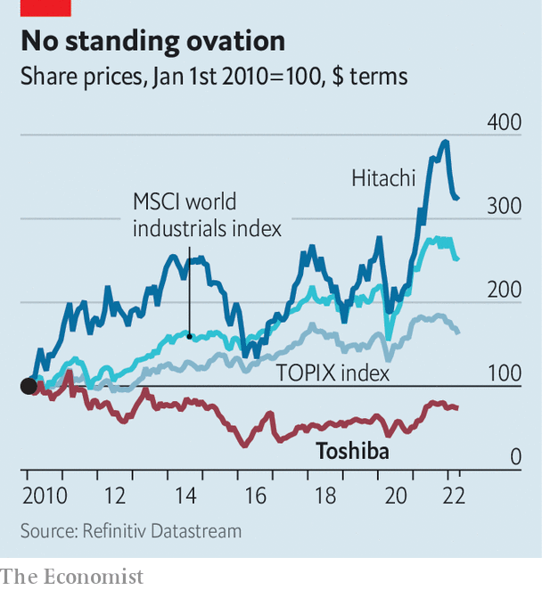

###### In search of an ending

# Bain Capital buying Toshiba could be a big deal for Japan 

##### America's private-equity barons circle one of the country's fading corporate jewels 

 

> Apr 9th 2022 

TOSHIBA WAS once synonymous with Japan’s industrial might. Of late the conglomerate, which has made everything from memory cards to nuclear reactors, has become a byword for drama. Japan’s business press writes of “Toshiba Theatre”, which began with accounting fraud a decade ago and has continued to the present day in a series of “slapstick” struggles between management and shareholders. Toshiba’s share price has underperformed domestic and foreign rivals, as well as the broader Japanese stockmarket (see chart).

The latest plot twist comes amid talk of a buy-out led by Bain Capital, an American private-equity group. This raised hopes among investors for some sort of resolution to the saga. Toshiba’s market value has risen by a quarter in the past month.


The opening act in the Toshiba spectacle was tragic. The firm cooked its books to inflate profits by $1.2bn between 2007 and 2014. Implicated executives bowed deeply in apology. A new crop of leaders had to apologise again two years later when a big bet on Westinghouse, an American nuclear-power company, went sour. To remain solvent, Toshiba sold its prized memory-chip unit to a Bain-led consortium and issued a block of new shares. Foreign activist investors spied opportunity. Effissimo Capital Management (ECM), a Singaporean asset manager, amassed a stake of nearly 10%, making it the single largest shareholder in the company.

 


That set the stage for a protracted second act of tragicomedy. As shareholders pushed for better returns and more transparency, Toshiba executives squirmed. Some colluded with the Japanese government to stop the activists from getting seats on the board in 2020, according to an independent inquiry. A year ago a surprise bid to take the company private collapsed, bringing the CEO, Kurumatani Nobuaki, down with it. Tsunakawa Satoshi, a former boss who returned to the job after Mr Kurumatani’s ousting, argued instead that the group should be split up.

This plan, too, faltered, and on March 1st Mr Tsunakawa fell on his sword. At an extraordinary general meeting three weeks later, shareholders killed the management’s proposal for a split into two businesses, one focused on electronics, the other on infrastructure. At the same time, they also rebuffed calls from Toshiba’s second-largest investor for the group to court buy-out offers.

The impasse set the stage for act three. On March 31st ECM announced it had signed an agreement to sell its stake to Bain if regulators gave the nod to the American firm’s bid. A deal would be hefty. Toshiba’s market value is $17.5bn; a premium could add a few billion, putting it in striking distance of the top ten leveraged buy-outs in history. Given Toshiba’s history (which stretches back to 1875) and prominence (it employs nearly 120,000 people), the transaction would also mark a big advance for both foreign investors and private equity in Japan, which has not historically been welcoming to either.

Hurdles remain. Japanese laws regulating foreign investment were amended in 2020 to increase oversight of industries important to national security. Toshiba has interests in several, including nuclear power, defence, chips and quantum computing. Regulators helped scuttle earlier buy-out bids. Bain appears to have learned from those experiences, and is said to be in discussions with Japanese funds and companies to form a consortium that would be palatable to the government. But “many issues” must still be resolved, Bain acknowledged. The curtain is far from closed. ■


