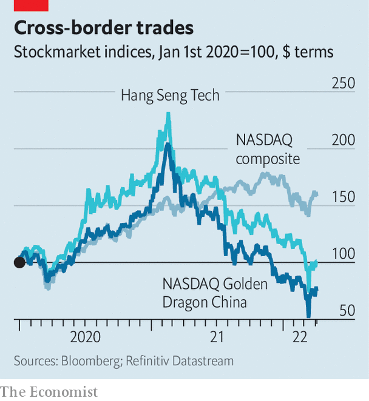

###### Double-entry book-keeping

# China’s regulators warm to American listings 

##### That may not be enough for American investors to warm to Chinese shares 

 

> Apr 9th 2022 

IN MOST COUNTRIES the state has no business in most commercial secrets. The Chinese authorities have long taken a different view, considering the review by foreign regulators of accounting documents drawn up in China for Chinese companies listed outside the mainland as an infringement on sovereignty, potentially punishable by death. The government softened its stance in 2020, when some such documents were shared with a Hong Kong accounting body. Now it seems ready to open the books to American regulators, who have been keen for a peek for more than a decade, in order to ensure the soundness of Chinese securities listed in New York.

On April 2nd the China Securities Regulatory Commission (CSRC) indicated that it will allow American inspections of Chinese accounting papers. The concession from the Chinese government is a breakthrough in one of the costliest regulatory spats in capital-markets history.


Without the reviews, an American law from 2020 could eventually force nearly $1trn-worth of Chinese stocks off New York’s exchanges. Although this would not happen until 2023 at the earliest, the mere prospect has exacerbated a sharp sell-off in Chinese technology stocks abroad, already battered by a broad clampdown on the tech industry at home. The NASDAQ Golden Dragon China Index, which tracks Chinese firms listed in New York, is down by two-thirds from its peak in February 2021. The publication last month of a list of 11 candidates for delisting by America’s Securities and Exchange Commission (SEC) shaved another $260bn from the collective value of American-listed Chinese stocks.

 


Market sentiment was boosted by the CSRC’s decision to cut a clause in securities rules that “on-site inspections will be dominated by domestic regulators or depend on the conclusions of inspections by domestic regulators.” The Chinese stocks have recouped most of the losses sustained after the SEC’s warning. Still, investors remain wary. The shares trade far below their prices a year ago, and they have performed worse than either Chinese tech firms listed in Hong Kong or American tech stocks overall (see chart).

One reason is growing concern over geopolitical friction between China and the West. This, reckons Deutsche Bank, “has permanently impaired” valuations of Chinese stocks in America. It is also unclear how China’s newfound fondness for information-sharing will work in practice. The CSRC proposes setting up a “cross-border regulatory co-operation mechanism” to conduct the inspections. This may fall short of American demands for independent reviews. The CSRC also retains the power to approve foreign inspections. Investors may distrust its assurances that it would only rarely deny such approval because of the sensitivity of the material.

And doubts persist about how much protection American oversight would actually afford investors. Chinese regulators with full access to accounts have failed to spot many a fraud. Chinese executives seldom face punishment in their home country for defrauding American shareholders, says Soren Aandahl of Blue Orca Capital, a Texan short-seller which has uncovered mischief at some Chinese firms. Until that changes, an incentive to fiddle with the numbers will remain. After all, books don’t get uncooked merely by being opened. ■


