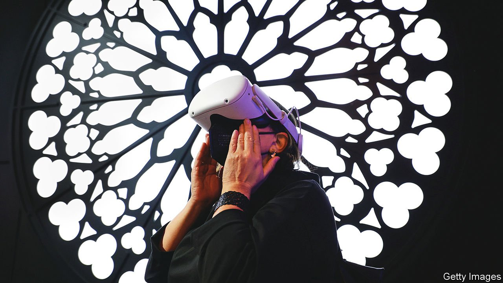
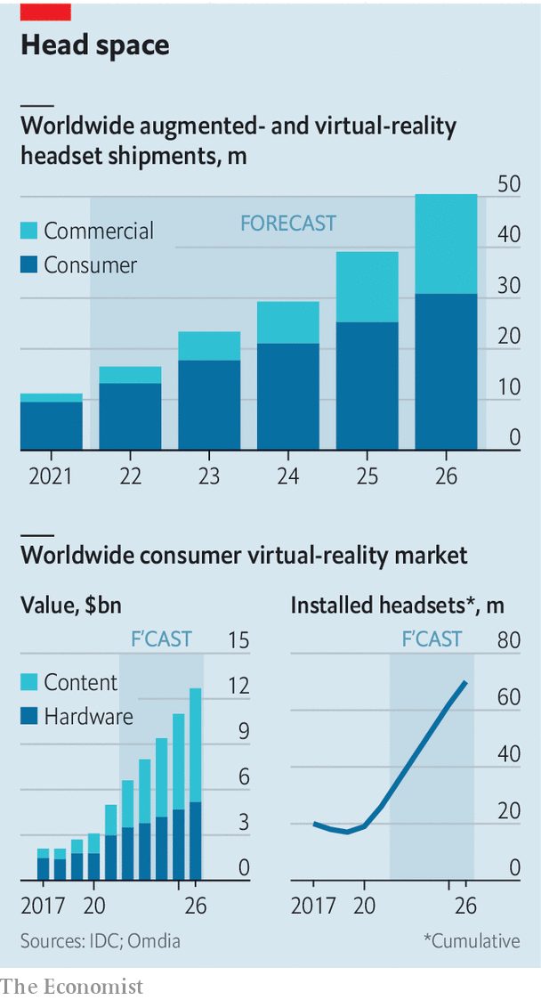

###### Seeing and believing

# From Apple to Google, big tech is building VR and AR headsets 

##### They might just be the next big platform after the smartphone 

 

> Apr 9th 2022 

WITH EYES like saucers, nine-year-old Ralph Miles slowly removes his Quest 2 headset. “It was like being in another galaxy!” he exclaims. He has just spent ten minutes blasting alien robots with deafening laser cannons—all the while seated silently in the home-electronics section of a London department store. Sales assistants bustle around, advertising the gear to take home today. “That would be sick!” enthuses Ralph. “Don’t get him started,” warns his dad.

Children are no longer the only ones excited about “extended reality”, a category which includes both fully immersive virtual reality (VR) and augmented reality (AR), in which computer imagery is superimposed onto users’ view of the world around them. Nearly every big technology firm is rushing to develop a VR or AR headset, convinced that what has long been a niche market may be on the brink of becoming something much larger.


Meta, Facebook’s parent company, has sold 10m or so Quest 2 devices in the past 18 months; Cambria, its more advanced headset, is coming this year. Microsoft is pitching its pricier HoloLens 2 to businesses. Apple is expected to unveil its first headset by early 2023 and is said to have a next-generation model in the pipeline. Google is working on a set of goggles known as Iris. And a host of second-tier tech firms, from ByteDance to Sony and Snap, are selling or developing eyewear of their own.

The tech giants spy two potentially vast markets. One is the kit itself. Only around 16m headsets will be shipped this year, forecasts IDC, a data firm (see chart). But within a decade sales may rival those of smartphones in mature markets, believes Jitesh Ubrani of IDC. “Some people ask, ‘Do you think this is going to be as big as what smartphones created?’” says Hugo Swart of Qualcomm, which makes chips for both headsets and phones. “I think it’s going to be bigger.”

 


That points to the second, still more tantalising opportunity: control of the next big platform. Apple and Google have established themselves as landlords of the smartphone world, taxing every purchase on their app stores and setting rules on things like advertising, at the expense of digital tenants such as Facebook. Whoever corners the headset market stands to acquire a similarly powerful gatekeeping position. “It is going to be the next big wave of technology,” says Mr Ubrani, “and they all want to make sure they get a piece of that.”

The search for the next platform comes as the last one shows signs of maturing. Smartphone shipments in America fell from a peak of 176m units in 2017 to 153m in 2021, according to IDC. The advertising model that has powered firms like Facebook and Google is under attack from privacy advocates. In response, Mark Zuckerberg, Meta’s boss, has bet the future of his company on the “metaverse”. Microsoft’s CEO, Satya Nadella, has said that extended reality will be one of three technologies that shapes the future (along with artificial intelligence and quantum computing). Sundar Pichai, his counterpart at Alphabet, Google’s corporate parent, said last year that AR would be a “major area of investment for us”. Venture-capital funds pumped nearly $2bn into extended reality in the last quarter of 2021, a record, according to Crunchbase, a data company.

Some 90% of headsets sold today are VR. Since buying Oculus, a headset-maker, for $2bn in 2014, Meta has captured the market, with 80% of VR sales by volume in 2021. The Quest 2, which offers a convincing (if mildly nauseating) experience with no need for an accompanying computer, has been a hit since its launch in 2020, helped by lockdowns and a $299 loss-leader price. Last Christmas the Quest’s smartphone app was the most-downloaded in America. Smaller rivals like HTC, a Taiwanese electronics firm, and Valve, an American games developer, which make VR gear for gaming, are being squeezed. Pico, a headset-maker owned by ByteDance, TikTok’s Chinese owner, is doing well in its home market, where Meta is banned.

Meta’s VR strategy still revolves around ads. It is selling headsets as fast as it can in order to build an audience for advertisers, says George Jijiashvili of Omdia, a firm of analysts. Horizon Worlds and Venues, its virtual spaces for hanging out, claim 300,000 monthly visitors. To the irritation of some of them, Meta has already experimented with running ads there. The Cambria, a more expensive “pass-through” headset that combines a VR-like screen with front-mounted cameras to display footage of the world outside, will train cameras on users’ faces. That will enable the capture of facial expressions in virtual form—as well as the monitoring of which ads eyeballs linger on.

Meta is also monetising its app store. From next year the market for VR content will surpass that for VR hardware, reckons Omdia. One of Mr Zuckerberg’s motives for pushing the new platform is to liberate Meta from dependence on phonemakers for the distribution of its apps. The firm has become a digital landlord itself, with the power to tax Quest-store pur chases in the same way that Apple and Google take a cut of smartphone app sales (Meta declines to say how much it charges).

While Meta ramps up its efforts in VR, others are experimenting with the knottier technology of AR. Unlike VR, which takes you to another place, AR is “anchored in the world around you”, says Evan Spiegel, boss of Snap. His Snapchat social-media app has long provided AR filters for phones, allowing users to turn themselves into cartoon characters or virtually try on products like clothes and make-up with the help of their device’s camera. Snap is now toying with hardware, building a prototype set of AR Spectacles, which have gone out to a few hundred software developers.

Your correspondent wandered through a floating solar system and was chased around Snap’s London offices by holographic zombies as he tried out the Specs, which at 134 grams look and feel like a chunky pair of sunglasses. The downside of their slender styling is a battery life of 30 minutes and a tendency to overheat. Limits in optical technology restrict the field of view to a square in the middle of the lens, meaning that overlaid graphics are seen as if through a letterbox. Snap’s main reason for making the device is to discover use cases for AR headsets when they become widely adopted, says Mr Spiegel. In the hardware market, “We have a shot. But our goal is still really on the AR platform itself.”

For now, AR glasses are a niche within a niche. High cost and wobbly performance limit their appeal. IDC expects industry shipments of 1.4m units this year. The top seller in 2021 was Microsoft’s HoloLens 2, a $3,500 device used by big clients including America’s armed forces (whose order for 100,000 pairs provoked complaints from Microsoft staff that they “did not sign up to develop weapons”). Magic Leap, a startup in Florida, will launch the second generation of its AR glasses, with a wider field of view, in September. It is targeting industries like health care and manufacturing, rather than consumers.

Despite VR’s dominance of the headset space, AR sparks more excitement about mass adoption. Even with Meta’s relentless promotion of virtual concerts, office meetings and more, few people use VR for anything other than gaming: 90% of the $2bn spent on VR content last year went on games, according to Omdia. Tim Cook, Apple’s boss, has criticised VR’s tendency to “isolate” the user. “There are clearly some cool niche things for VR. But it’s not profound in my view,” Mr Cook has said. “ AR is profound.” Apple has shown notably little interest in the immersive metaverse that excites Mr Zuckerberg.

Apple’s upcoming pass-through headset will give a taste of the AR experience. A pair of true AR glasses are still in early development. These first products are said to be aimed at designers and other creative professionals, rather like its high-end Macintosh computers. Still, the firm’s entry into the industry could prove to be a watershed. “Apple’s ability to drive adoption is probably unparalleled in the market,” says Mark Shmulik of Bernstein, a broker. It will hope to do brisk business in China, giving it an edge over Meta. IDC predicts that in 2026, 20m pairs of AR glasses could be shipped worldwide, making them about twice as popular as VR goggles are today.

Argumented realities

The big question is whether headsets can go beyond gamers and professionals, and become a true tech platform rather than just an accessory. Today’s AR and VR gear is good at solving “very specific pain-points”, says Tony Fadell, a former Apple executive who helped develop the iPhone. A generalisable platform such as an iPhone “is a whole different story”, he says. “And I don’t believe it,” he adds, at least for the next five years. In the foreseeable future, Mr Fadell thinks, headsets will be a bit like smart watches, popular but not revolutionary in the way the smartphone has been.

Mr Spiegel agrees that headsets will not fully replace phones, just as phones have not done away with desktop computers. But, he points out, “one overarching narrative is that computing has become way more personal.” It has moved from the mainframe, to the desktop, to the palm of the hand. The next step, he believes, is for computing to be “overlaid on the world around you” by AR. Desktop computing was mainly about information processing, and smartphones were mainly about communication. The next era of computing, he suggests, will be “experiential”.

In this scenario headsets could be part of a broader ecosystem of wearable technology that draws consumers’ attention—and spending power—away from the smartphones that have hypnotised them for the past decade and a half. With smart watches, smart earphones and, soon, smart spectacles, the phone could become personal computing’s back office rather than its primary interface. Gadgets on your eyes would complement the “things on our wrists, things on our ears and things in our pockets”, thinks Mr Shmulik. One day, he speculates, “you might even forget that you’ve got your phone.” ■

For more expert analysis of the biggest stories in economics, business and markets, , our weekly newsletter.

