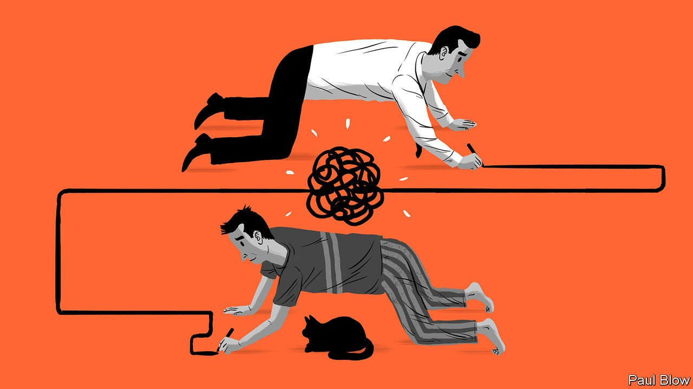

###### Bartleby

# How to make hybrid work a success 

##### Clarity of expectations is the key 

 

> Apr 9th 2022 

WHITE-COLLAR WORKERS tend to like hybrid working. Research by Nicholas Bloom of Stanford University suggests that, on average, employees reckon the blend of in-person and remote work is a perk equivalent to an 8% pay increase. The biggest attraction of days spent working from home is the absence of a commute. Other benefits include not having to get ready for the office: the proportion of people wearing a fresh set of clothes drops by 20 percentage points when they are not commuting.

Executives have been keener to get people back into the office full-time, so that employees can bond with peers, absorb the corporate culture and appreciate the awesome power of laundry. But even sceptics have accepted that hybrid working will be part of the post-pandemic future: in his annual letter to shareholders this week, Jamie Dimon, the boss of JPMorgan Chase, said he thought that about 40% of the bank’s staff would be hybrid. The job now is to make sure that hybridisation works as well as it can for both employees and employers. That depends on one ingredient above all: clarity. Things function best when everyone knows what is expected.


Start with the shape of the hybrid week. One of the great theoretical attractions of hybrid working to employees is that they get to choose what days they come in. But the point of in-person working is to spend time collaborating and bonding with their colleagues: that is much more likely to happen if companies are clear about who they want in the office on which days of the week.

Clarity also maximises the benefits of work-from-home days. If office time is best spent in a whirlwind of collaborative brainstorming and socialising, home days are logically the time when solo and focused work should get done. That requires bosses to do what comes unnaturally to them, by resisting the temptation to interrupt at will.

It is easier to do that if expectations are clear. Anne Raimondi of Asana, a work-management platform, says the firm expects people to come in on Mondays, Tuesdays and Thursdays, and has a “no meetings” day on Wednesday. If a manager wants to have a meeting that day, they have to “recontract” with their team and explain why it is needed.

By the same token, being explicit when a reply is needed on an email saves everyone scurrying around in a desperate bid to answer the boss first. Defining what kinds of work can be done asynchronously and what requires everyone to get together is a recipe for fewer, better meetings. Encouraging a set of do-not-disturb protocols makes it less likely that employees will be bothered unnecessarily.

Clear protocols also make hybrid meetings go better. Harry’s, a shaving firm that has published its guidelines for hybrid working, expects each attendee to have their own screen and promises not to keep discussing the matter at hand once remote colleagues have left the meeting (though commenting on who is wearing the same clothes as they did yesterday is presumably fine).

Some of this will be deeply alarming to managers who worry about slippery slopes. First you give people space to focus at home, and soon enough you cannot contact anyone because they have changed their settings on Slack and are binge-watching “Bridgerton”.

There are three answers to such worries. First, expectations are firmly in the gift of managers. Asana’s no-meetings day does not extend to meetings with customers, for example.

Second, burnout is as much of a risk as slacking. New research from Microsoft finds evidence for what it calls a “triple-peak day”. As well as the usual large crests in activity in the early morning and after lunch, around 30% of employees at the tech giant also experience a smaller, third bump in work in the late evening. That may be a sign of people getting work done when it suits them—or of the workday extending relentlessly into every waking hour. Setting expectations, over things like how quickly notifications need to get a response, can help determine which one it is.

Last, good performance is not defined by employees’ locations at specific times of the day but by what they achieve—what Mr Bloom calls “managing outputs, not inputs”. If bosses can articulate what counts as productive activity, and evaluate it regularly, it matters less whether employees are at headquarters or stinking out the spare bedroom. Managers may have concerns about hybrid working, but it is pretty clear what will make it successful.

Read more from Bartleby, our columnist on management and work:

 (Apr 2nd)

 (Mar 26th)

 (Mar 19th)


