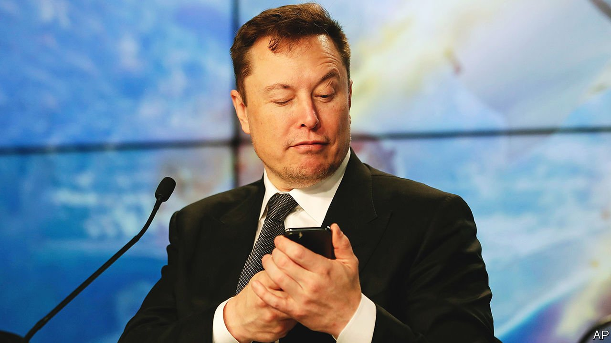

###### Another Musk-have

# Is investing in Twitter a meme too far for Elon Musk? 

##### The self-styled Technoking may be overextending himself 

 

> Apr 9th 2022 

WHAT WILL he do with it? That was the big question after Elon Musk let it be known on April 4th that he had amassed a stake of 9.2% in Twitter, making him the social-media firm’s largest shareholder. Will the world’s richest man buy more shares or even take Twitter private? Will the  take a hands-on role in Twitter’s management? Will the libertarian troll push to bring back Donald Trump, kicked off the platform after inciting an assault on the Capitol in January 2021? Speculation mounted after Twitter said a day later that Mr Musk would join its board.

As is his wont, Mr Musk will reveal his plans in his own time and probably in his own tweets to the 80m people who follow him on the platform (not many fewer than followed Mr Trump before he got the boot). In posts published before he announced the investment, he complained that Twitter “serves as the de facto public town square” but fails “to adhere to free-speech principles”. He urged the company to open up the algorithm that decides which tweets users see. In light of his well-documented sympathies for cryptocurrencies and their underlying technology, the blockchain, he could try to turn Twitter into a decentralised service controlled by users.


It is hard to see how that would make the company more profitable. Investors rejoiced anyway. Some may be believers in the “Elon markets hypothesis”, which holds that stocks should be valued based not on fundamentals but on their proximity to Mr Musk. Others may hope that he can really shake things up.  has been a much bigger cultural success than a commercial one. Before Mr Musk’s move sent its share price up by a third, the firm’s market value had been languishing around $30bn, not much higher than where it was when it went public in 2013. By comparison, its social-media rival Meta (née Facebook), briefly became a $1trn company and its market capitalisation is up more than five-fold in the same period despite a recent tumble (it is currently worth $631bn).

Whatever Mr Musk’s designs for Twitter, one near-certainty is that they will require money, time and attention. That raises another question: is the self-styled Technoking overextending himself?

Financially, he isn’t. The investment in Twitter, which cost less than $3bn, is chump change for Mr Musk—about 1% of his net worth. A bigger concern, especially to investors in his other firms, is over his workload. Twitter comes on top of several big corporate commitments. Besides running Tesla, a $1.1trn electric-car giant with nearly 100,000 employees, he heads up , a privately held rocketry firm valued at $100bn. He also helped found two drilling startups, one making big holes to build tunnels (The Boring Company), the other making tiny ones to  (Neuralink). Adding a Twitter board seat to his résumé may overtax even a functioning workaholic and astute delegator like Mr Musk. Now 50 years old and the father of eight, he has been putting in 100-hour weeks for decades, as he recently revealed in an interview.

Where Mr Musk may be most over extended is in his trolling—not so much of his numerous critics (though he does plenty of that in his spare time) but of regulators. America’s Securities and Exchange Commission was  for allegedly violating a court agreement to have his tweets lawyered before publishing, reached after he tweeted in 2018 that he had “funding secured” to take Tesla private, which he ended up not doing.

The Twitter investment may get him into further trouble. He made it public a few days after the deadline for such disclosures. And his filing suggested that he would be a passive investor, which seems at odds with his joining the board. Expect his Twitter habit to raise even more eyebrows now that he is no longer just a big user but a large shareholder, too. ■

For more expert analysis of the biggest stories in economics, business and markets, , our weekly newsletter.

