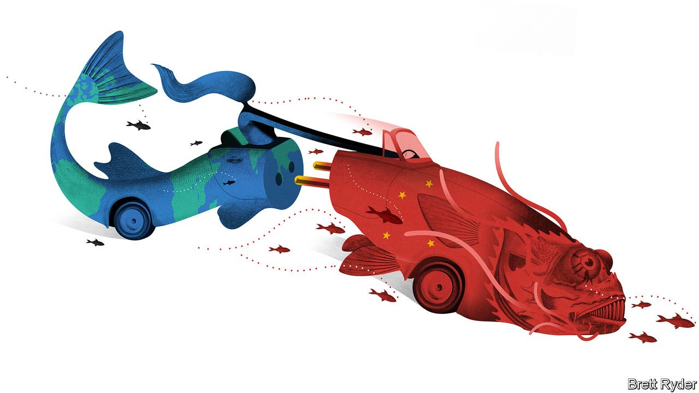

###### Schumpeter

# Save globalisation! Buy a Chinese EV 

##### Electric cars can help stop the world from decoupling 

 

> Apr 9th 2022 

SCHUMPETER IS NOT a car owner. He bought his last one, a diesel-fuelled Volkswagen, in 2015, days before the emissions-cheating scandal erupted. He was so appalled that when the car’s engine caught fire he vowed never to buy another and took to a bike instead. He has lived in emissions-free smugness ever since. At least he did—until increasing numbers of electric vehicles (EVs) started to swish past, signalling even more virtue. Now his car envy has returned—but with a dilemma. Some of the most appealing EVs in Europe are either made in China (Tesla) or by Chinese-owned firms (MG). Given concerns about the decoupling of trade into ideological blocs, should that be a dieselgate-sized worry?

To answer that question, first examine what is known in China as “the catfish effect”, the idea that a predator makes weaker rivals swim faster. For years China led the world in production and purchase of EVs. However, the cars were heavily subsidised and shoddy. They were a response to the government’s desire to scrub the air and leapfrog the internal-combustion engine, a technology in which China was a laggard. Delighting customers was an afterthought. No Chinese EV-maker was as world-beating as Huawei became in smartphones—before America blackballed it in 2019.


That same year Tesla set up shop in Shanghai and began rolling Model 3s off the production line. It became, says Gregor Sebastian of the Mercator Institute for China Studies in Berlin, the epitome of a catfish. The effect was similar to the benefit that production of Apple’s iPhone in China brought to the country’s smartphone market, where local suppliers had to raise their game to meet international standards. Chinese carmakers’ ambitions likewise rose. The result has been an accelerated shift towards electrification. BYD, a battery manufacturer turned China’s biggest seller of EVs and hybrids, said on April 4th that it had ceased making full combustion-engine vehicles. As with Tesla, its sales are booming.

As yet, no Chinese EV-maker is an export powerhouse. Stockmarket analysts are playing up the potential, hoping this will bring Tesla-like valuations, says Tu Le of Sino Auto Insights, a consultancy. But most of China’s EV exports are by wholly foreign brands, such as Tesla, or those with Chinese partners, such as BMW. Foreign marques account for most of the 296,000 Chinese-made EVs and plug-in hybrids sold abroad last year—more than quadruple the number in 2020. Because of high American tariffs, the favourite destinations are Europe and South-East Asia.

China’s biggest EV firms are adopting a variety of export strategies to catch up. SAIC, a state-owned car company, is making inroads in Europe under the cover of MG, a classic British sports-car brand that it bought in 2007. It keeps its Chinese identity hidden behind the alluring octagonal nameplate, which may be why sales hit more than 52,000 in Europe last year, double the year before, many of which were EVS. BYD, as well as Nio, which hopes to take on luxury marques like Mercedes, have made EV-friendly Norway the springboard for their forays into Europe. In South-East Asia the strategy is to “attack the villages to surround the cities”, says Scott Kennedy of the Centre for Strategic and International Studies, a think-tank in Washington. That means selling low-cost EVs where Western companies do not venture, in order to strengthen supply chains. Taxi fleets are a popular target for firms like BYD.

Until recently it was considered a long shot that such low-cost brands could penetrate developed markets as well as developing ones. The EV market in China includes scores of also-rans and it begs for consolidation. The firms lack the overseas sales networks of global rivals. Yet they have their own built-in advantages, including access to the best battery supply in the world and in some cases more sophisticated software than European rivals. China is also taking international safety standards more seriously.

If its EV-makers thrive, it would be good for more than just the car market. The more high-quality Chinese products appeal to international consumers, the more of a stake China has in preserving global trade. EVs encompass many of the strategic tensions that burden the trading system. They are heavily reliant on semiconductors, which has become a sore point in China, and on batteries, Chinese dominance of which is a bugbear for the West. They are hugely subsidised. The harvesting of personal information to improve traffic routes, charging and self-driving technology raises thorny questions about privacy, data storage and cyber-security. The EV industry is also exposed to trade wars: since 2018 America has levied 25% tariffs on Chinese battery cells, electric motors and other EV components. The European Union, with its green agenda, is less overtly protectionist for once.

Most Western carmakers have enough of a stake in keeping supply chains open, and in maintaining access to China’s own market, that they would prefer not to erect more trade barriers. They know, however, that China is using them as catfish to improve its own industry. At any point it could decide that they have done their job. That could throw the entire global market, including China’s, into turmoil.

Completing the circuit

Yet the catfish effect can work in both directions. Last month Bloomberg reported that CATL, China’s battery behemoth, was considering building a $5bn factory in North America. In response Jim Greenberger of NAATBatt International, a battery trade body, said he would welcome this as long as CATL brought battery-manufacturing tech and know-how in order to foster technology transfer to American firms.

That, of course, is the magic of globalisation. Over time, competition and co-operation lead to the exchange of ideas, benefiting all. It will not last if geopolitical tensions, heightened by Russia’s pounding of Ukraine, splinter the world economy into competing blocs. If buying a Chinese car feels unfamiliar, remember that you are supporting globalisation. Not bad as fringe benefits go. ■

Read more from Schumpeter, our columnist on global business: (Apr 2nd)

 (Mar 26th) (Mar 19th)


