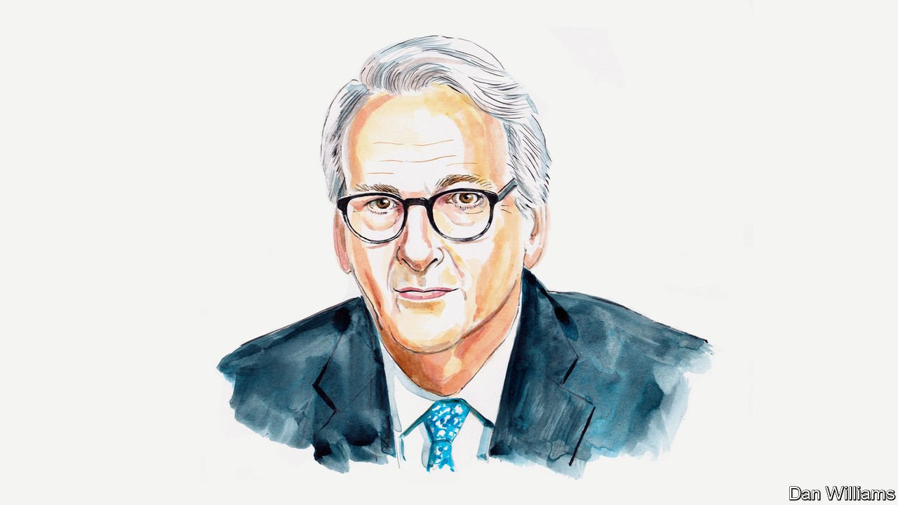

###### Russia and Ukraine

# Ivo Daalder says NATO enlargement didn’t go far enough 

##### America’s former ambassador to the organisation says Russia would have been deterred, not provoked, by a bigger NATO 

 

> Apr 9th 2022 

“UKRAINE IS NOT just a neighbouring country for us,” declared Russia’s President Vladimir Putin in a rambling, raging speech in February which set the stage for war. “It is an inalienable part of our own history, culture and spiritual space.”

It was a shocking speech which reverberated around the world. Western countries mobilised an unprecedented response to the invasion through sanctions and through military aid to Ukraine. Much of the rest of the world united in condemnation of Russia—though heavyweights such as India and China did not.


Although Mr Putin made his case for why war would be justified, for some the fault lay elsewhere. The principal responsibility for the Ukrainian crisis,  in an article for The Economist’s By Invitation section on March 19th, lay with “the West, and especially America”. He says the crisis can be traced back to NATO’s decision after the cold war to bring in new members. Professor Mearsheimer particularly blames America because in 2008 it foolishly pushed to extend NATO membership to Ukraine (and Georgia)—ignoring Moscow’s red line.

He could not be more wrong. Even before Russia’s war on Ukraine, far too much ink was wasted on whether NATO was at fault for Russia’s threat to Ukraine. But after war started—after Putin had declared Ukraine’s statehood a fiction, after bombs rained on hospitals and shelters for children, after the pitiless bombardment of Mariupol had begun—after all this, still to blame NATO is, frankly, absurd.

When the cold war ended, the countries of central and eastern Europe could, for the first time in decades, look to a future free of external domination. The question was whether it would also be a future free of war. In 1990 Professor Mearsheimer argued that we all would soon miss the cold war. He believed that without it NATO would collapse along with the Warsaw Pact and that America would withdraw from Europe.

Professor Mearsheimer’s worries about Europe’s future were shared by leaders in Washington, and throughout European capitals. But rather than calling it quits on NATO and withdrawing American troops from Europe, American leaders understood that Europe’s future stability required the continued presence of both. They rallied around a vision that President George H.W. Bush laid out in May 1989 for “Europe to become whole and free”. NATO would be a critical instrument for both endeavours.

In the early 1990s, the countries of central and eastern Europe asked to join NATO so they could enjoy the same peace and security that western European members of the organisation had long enjoyed. The North Atlantic Treaty anticipated the possibility of adding new members, as it had even during the cold war. NATO adopted an “open door” policy towards membership, which was fully consistent with security declarations signed by all European countries, including Russia, enshrining the right of all states to choose their own alliances and security arrangements.

In the 15 years after the Berlin Wall came down, ten countries formerly incorporated in the Warsaw Pact and the Soviet Union joined the Atlantic alliance. Although Moscow expressed its displeasure at times, it developed a close relationship with the alliance through the adoption of the NATO-Russia Founding Act of 1997 and the creation of the NATO-Russia Council in 2002. Indeed, in 2000 Mr Putin even raised the possibility of Russia joining NATO.

The prospect of membership in both NATO and the European Union provided central and eastern European countries a vital incentive to reform their economies and governance structures to become market democracies. Membership also provided security guarantees from America and other NATO members that they had long desired. These guarantees were particularly important for countries such as the three Baltic states and Poland, which border Russian territory.

For NATO and the new members, as for other states in Europe, enlargement thus created security and stability in the very part of Europe that historically had been the source of conflict. Even so, Europe’s zone of security and stability didn’t extend all the way across the continent. Ukraine, in particular, remained outside NATO’s security umbrella.

In 2008, Kyiv sought to change that when it asked NATO to start the process of bringing Ukraine into the Atlantic alliance. NATO countries were divided over the wisdom of taking that step, with some worried about Moscow’s reaction. Rather than deferring the issue for lack of consensus, NATO settled on a formulation that closed off an immediate path to membership but promised Ukraine would become a member in the future. The compromise pleased no one. Ukraine received a promise but not actual membership, and NATO allies remained as divided on the issue as before.

Russia was not pleased either. “Ukraine is not even a country,” Mr Putin told George W. Bush. Despite NATO’s promise in 2008, Ukraine is no closer to NATO membership now than it was almost 14 years ago. Strangely Professor Mearsheimer claims otherwise, suggesting that it’s “a de facto member of NATO” since America started training Ukrainian forces and, later, sending defensive weapons to Ukraine after Russia first invaded it in 2014.

That’s ridiculous. Before the war, NATO repeatedly said it would not defend Ukraine because it was not a member. Five weeks into the war, NATO still asserts that it will not come to Ukraine’s defence—though it will defend “every inch” of NATO territory.

The problem is not that NATO enlargement went too far. The problem is that it didn’t go far enough. If Ukraine had been a member of NATO—if American and NATO troops had been deployed to its territory to defend the country—Mr Putin would have thought twice before starting a war with a nuclear-armed alliance militarily superior to his own army. That is the potency of deterrence. With American and NATO troops on the ground, the onus of starting a war with NATO would have been on Russia. Since Russia’s invasion of Ukraine, the onus to intervene and go to war is on NATO—not Russia.

Therein lies the real lesson for the future. Whenever this war ends, NATO will have to decide whether to invite Ukraine to join the alliance and thereby deter a renewal of Russian aggression. Given the damage and destruction that Russia has already caused, that should be an easy decision for NATO to make.

_______________

Ivo Daalder served as America’s permanent representative to NATO between 2009 and 2013. He is now the president of the Chicago Council on Global Affairs, an American think-tank.


